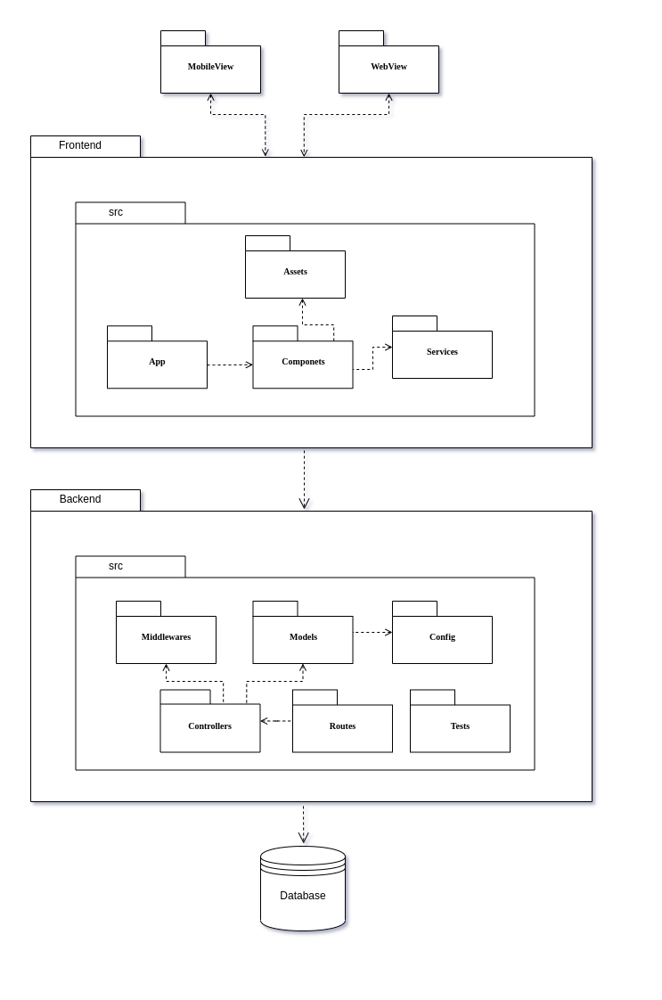
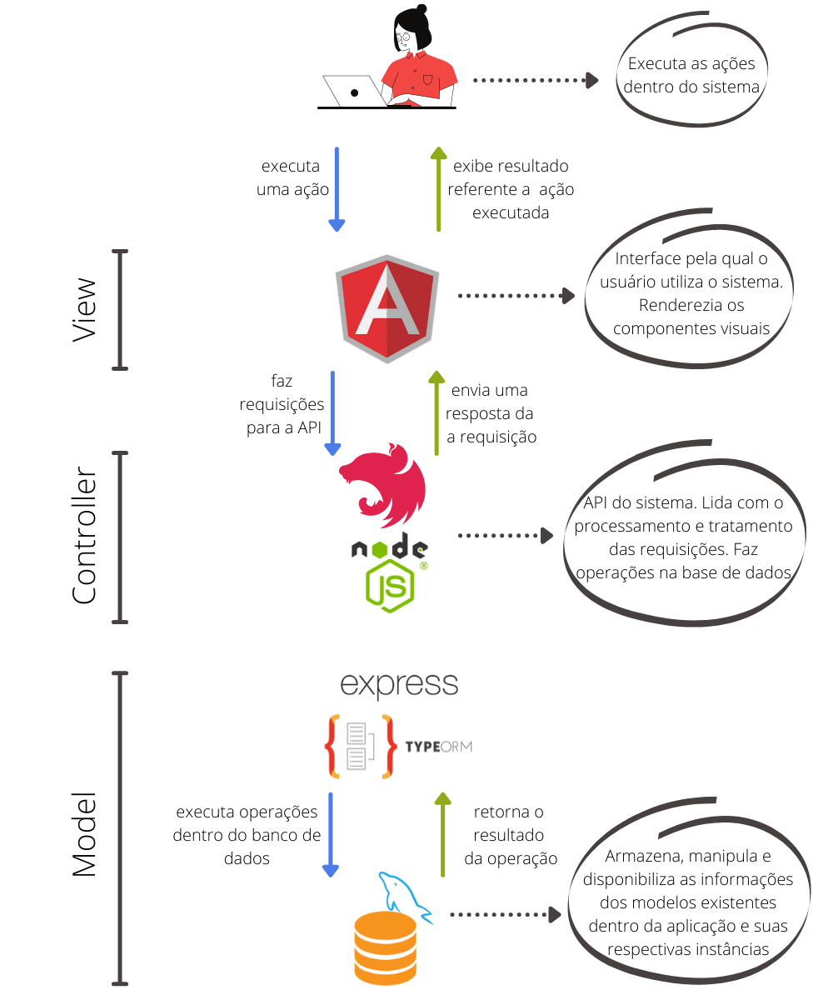

# Cardeal

**Código da Disciplina**: FGA0208<br>
**Número do Grupo**: 04<br>

## Alunos
|Matrícula | Aluno | GitHub |
| -- | -- | -- |
| 18/0117548  |  Bruno Carmo Nunes | [@brunocmo](https://github.com/brunocmo) |
| 17/0140571  |  Douglas Farias de Castro | [@douglasffcastro](https://github.com/douglasffcastro) |
| 18/0052616  |  Estevão de Jesus Reis | [@estevaoreis25](https://github.com/estevaoreis25) |
| 18/0017659  |  Giovana Vitor Dionísio Santana | [@giovanadionisio](https://github.com/giovanadionisio) |
| 20/0038141  |  Gustavo Duarte Moreira | [@gustavoduartemoreira](https://github.com/gustavoduartemoreira) |
| 15/0129866  |  Igor Araújo de Sousa | [@zero101010](https://github.com/zero101010) |
| 17/0150747  |  Marcos Vinícius Rodrigues da Conceição | [@marcos-mv](https://github.com/marcos-mv) |
| 18/0129147  |  Pedro de Miranda Haick | [@peHaick](https://github.com/peHaick) |
| 14/0169784  |  Luiz Gustavo Dias Paes Pinheiro | [@PinheiroLG](https://github.com/PinheiroLG) |
| 18/0138596  |  Tomás Veloso Peixoto Matutino | [@tomasvelos0](https://github.com/tomasvelos0) |

## Sobre 

O projeto é uma aplicação web de uma imobiliária que tem como seu principal objetivo apresentar aos seus clientes os imóveis disponíveis.

## Screenshots Primeira Entrega <<FOCO: DSW(Base)>>
### Causa e Efeito


## Vídeo(s) Primeira Entrega <<FOCO: DSW(Base)>>
### 1.1 Apresentação 1
https://drive.google.com/file/d/1UDwwgw3X94OJ59j6FCQYXQfpk-eBe73a/preview

### 1.2 Apresentação 2
https://drive.google.com/file/d/1amyyFE3ptUVjyf4e1vfkac_KyzSmKR6N/preview 

## Screenshots Segunda Entrega <<FOCO: DSW(Modelagem)>>

### Diagrama de Classes

### Diagrama de Componentes


### Diagrama de Pacotes


### Diagrama de atividades
#### Editar Imóvel


## Vídeo(s) Segunda Entrega <<FOCO: DSW(Modelagem)>>
[Notação UML – Diagramas Estáticos](https://youtu.be/2ntMRX4Njvs)

[Notação UML – Diagramas Dinâmicos](https://youtu.be/O4vlXzG3z3M)

[Modelagem Ágil + iniciativas extras](https://youtu.be/7kLH5GGu5mU)

## Screenshots Terceira Entrega <<FOCO: DSW(Padrões de Projeto)>>
### GRASPs
[](https://i.ibb.co/tPpTH3W/Captura-de-tela-de-2021-09-20-22-02-39.png)

### GOFs
#### GOFs Criacionais
[](https://i.ibb.co/jJs21RG/Captura-de-tela-de-2021-09-20-22-04-51.png)
#### GOFs Estruturais
[](https://i.ibb.co/jkTLsBt/Captura-de-tela-de-2021-09-20-22-05-11.png)
#### GOFs Comportamentais
[](https://i.ibb.co/3rb100y/Captura-de-tela-de-2021-09-20-22-05-30.pngg)
### Padrão Emergente
[](https://i.ibb.co/F3Pdd36/Captura-de-tela-de-2021-09-20-22-06-02.png)
### Extras (Front-End)
[](https://i.ibb.co/jhpmRq3/Captura-de-tela-de-2021-09-20-22-09-24.png)

## Vídeo(s) Terceira Entrega <<FOCO: DSW(Padrões de Projeto)>>
[Padrões de Projeto GRASPs](https://drive.google.com/file/d/1GOg5dKzSQBfEAwIViA_y_rfsQ5u51NO5/view?usp=sharing)  
[Padrões de Projeto GoFs](https://drive.google.com/file/d/1u5Pl3v609kxjh-XnWjBTOlZvUeFEaXHJ/view?usp=sharing)  
[Padrões de Projeto Emergentes](https://drive.google.com/file/d/1aK_dIJugrnfpWBiblseDTMgTwr5qs1qk/view?usp=sharing)

## Screenshots Quarta Entrega (FINAL) <<FOCOS: Arquitetura & Reutilização de Software & PROJETO FINAL>>

### Documento de Arquitetura (DAS)

#### DAS - Inicio


#### DAS - Diagrama relação camada e tecnologias



### Reutilização de Software

#### Reutilização - Back-end


#### Reutilização - Front-end


### Fluxo do cliente

#### Filtragem dos Imóveis


#### Exibir Imóveis


#### FAQ


### Fluxo do corretor

#### Login


#### Cadastrar Imóvel


#### Cadastrar Clientes


#### Cadastrar Agendamentos


## Vídeo(s) Quarta Entrega (FINAL) <<FOCOS: Arquitetura & Reutilização de Software & PROJETO FINAL>>

### Documento de Arquitetura (DAS)

* [Apresentação](https://drive.google.com/file/d/1KBpWkxU5C6Bb0HteBmdXK4bP8SxXFh3T/view?usp=sharing)

### Reutilização de Software e Iniciativas Extras

* [Apresentação](https://drive.google.com/file/d/13q2d5M5S8yrDRSNCz8_oSrO_kx52etf-/view?usp=sharing)

## Descritivo dos Principais Aspectos Técnicos 
**Principal Metodologia Adotada**: Scrum<br>
**Principal Linguagem Utilizada**: TypeScript<br>
**Principais Tecnologias Utilizadas**: NestJS(back-end) e Angular(front-end)<br>
**Principal Estilo Arquitetural Adotado**: MVC<br>

## O Projeto está rodando?
(X) SIM
( ) NÃO

Se SIM, insira um manual (ou um script) para auxiliar ainda mais os interessados em consultar o projeto.

O site de acesso da aplicação está disponivel no link:

* [Cardeal](https://front-cardeal.devopstests.com/
)

Encontra-se os scripts nos seguintes repositórios:

* [Back-end: Servidor - API](https://github.com/UnBArqDsw2021-1/2021.1-g04-cardeal-back-end)

* [Front-end](https://github.com/UnBArqDsw2021-1/2021.1-g04-cardeal-frontend)

## Informações Complementares 

### Para publicação no gh-pages

1 - Use o comando:

```pip install mkdocs```

2 - Para verificar se tudo deu certo, execute esse comando:

```mkdocs --version```

Deve estar na versão: version 1.2.2

3 - Após a instalação do mkdocs, é preciso instalar o nosso tema, utilizando o comando:

```pip install mkdocs-material```

```pip install mkdocs-material-extensions```

```pip install mkdocs-awesome-pages-plugin```

4 - Para iniciar a página de documentação do projeto, entre no local onde a pasta do projeto foi clonada e execute o comando:

```mkdocs serve```

5 - Para realizar o deploy das suas mudanças nos documentos, verifique se não existe nenhuma divergência na main realize o push e depois utilize o comando dentro da branch main:

```mkdocs build```


 e depois o comando

```mkdocs gh-deploy``` 

Suas mudanças devem ser aplicadas e podem ser visualizadas neste link https://unbarqdsw2021-1.github.io/2021.1_G04_Cardeal/
