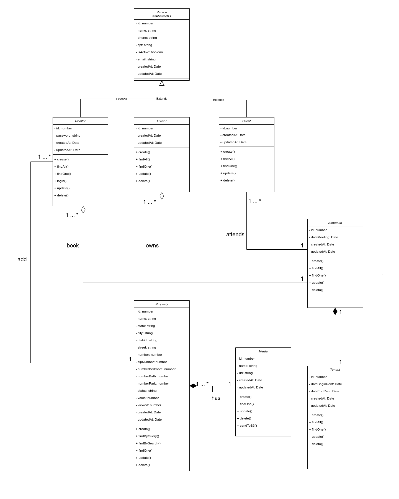

# DAS - Documento de Arquitetura de Software
## 1. Introdução
&emsp;&emsp; O Documento de Arquitetura de Software (DAS) pode ser descrito como "uma visão arquitetural abrangente do sistema, usando diversas visões de arquitetura para representar diferentes aspectos do sistema" (IBM Corp, 2006). Ele estabelece a comunicação entre o arquiteto de software e os outros profissionais responsáveis pelo projeto, descrevendo possíveis decisões arquiteturais que possuam relevância significativa dentro do contexto do produto em desenvolvimento.  

### 1.1 Propósito 
&emsp;&emsp; Tendo em vista a definição apresentada para o DAS, este documento tem como finalidade descrever a arquitetura do Projeto Cardeal, que está sendo desenvolvido pela equipe, através da [Visão Lógica](#5-visao-logica), da [Visão de Processos](#6-visao-de-processos), da [Visão de Implantação](#7visao-de-implantacao), da [Visão de Implementação](#8-visao-de-implementacao) e da [Visão de Dados](#9-visao-de-dados), além de trazer outros aspectos relevantes sobre a arquitetura do produto em produção. 

### 1.2 Escopo
&emsp;&emsp; O Projeto Cardeal consiste em um site para uma imobiliária fictícia, dando suporte a atividades como o cadastro e apresentação de imóveis, cadastro de corretores, entre outros aspectos de interesse da empresa. Essa aplicação visa facilitar o gerenciamento da imobiliária, entregando uma solução de software para a concentração de seus recursos de trabalho (gerentes, clientes, imóveis, proprietários, visitas, etc.).  
&emsp;&emsp; Neste contexto, este artefato abrange toda a arquitetura do Projeto Cardeal em seus diferentes níveis de desenvolvimento. Desta maneira, neste documento está descrita a estrutura e organização do produto de software, assim como o seu funcionamento, requisitos, restrições, componentes e as tecnologias que foram utilizadas ao longo da sua implementação.

### 1.3 Visão Geral
&emsp;&emsp; Na [reunião em equipe do dia 27/09/21](https://unbarqdsw2021-1.github.io/2021.1_G04_Cardeal/arquitetura/atas/27-09-21/) foi debatido entre os membros quais tópicos seriam importantes e coerentes ao contexto do nosso projeto. Consultamos projetos elaborados nesta disciplina em outros semestres, além de verificar bibliografias para que soubessemos quais tópicos são obrigatórios ou não neste artefato.  
&emsp;&emsp; Por fim, o Documento de Arquitetura de Software do Projeto Cardeal está particionado da seguinte forma, onde cada tópico apresenta um aspecto sobre a arquitetura da aplicação:

Número | Tópico | Descrição 
------: | ------ | ---------
 2 | [Representação Arquitetural](#2-representacao-arquitetural) | Descrição da arquitetura e das tecnologias utilizadas no projeto 
 3 | [Metas Arquiteturais e Restrições](#3-metas-arquiteturais-e-restricoes) | Descrição dos objetivos e as especificações que a nossa arquitetura visa alcançar e seguir
 4 | [Visão de Caso de Uso](#4-visao-de-caso-de-uso) | Descrição das principais funcionalidades, interfaces externas e usuários do sistema
 5 | [Visão Lógica](#5-visao-logica) | Descrição da estrutura do sistema no que diz respeito às unidades de implementação
 6 | [Visão de Processos](#6-visao-de-processos) | Descrição do sistema em tempo de execução através de interações e comportamento dos elementos
 7 | [Visão de Implantação](#7visao-de-implantacao) | Descrição do mapeamento do sistema no hardware
 8 | [Visão de Implementação](#8-visao-de-implementacao) | Descrição da organização de arquivos dos artefatos do projeto
 9 | [Visão de Dados](#9-visao-de-dados) | Descrição da persistência e modelagem dos dados
 10| [Tamanho e Desempenho](#10-tamanho-e-desempenho) | Descrição do tamanho do software e os seus objetivos de performance
 11| [Qualidade](#11-qualidade) | Descrição do impacto da arquitetura nos atributos de qualidade do software

## 2. Representação Arquitetural
&emsp;&emsp; Para desenvolver o sistema Web do projeto Cardeal, foi decidido que seria utilizado o padrão de projeto arquitetural Model-View-Controller(MVC), visto que é um padrão bastante utilizado no desenvolvimento de sistemas web. Segundo Vitor Zucher o MVC é um padrão de arquitetura de software responsável por contribuir na otimização da velocidade entre as requisições feitas pelo comando dos usuários. Com quase 50 anos de formulação, a arquitetura MVC é dividida em três camadas essenciais: View, Controller e Model.
 
#### View
&emsp;&emsp; Essa camada é responsável por apresentar as informações de forma visual ao usuário. Em seu desenvolvimento devem ser aplicados apenas recursos ligados a aparência como mensagens, botões ou telas. Esta camada está na linha de frente da comunicação com o usuário e é responsável por transmitir questionamentos ao controller e entregar as respostas obtidas ao usuário. É a parte da interface que se comunica, disponibilizando e capturando todas as informações do usuário.
Nesta camada, foi utilizado o framework front-end javascript [Angular](#angula)
 
#### Controller
&emsp;&emsp; Essa camada é responsável por intermediar as requisições enviadas pelo View com as respostas fornecidas pelo Model, processando os dados que o usuário informou e repassando para outras camadas. Foi utilizado o framework back-end [Nest.js](#nest) para compor essa camada, sendo ainda que , esse framework faz uso de outros como o [Node.js](#node) e o [Express](#exp), e o [TypeORM](#orm), estando esses dois últimos entre a camada de Controller e de Model.
 
#### Model
&emsp;&emsp; Essa camada é responsável por gerenciar e controlar a forma como os dados se comportam por meio das funções lógica e regras de negócios estabelecidas. Ele é o detentor dos dados que recebe as informações do Controller, valida se ela está correta ou não e envia a resposta mais adequada. Foi utilizado para compor essa camada o framework [Express](#exp) e o [TypeORM](#orm), fazendo a abstração da camada de modelo e a utilização do banco de dados [MySQL](#my).
 
&emsp;&emsp; Segue abaixo o diagrama, desenvolvido no [Canva](https://www.canva.com/), explicitando a relação entre as camadas e as tecnologias utilizadas em cada uma delas.
 
 

 
### 2.1. Tecnologias
&emsp;&emsp; Neste tópico é abordado uma explicação geral sobre cada tecnologia utilizada na aplicação. Vale ressaltar que todas as tecnologias foram escolhidas pensando no suporte que elas possuem ao Typescript, visto que através dele podemos aplicar adequadamente os conceitos de Orientação a Objetos.
 

 
#### Angula
&emsp;&emsp; Segundo a documentação oficial do Angula, ele é uma plataforma de desenvolvimento, construída em TypeScript. Como plataforma, o Angular inclui:
 
- Uma estrutura baseada em componentes para a construção de aplicativos da web escaláveis
- Uma coleção de bibliotecas bem integradas que cobrem uma ampla variedade de recursos, incluindo roteamento, gerenciamento de formulários, comunicação cliente-servidor e muito mais
- Um conjunto de ferramentas de desenvolvedor para ajudá-lo a desenvolver, construir, testar e atualizar seu código
 

 
#### Node.js
&emsp;&emsp;Segundo a Opus Software o Node.js pode ser definido como um ambiente de execução Javascript server-side. Isso significa que com o Node.js é possível criar aplicações Javascript para rodar como uma aplicação standalone em uma máquina, não dependendo de um browser para a execução.
 

 
#### Express
&emsp;&emsp; Segundo o site oficial do Express, ele é um framework para aplicações web do Node.js mínimo e flexível que fornece um conjunto robusto de recursos para aplicativos web e mobile. Com uma miríade de métodos utilitários HTTP e middleware a seu dispor,  é possível criar facilmente uma API robusta de forma rápida. O Express fornece uma camada fina de recursos fundamentais para aplicativos da web, sem esconder os recursos já existentes do Node.js.
 

 
#### TypeOrm
&emsp;&emsp; Segundo a documentação oficial do TypeORM, ele é um ORM(Object Relational Mapping) cujo objetivo é sempre oferecer suporte aos recursos JavaScript mais recentes e fornecer recursos adicionais que o ajudem a desenvolver qualquer tipo de aplicativo que use bancos de dados - desde pequenos aplicativos com algumas tabelas até aplicativos corporativos de grande escala com vários bancos de dados.
 

 
#### Nest.js
 
&emsp;&emsp;Segundo a documentação do Nest.js ele é um framework para a construção de aplicações [Node.js](#node) do lado do servidor eficientes e escaláveis . Ele usa JavaScript progressivo, é construído com e suporta totalmente TypeScript e combina elementos de OOP (Programação Orientada a Objetos), FP (Programação Funcional) e FRP (Programação Reativa Funcional).O Nest faz uso de estruturas robustas de servidor HTTP como [Express](#exp).
 

 
#### MySQL
&emsp;&emsp;Segundo José Algusto em seu livro "MySQL 5.5 Interativo" o programa MySQL é um sistema de gerenciamento de banco de dados relacional que utiliza a linguagem de consulta estruturada SQL como interface de acesso e extração de informações do banco de dados em uso.
 
## 3. Metas Arquiteturais e Restrições
   Os objetivos arquiteturais dizem respeito e trabalham em cima das metas mais significativas e das metas que foram impostas para tal projeto sendo assim, basicamente se trata que satisfaz as expectativas, desejos e necessidades dos Stakeholders do projeto. As restrições arquitetônicas de um projeto são definidas como condições que são impostas ao sistema e limitam a execução desse mesmo, tendo estas que serem cumpridas da maneira correta, para que este funcione de acordo com o esperado. 

### 3.1 Metas 
   Dentro do que é referente às restrições, requisitos e objetivos da arquitetura do site online da corretora Cardeal, serão listados abaixo os pontos de maior importância para o projeto:
- Segurança: A aplicação deve manter os dados dos usuários em segurança
- Linguagem: A aplicação deve conter uma linguagem acessível e que possa ter um fácil entendimento pelo os usuários
- Portabilidade: A aplicação deve ser funcionar e ser executada com desempenho igual ou próximo nos navegadores Google Chrome, Mozilla Firefox e Microsoft Edge
- Usabilidade: é essencial que o sistema possibilite que o usuário a realize ações rapidamente e de maneira intuitiva
- Escalabilidade: O software deve tornar possível sua evolução e manutenção.
- Manutenibilidade: A aplicação deve permitir manutenção e melhorias de maneira a não gerar custo e tempo muito acima do normal.

### 3.2 Restrições

- Tecnologias: O desenvolvimento da plataforma deve seguir o planejamento a as tecnologias definidas pela equipe
- Conectividade: Conexão com a internet para que o usuário acesse ao site
- Prazo: A aplicação deverá ser finalizada dentro da data estipulada para entrega final do projeto
- Idioma: O site deve estar na linguagem Português-Brasil.
- Público alvo: A aplicação deve atender usuários que desejam os serviços do site da corretora Cardeal.

## 4. Visão de caso de uso
 
## 5. Visão Lógica

  A visão lógica é a organização conceitual do software em termos das camadas, subsistemas, pacotes, frameworks, classes e interfaces mais importantes. Também resume a funcionalidade dos principais elementos de software. Visualizando com diagramas de classe, pacotes e comunicação da UML.

### 5.1 Diagrama de Classes

   Na UML, uma classe é uma descrição de um conjunto de objetos que compartilham os mesmos atributos, operações, relacionamentos e semântica.
 

 ### 5.2 Diagrama de Pacotes

Como pode ser observado, o diagrama de pacotes oferece uma visão de mais alto nível do modelo do sistema. Onde nele é separada em 4 partes:

* Visualização web (PC ou Mobile)
* Frontend(ReactJS)
* Backend(NestJS)
* Sistema gerenciamento de banco de dados (MySQL)

Podemos observar a partir do MySQL, onde gerencia os dados, passa as informações para o o NestJS que interage os arquivos de cada pasta exibida, assim o controle de acesso, requisição e armazenamento de dados interage com o ReactJS, onde seus componentes então mostram para o usuário final a solução computacional da Imobiliária Cardeal.

### 5.3 Diagrama de comunicação

Os diagramas de comunicação ilustram as interações entre objetos em forma de grafo ou rede, na qual os objetos podem ser colocados em qualquer lugar no diagrama. Temos então, três diagramas principais da nossa aplicação.

#### 5.3.1 Adicionar Imóvel

Nesse diagrama, é apresentado então como o corretor adiciona as informações de um proprietário e um imóvel.

#### 5.3.2 Marcar Reunião

Nesse diagrama, é exibido como um corretor marca uma reunião e em seguida aluga um imóvel para o cliente.

#### 5.3.3 Procurar Imóvel

Nesse diagrama, é mostrado como um cliente busca um imóvel que está interessado.

## 6. Visão de Processos

### 6.1 Visão Geral

&emsp;&emsp;Ela descreve uma visão do modelo de projeto, com visualização de classes e diagramas de interação do sistema. Utilizando a notação de processos ou threads.

### 6.1 Diagrama de Sequência

&emsp;&emsp;Na aplicação o diagrama de sequência foi usado para evidenciar os fluxos de interação do usuário para visualizar o imóvel e do corretor ao cadastrar o anúncio do imóvel.

#### 6.1.1 Interação do Usuário

&emsp;&emsp;No diagrama de interação do usuário o fluxo de pesquisa de imóvel.

  
_Autor: Giovana Dionisio_

#### 6.1.2 Operações com Anúncios

&emsp;&emsp;No diagrama de operação de anúncios o usuário corretor interage com a aplicação cadastrando um imóvel.

  
_Autor: Giovana Dionisio_

## 7.Visão de Implantação

&emsp;&emsp;Essa visão busca explorar e avaliar as opções arquiteturais de alto nível. Ela irá promover um entendimento da estrutura para os patrocinadores e demais stakeholder. Para isso, é preciso levar em consideração o design das redes preexistentes e os bancos de dados preexistentes. A fim de descrever como o sistema é mapeado para o hardware (MONTEIRO, 2010).

&emsp;&emsp; Os dados da aplicação Web ficam armazenados no banco de dados MySQL. As requisições são feitas pelo front-end, implementado com auxílio do Angular, para o back-end, implementado com o NestJS. Este e aquele construídos com a linguagem TypeScript.

&emsp;&emsp; A partir dessas requisições, o back-end realiza os serviços solicitados, fazendo buscas e/ou serviços no banco de dados, e responde ao front-end, que por sua vez apresenta todas as informações necessárias ao usuário. Essa visão pode ser representada utilizando o seguinte diagrama:

_Autor: Douglas Castro_

## 8. Visão de Implementação

&emsp;&emsp; A finalidade da visão de implementação é captar as decisões de arquitetura tomadas para a implementação. Especifica os componentes de código do projeto, como organização dos arquivos, dependências e pacotes em diferentes camadas e subcamadas. Essa visão é representada principalmente pelo diagrama de componentes.

_Autor: Marcos Vinícius_

## 9. Visão de Dados

## 10. Tamanho e Desempenho
 
O tamanho do projeto não pode ser precisamente estimado até a data de escrita desse 06//10/2021, pois o mesmo ainda encontrava-se em fase de desenvolvimento e evolução do projeto, não sendo possui-vel mesurar com precisão o tamanho final. Levando em conta seus repositórios Back-end e Front-end do site da corretora Cardeal, a somatórios dos dois não passará de 1GB, não sendo necessário o download ou instalação de qualquer programa para acesso ao mesmo, tendo em vista de que este se trata de uma aplicação web, tendo seu acesso disponível pelo navegador, assim que o mesmo encontrar-se hospedado em um servidor.

Em relação à performance, o sistema foi desenvolvido com foco na otimização de resposta às requisições. Sendo assim, é esperado que o desempenho geral do sistema atenda às expectativas e à testes de Stress. Sendo capaz de: 
- O sistema deve ser capaz de suportar usuários simultâneos em seu site;
- O sistema deve ser capaz de carregar suas páginas em menos de 10 segundos.

## 11. Qualidade
&emsp;&emsp; Quanto à Qualidade, a arquitetura do Projeto Cardeal é orientado pelos atributos FURPS, sigla para _**F**uncionality, **U**sability, **R**eliability, **P**erformance_ e _**S**uportability_. Segundo PRESSMAN e MAXIM (2016), as seguintes definições podem ser aplicadas para esses atributos:  

* Funcionalidade (_funcionality_): se refere ao conjunto de características e capacidades, funções e segurança de um software;  
* Usabilidade (_usability_): está relacionada a fatores humanos do software, como estética, consistência e documentação;  
* Confiabilidade (_reliability_): é avaliada através da medição de frequência e severidade das falhas, da precisão dos resultados gerados, do tempo médio entre defeitos, da capacidade do sistema de recuperar-se de uma falha e da previsibilidade do software;  
* Desempenho (_performance_): considera a velocidade de processamento, tempo de resposta, consumo de recursos e a eficiência do programa;  
* Facilidade de suporte (_suportability_): engloba a extensibilidade, a adaptabilidade e a reparabilidade, entre outras características que envolvem o suporte de um software.  

No projeto desenvolvido, estes atributos de qualidade podem ser observadas em características como:
### Funcionalidade
O produto de software tem sido desenvolvido pela equipe com base nos [requisitos](https://unbarqdsw2021-1.github.io/2021.1_G04_Cardeal/desenhoSoftwareBase/brainstorm/) levantados pela equipe. Tais requisitos, que deram origem ao [backlog do produto](https://unbarqdsw2021-1.github.io/2021.1_G04_Cardeal/modelagem/backlog_do_produto/), garantem a funcionalidade do projeto.

### Usabilidade
A interface elaborada para o projeto é minimalista, apresentado padrões de cores e fontes. Além disso, as principais funcionalidades do site são apresentadas na sua home page, o que facilita a navegação do usuário. Também é possível notar que o sistema utiliza linguagem clara e direta, simplificando o entendimento do que está sendo feito e o que se pode fazer.

### Confiabilidade
O software da imobiliária Cardeal é projetado para estar constantemente disponível, podendo se recuperar de possíveis falhas apresentadas. 

### Desempenho
Tal característica foi implementada no produto de software seguindo os pontos levantados no tópico anterior ([Tamanho e Desempenho](#10-tamanho-e-desempenho)).

### Facilidade de Suporte
Ao aplicarmos os padrões de projeto [GRASPs](https://unbarqdsw2021-1.github.io/2021.1_G04_Cardeal/padroesDeProjeto/GRASPs/), [GOFs](https://unbarqdsw2021-1.github.io/2021.1_G04_Cardeal/padroesDeProjeto/gofs_criacionais/) e [Emergentes](https://unbarqdsw2021-1.github.io/2021.1_G04_Cardeal/padroesDeProjeto/padraoEmergente/), possibilitamos ao software uma maior manutenibilidade, o que facilita seu suporte, comportando possíveis modificações, melhorias e correções com maior segurança e menor risco de falhas, reforçando a sua [confiabilidade](#confiabilidade). 

## 12. Referências

> Arquitetura de Software. MONTEIRO, Marcos. Disponível em: https://www.marcosmonteiro.com.br/mm/Cursos/Arquitetura_Software/Arquitetura_de_Software-marcosmonteiro.pdf. Acesso: 30/09/2021.

> Como documentar a Arquitetura de Software. Disponível em: http://www.linhadecodigo.com.br/artigo/3343/como-documentar-a-arquitetura-de-software.aspx. Acesso em: 30/09/2021.

> Conceito: Visão da Implementação. Universidade de Pernambuco. Disponível em: https://www.cin.ufpe.br/~gta/rup-vc/core.base_rup/guidances/concepts/implementation_view_E373E3B6.html. Acesso em: 04/10/2021.

>Canva. Disponível em <https://www.canva.com/>. Acessado em 30/09/2021.

>"O que é padrão MVC? Entenda arquitetura de softwares!". Disponível em <https://www.lewagon.com/pt-BR/blog/o-que-e-padrao-mvc>. Acessado em 30/09/2021

> "O que é Angular?". Disponível em <https://angular.io/guide/what-is-angular>. Acessado em 30/09/2021

> "Node.js – O que é, como funciona e quais as vantagens". Disponível em <https://www.opus-software.com.br/node-js/>. Acessado em 30/09/2021.

> "Express - Framework web rápido, flexível e minimalista para Node.js". Disponível em <https://expressjs.com/pt-br/>. Acessado em 30/09/2021.

> TypeORM. Disponível em <https://typeorm.io/#/>. Acessado em 30/09/2021.

>Documentação Nest.js.<https://docs.nestjs.com/>. Acessado em 30/09/2021.

>MANZANO, José.Augusto.N. G. MySQL 5.5 Interativo: Guia Essencial de Orientação e Desenvolvimento. Acessado em 30/09/2021.

>ORM - Object Relational Mapping - Revista Easy .Net Magazine 28. Disponível em <https://www.devmedia.com.br/orm-object-relational-mapping-revista-easy-net-magazine-28/27158>. Acessado em 30/09/2021.

>PRESSMAN, Roger S.; MAXIM, Bruce R.. Engenharia de software: uma abordagem profissional. 8 ed. Porto Alegre: AMGH, 2016. p 210, 211.

> Artefato: Documento de Arquitetura de Software. Rational Unified Process for Value Creation, IBM Corp. 1987, 2006. Disponível em <https://www.cin.ufpe.br/~gta/rup-vc/core.base_rup/workproducts/rup_software_architecture_document_C367485C.html> Acessado em 08/10/2021.

> SERRANO, Milena. Arquitetura e Desenho de Software AULA - ARQUITETURA & DAS – PARTE II. Disponível em: <https://aprender3.unb.br/pluginfile.php/897151/mod_label/intro/Arquitetura%20e%20Desenho%20de%20Software%20-%20Aula%20Arquitetura%20e%20DAS%20-%20Parte%20II%20-%20Profa.%20Milene.pdf> Acessado em 10/10/2021.

> LARMAN, Craig. Utilizando UML e padrões : uma introdução à análise e ao projeto orientados a objeto e ao desenvolvimento iterativo. 3.ed. Porto Alegre : Bookman, 2007. 

> BOOCH, Grady. UML: guia do usuário. 7.ed. Rio de Janeiro: Elsevier, 2005.

## Versionamento
| Data       | Versão | Descrição         | Autores       |
| ---------- | ------ | ----------------- | ------------- |
| 24/09/2021 | 0.1 | Criação do arquivo| Estevao Reis  |
| 27/09/2021 | 0.2 | Estruturação dos tópicos do documento| Estevao Reis |
| 30/09/2021 | 0.3 | Adição do tópico de Representação Arquitetural| Estevao Reis |
| 05/10/2021 | 0.4 | Criação inicial dos tópicos 3 e 10| Luiz Gustavo  |
| 05/10/2021 | 0.5 | Criação inicial dos tópicos 3 e 10| Luiz Gustavo  |
| 06/10/2021 | 0.6 | Correções nos tópicos 3 e 10| Luiz Gustavo  |
| 07/10/2021 | 0.7 | Adição da visão de Implantação| Douglas Castro  |
| 08/10/2021 | 0.8 | Adição da visão da Implementação| Douglas Castro  |
| 08/10/2021 | 0.9 | Adição da Introdução | Giovana Dionisio  |
| 09/10/2021 | 0.9.1 | Revisão da Introdução | Gustavo Moreira  |
| 08/10/2021 | 1.0 | Adição do tópico qualidade| Giovana Dionisio  |
| 10/10/2021 | 1.1 | Adição do tópico visão de processo| Gustavo Moreira  |
| 11/10/2021 | 1.2 | Adição da visão lógica com diagramas | Bruno Nunes  |

