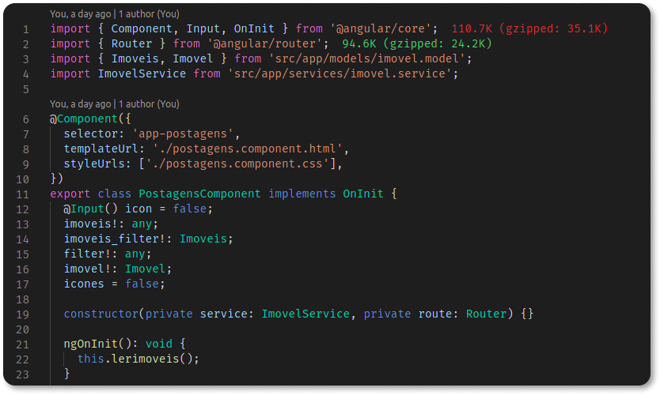

# Reutilização de Software no Front-end

## 1. Introdução

<p align = "justify"> A reutilização de software possui a finalidade de tornar uma solução de software reutilizável. Assim, projetos bem sucedidos podem ser usados novamente para projetos futuros, reaproveitando soluções aprovadas, melhorando a qualidade de desenvolvimento e poupando esforços. Reutilização de software não se aplica apenas ao nível de código, mas também em vários contextos aplicados ao desenvolvimento de software, ou seja, em soluções que podem ser reaproveitadas. Padrões de projetos tem uma boa aplicação para a reutilização de software, pois padrões de projetos são adequados para problemas recorrentes que possuem soluções bem sucedidas e aceitas pela comunidade, assim, é uma forma de reutilizar algo, que possui características semelhantes, e que já provou ser uma boa solução. </p>

<p align = "justify"></p>

## 2. Framework

<p align = "justify"><cite>O framework dita a arquitetura da sua aplicação. Ele irá definir a estrutura geral, sua divisão em classes e objetos e em consequência as responsabilidades-chave das classes de objetos, como estas colaboram, e o fluxo de controle. Um framework predefine esses parâmetros de projeto, de maneira que você, projetista/implementador da aplicação, possa se concentrar nos aspectos específicos da sua aplicação.</cite> (GAMMA et al., 2000, p.42).
    Framework é aplicado para desenvolver  soluções que possuem o mesmo domínio cognitivo ou similares, sendo uma estrutura geral que atenda um conjunto de aplicações similares. Uma forma de aplicar a reutilização de software é pelo o uso de framework, facilitando no desenvolvimento de novas aplicações. </p>

## 2.1. Framework - Hot-Spots e Frozen-Spots

<p align = "justify">Hot-spots representam uma parte da reutilização de software de um framework, mas de uma forma genérica, o que possibilita o desenvolvedor adaptá-las ao contexto da aplicação, de forma que suas funcionalidades podem ser complementadas pelo programador. O Frozen-spots é diferente por não permitir a alteração, ou seja, foi projetado para não ter adaptação, sua funcionalidade continua igual em todos os momentos que são instanciados. Exemplos de aplicações Hot-Spots, Classes abstratas, métodos abstratos, métodos hook. Classes concretas e métodos template são exemplos de Frozen-spots.</p>

<h6 align = "center">Tabela 1 - Hot-Spots e Frozen-Spots.</h6>
<center>

|                                        **Hot-Spots**                                         |                                                         **Frozen-Spots**                                                         |
| :------------------------------------------------------------------------------------------: | :------------------------------------------------------------------------------------------------------------------------------: |
| Representam as partes do framework de aplicação que são específicas de sistemas individuais. | Definem a arquitetura geral de um sistema de software, ou seja, seus componentes básicos bem como os relacionamentos entre eles. |
|    São projetados para serem genéricos, cabendo adaptá-los às necessidades da aplicação.     |                              Permanecem fixos em todas as instanciações do framework de aplicação.                               |
|                      Normalmente, representados com classes abstratas.                       |                                           Também conhecidos como "core" do framework.                                            |

</center>

<h6 align = "center">Fonte:<a href="https://www.figma.com/proto/DKWzd4WjiCNoDUUINY1U4v/Identidade-Visual-Cardeal?node-id=6%3A6" target="_blank">Milene Serrano - Aula Reutilização & Framework</a>, adaptado.</h6></br>

## 2.2. Framework - Aplicação no projeto

<p align = "justify">Utilizamos o framework <a href="https://angular.io/" target="_blank"><b>Angular</b></a> para o desenvolvimento da aplicação web. <a href="https://angular.io/" target="_blank"><b>Angular</b></a> é um framework que utiliza de Typescript para a criação de páginas web, é caracterizado por ser uma "Sigle-Page Applications (SPA)", ou seja, diferente de outras aplicações web, que ao interagir com alguma informação da página, toda a aplicação é atualizada, o Angular a comunicação com o back-end é feita de forma dinâmica. <a href="https://angular.io/" target="_blank"><b>Angular</b></a> é instalado através do gerenciador de pacotes do NodeJS, um software para execução de javascript.</p></br>

<p align = "justify">A Imagem 1, mostra os pacotes do projeto utilizando o framework Angular. É um exemplo de como a organização dos diretórios devem seguir de acordo com a pré-estruturação do framework. Portanto é a forma genérica de como deve ser a estrutura, e os desenvolvedores especializam o código.</p>

<center>

[](./img/arq_angular.png){target=\_blank}

</center>
<h6 align = "center">Imagem 1: Diretório do projeto.</h6></br>

<p markdown="1" align="justify">A próxima imagem, mostra como é feito a estrutura de um componente em Angular, desenvolvido em Typescript. Um componente em Angular é uma classe que recebe o decorator em @Component, e algumas propriedades relacionadas à classe, template (HTML) e  estilo (CSS). Depois da estrutura padrão do framework, os desenvolvedores especializam essa instância.</p>

<center>

[](./img/component.png){target=\_blank}

</center>
<h6 align = "center">Imagem 2: Classe no Angular.</h6></br>

<p markdown="1" align="justify">Pode reutilizar um componente em outros locais da aplicação, a Imagem 3, descreve como é feito a reutilização do código, evitando assim partes de código duplicado. Na aplicação, por exemplo, um componente chamado "Postagens" é utilizado em vários momentos na aplicação, como na página "Buscar imóveis" e na página "Meus Imóveis". Caracterizando como um framework Hot Spot.</p>

<center>

[](./img/postagens.png){target=\_blank}

</center>
<h6 align = "center">Imagem 3: Componente Postagens.</h6></br>

<center>

<p markdown="1" align="justify">A importância da reutilização é utilizar de algo que mostrou ser bom para determinada situação, evitando assim, o gasto de tempo, recursos e tendo menos riscos. No exemplo prático, esse trecho de código não é duplicado para ser usado em cada momento que necessita do uso dessas informações. </p>

```JS
import { ToastService } from 'src/app/services/toast.service';
import { Component, Input, OnInit } from '@angular/core';
import { Router } from '@angular/router';
import { Imoveis, Imovel } from 'src/app/models/imovel.model';
import ImovelService from 'src/app/services/imovel.service';
import { CorretorService } from 'src/app/services/corretor.service';

@Component({
  selector: 'app-postagens',
  templateUrl: './postagens.component.html',
  styleUrls: ['./postagens.component.css'],
})
export class PostagensComponent implements OnInit {
  @Input() icon = false;
  @Input('tipo') urlFiltro: string = '';

  imoveis!: any;
  imoveis_filter!: Imoveis;
  filter!: any;
  imovel!: Imovel;
  icones = false;

  constructor(
    private service: ImovelService,
    private route: Router,
    private toast: ToastService,
    private corretorService: CorretorService
  ) {}

  ngOnInit(): void {
    this.lerimoveis();
  }

  lerimoveis() {
    if (!this.icon) {
      this.service.listarImovelFiltro(this.urlFiltro).subscribe(
        (resultado) => {
          this.imoveis = resultado;
        },
        (error) =>
          this.toast.showErroToast('Erro ao listar os imóveis: ' + error)
      );
    } else {
      this.lerImoveisCorretor();
    }
  }

  lerImoveisCorretor() {
    let corretor = this.corretorService.CorretorAtual();
    console.log(corretor);
    this.urlFiltro = `/${corretor.id}`
    console.log(this.urlFiltro);
    this.service.listarImovelFiltro(this.urlFiltro).subscribe(
      (resultado) => {
        this.imoveis = resultado;
      },
      (error) => this.toast.showErroToast('Erro ao listar os imóveis: ' + error)
    );
  }

  deleteImovel(imovel: any) {
    this.service.deletarImovel(imovel.id).subscribe(
      (resultado) => {
        console.log(imovel);
        this.toast.showSucessToast('Imóvel removido com sucesso');
        this.lerimoveis();
      },
      (error) => this.toast.showErroToast('Erro ao remover imóvel: ' + error)
    );
  }

  view(imovel: any) {
    console.log(imovel.id);
    this.service.MostraImovel(imovel.id).subscribe(
      (resultado) => {
        this.route.navigateByUrl('/imovel/' + imovel.id);
      },
      (error) =>
        this.toast.showErroToast(
          'Erro ao carregar as informações do imóvel: ' + error
        )
    );
  }

  atualizarImovel(imovel: any) {
    console.log(imovel.id);
    this.service.MostraImovel(imovel.id).subscribe(
      (resultado) => {
        this.route.navigateByUrl('/update-imovel/' + imovel.id);
      },
      (error) =>
        this.toast.showErroToast(
          'Erro ao carregar as informações do imóvel: ' + error
        )
    );
  }

  showIcones() {
    this.icones = true;
  }
}
```

</center>

<p markdown="1" align="justify">A utilização das informações geradas pelo código, são os cards relacionados aos imóveis:</p>

<center>

[](./img/cards.png){target=\_blank}

</center>
<h6 align = "center">Imagem 5: Cards gerados pelo component Postagens.</h6></br>

<p markdown="1" align="justify">A utilização do trecho de código em outras páginas da aplicação web é realizado no Angular, da seguinte forma: </p>

```html
<app-postagens [icon]="true"></app-postagens>
```

<center>

[](./img/html.png){target=\_blank}

</center>
<h6 align = "center">Imagem 6: Reutilizando Componente.</h6></br>

<!-- <p markdown="1" align="justify">Portando, nesses exemplos, o modelo criado trata-se de um Hotspot, pois possui componentes que são usados em outros momentos, mas é especializado no momento que é usado.</p> -->

## 3. Bibliotecas

<p markdown="1" align="justify">O reuso de software pode ser feitor através de um Biblioteca, que é uma solução para um problema em particular. Dessa forma, bibliotecas auxiliam no desenvolvimento de software, pois podem ser usadas em qualquer momento para incorporar uma solução, por meio de funções e métodos. Entre as diferenças que uma biblioteca possui para o framework, é que a biblioteca é chamada pelo desenvolvedor, e seu uso é feito com grau de liberdade maior, já os frameworks devem ser respeitados seus relacionamentos. </p>

## 3.1. Bibliotecas - Aplicação no projeto

<p markdown="1" align="justify"> O próprio framework Angular possui algumas bibliotecas, no desenvolvimento do projeto foram utilizadas essas bibliotecas. Um exemplo de aplicação de uma biblioteca do Angular no projeto foi no uso do Angular Router, reponsável pela navegação pelas páginas da aplicação web. A biblioteca Angular HttpClient, foi utilizada na aplicação, pois é uma solução para a comunicação com o servidor de banco de dados. Outro exemplo de utilização de uma biblioteca, foi a aplicação do Angular Forms, que é um sistema para uso de formulários. </p>

<center>

[](./img/bibliotecas.png){target=\_blank}

</center>
<h6 align = "center">Imagem 7: Bibliotecas.</h6></br>

## 3. Serviços

<p markdown="1" align="justify">Os serviços são usados para que tenha comunicação com os diversos sistemas envolvidos em uma solução de software. Existindo assim, uma acessibilidade entre os diversos serviços por meio de padrões.</p>

## 3. Serviços - Aplicação no projeto

<p markdown="1" align="justify">A aplicação de serviço no projeto, é estabelecida com o usuário fazendo a comunicação, por intermédio do browser, com o serviço web de forma padronizada.</p>

<center>

[](./img/implantacao.jpg){target=\_blank}

</center>
<h6 align = "center">Imagem 8: Serviços. Autor: Douglas Castro.</h6></br>

<p markdown="1" align="justify">A comunicação do sistema web, com os demais sistemas, é realizada utilizando o serviço REST.</p>

<center>

[](./img/servicos.png){target=\_blank}

</center>
<h6 align = "center">Imagem 9: REST Web Service. Fonte: Milene Serrano - Aula - REUTILIZAÇÃO & FRAMEWORK, p. 58, (Adaptado).</h6></br>

<p markdown="1" align="justify">Utilizando o framework Angular, alguns serviços foram desenvolvidos para que façam comunicação usando o REST.</p>

<center>

[](./img/services.png){target=\_blank}

</center>
<h6 align = "center">Imagem 10: Service Angular.</h6></br>

<p markdown="1" align="justify">O services criado no desenvolvimento, realizam a comunicação utilizando os métodos GET, PATCH, POST e DELETE. Um exemplo na aplicação dos métodos mencionados está implementado em "proprietario.service.ts".</p>

<center>

[](./img/rest.png){target=\_blank}

</center>
<h6 align = "center">Imagem 11: Serviço Proprietário.</h6></br>

<p markdown="1" align="justify">Para que a comunicação entre os sistemas e o servidor, sejam feitas da forma mais segura e padronizada, foi desenvolvido uma camada de autenticação.</p>

<center>

[](./img/autentica.png){target=\_blank}

</center>
<h6 align = "center">Imagem 12: Serviço de Autenticação.</h6></br>

# Referências

> SERRANO, Milene. **Arquitetura e Desenho de Software:** Aula - Reutilização & Framework, disponível em: [aprender3.unb](https://aprender3.unb.br/pluginfile.php/897154/mod_label/intro/Arquitetura%20e%20Desenho%20de%20Software%20-%20Aula%20Reutiliza%C3%A7%C3%A3o%20%20Framework%20-%20Profa.%20Milene.pdf){target=\_blank} (último acesso: dia 14 de outubro de 2021).

---

> GAMMA, Erich; HELM, Richard; JOHNSON, Ralph; VLISSIDES, John. **Padrões de Projeto**: Soluções reutilizáveis de software orientado a objetos. Porto Alegre: Bookman, 2007.

---

> L. Peter Deutsch. Design reuse and frameworks in the Smalltalk-80 system. In
> Ted J. Biggerstaff and Alan T. Perlis, editors, Software Reusability, Volume II:
> Applications and Experience, páginas 57-71. Addison-Wesley, Reading, MA, 1989.

---

> [Agular](https://angular.io/){target=\_blank}, acessado dia 14 de outubro de 2021.

---

> [Blog Betrybe - Angular: como funciona esse framework e principais bibliotecas!](https://blog.betrybe.com/framework-de-programacao/angular/){target=\_blank}, acessado dia 14 de outubro de 2021.

---

> [DEVMEDIA: Angular Components: Conhecendo e configurando no seu projeto.](https://www.devmedia.com.br/angular-components-conhecendo-e-configurando-no-seu-projeto/40734){target=\_blank}, acessado dia 14 de outubro de 2021.

https://www.devmedia.com.br/angular-components-conhecendo-e-configurando-no-seu-projeto/40734

## Versionamento

| Data       | Versão | Descrição          | Autores                                        |
| ---------- | ------ | ------------------ | ---------------------------------------------- |
| 24/09/2021 | 0.1    | Criação do arquivo | Estevao Reis                                   |
| 15/10/2021 | 0.2    | Adição do conteúdo | [Tomás Veloso](https://github.com/tomasvelos0) |
