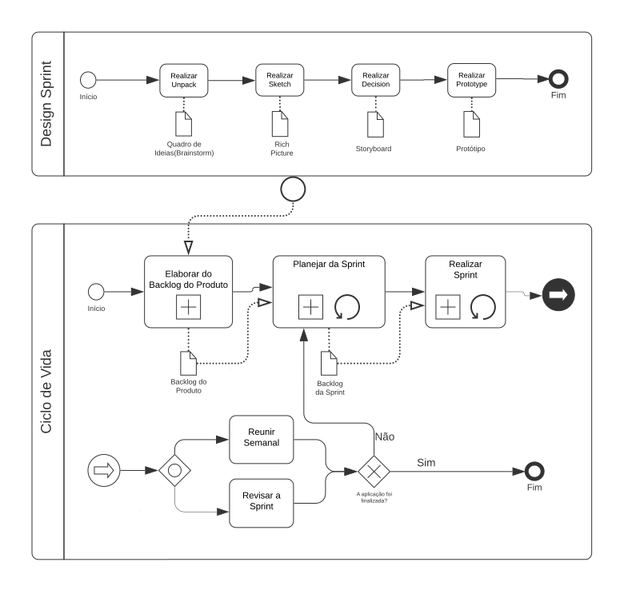

# Modelagem BPMN

## 1. Introdução

O <i>Business Process Model and Notation</i> (BPMN) é uma linguagem de modelagem que possui uma numerosa quantidade de símbolos, que podem ser usados para mapear todos os processos envolvidos em um projeto. O seu principal objetivo é fornecer uma representação que seja facilmente compreensível por todos os envolvidos em um projeto, como descreve a <i>Standards Development Organization</i>(OMG). Ou seja, sua intenção é padronizar um modelo diante de outras notações e pontos de vista diferentes. Com essa padronização, o BPMN fornecerá, não só uma modelagem simples que comunicará essas informações dos processos, como também poderá fornecer uma modelagem complexa e bem detalhada conforme as necessidades da equipe (SGANDERLA, Kelly).

# 2. Metodologia

Nesse artefato buscamos representar os processos que fazem parte do desenvolvimento e do gerenciamento do projeto. Sendo assim, decidimos representar o fluxo da Desing Sprint, que foi usada para levantamentos dos requisitos, o fluxo do ciclo de vida que usaremos, do processo da  Elaboração do Backlog do Produto e do Planejamento da Sprint. Algumas tarefas e subprocessos, como o Planejamento e Revisão da Sprint e as Reuniões Semanais, foram desacoplados do subprocesso Sprint para se adequar a abordagem ágil que adotamos, então optamos por não representá-lo nessa modelagem, visto que ele conterá apenas a fase de implementação.

## 3. Resultados 

* ### Design Sprint & Ciclo de Vida
  
* ### Elaboração do Backlog do Produto 
 
* ### Planejamento da Sprint
  

## 4. Referências

* SGANDERLA, Kelly. Um guia para iniciar estudos em BPMN (I): Atividades e sequência. Blog da iProcess. Disponível em: http://blog.iprocess.com.br/2012/11/um-guia-para-iniciar-estudos-em-bpmn-i-atividades-e-sequencia/. Acesso em: 31 de Julho de 2021.

* SERRANO, Milene. BPMN, 2021. Videoaulas disponibilizadas no moodle da disciplina de Arquitetura e Desenho de Software do curso de Engenharia de Software da UnB, FGA. Acesso em: 01 de Agosto de 2021.

* Business Process Model and Notation (BPMN) Version 2.0.2. OMG (2013). Disponível em: https://www.omg.org/spec/BPMN. Acesso em: 02 de Agosto de 2021.

## 5. Versionamento

| Versão | Data | Descrição | Autor |
| :--: | :--: | -- | :--: |
| 1.0 | 02/08/2021 | Criação do documento | Douglas Castro |
| 1.1 | 02/08/2021 | Adição da Introdução | Douglas Castro |
| 1.2 | 02/08/2021 | Adição da Metodologia | Douglas Castro |
| 1.3 | 03/08/2021 | Adição da modelagem da Design Sprint e do Ciclo de Vida | Douglas Castro |
| 1.4 | 03/08/2021 | Adição da modelagem da Elaboração do Backlog do Produto | Douglas Castro |
| 1.5 | 03/08/2021 | Adição da modelagem do Planejamento da Sprint  | Douglas Castro |
| 1.6 | 04/08/2021 | Atualização da Metodologia e correção nas imagens das modelagens | Douglas Castro |
| 1.7 | 04/08/2021   | Padronização do documento       | Bruno Nunes e Marcos Rodrigues    |
| 1.8 | 04/08/2021   | Correções no documento | Douglas Castro |