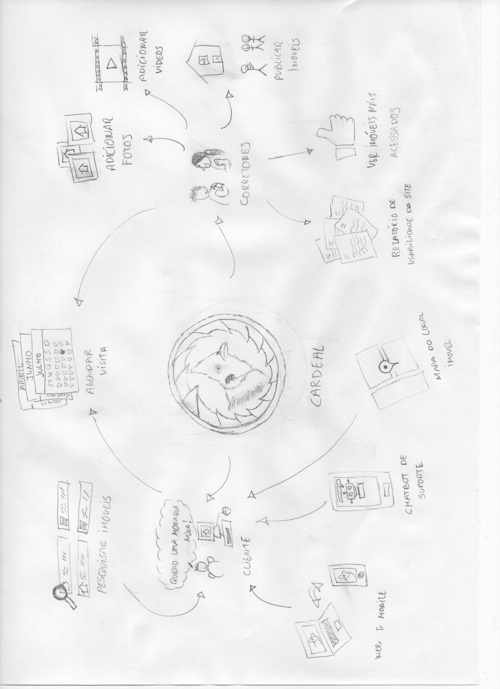
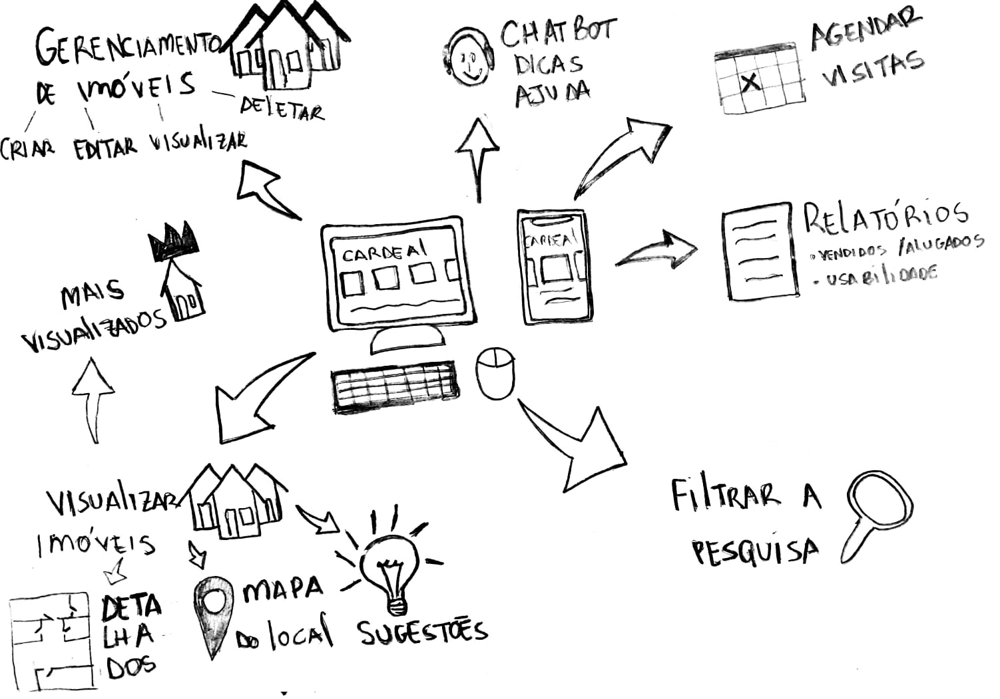
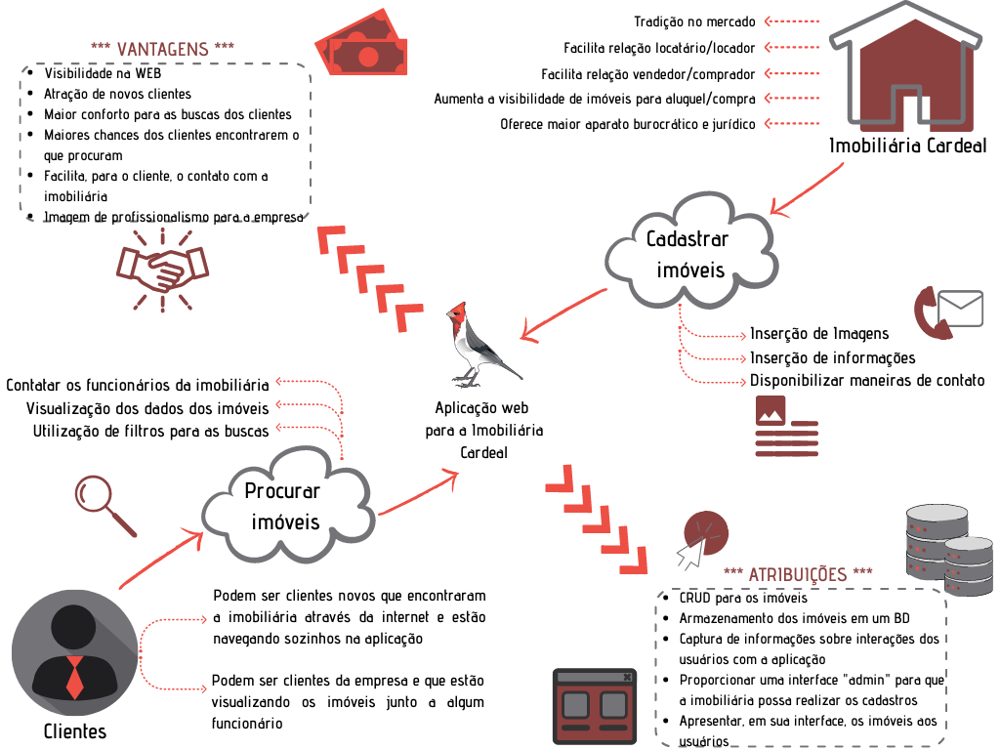
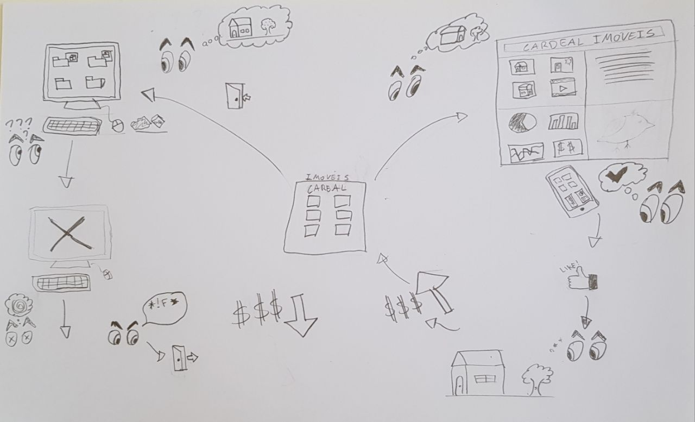
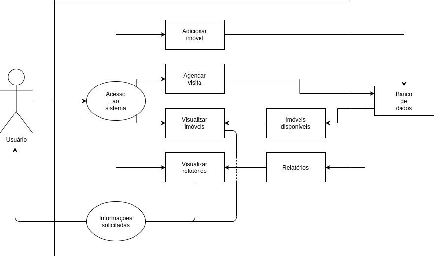
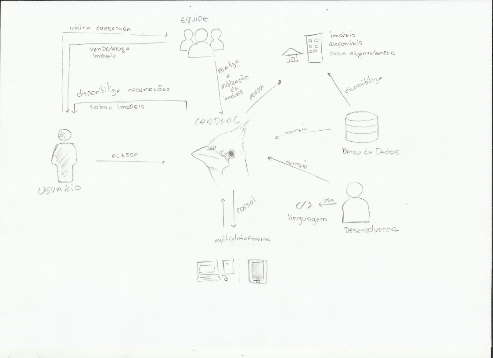

# Rich Picture
## 1. Introdução
O Rich Picture é uma maneira de modelar ideias, e bastante conveniente para ser aplicada em reuniões com clientes ou em equipes de desenvolvimento.
 
Segundo Systems Thinking and Practice, Rich Pictures são usadas para descrever situações complicadas. Eles são uma tentativa de encapsular a situação real por meio de uma representação sem barreiras, em quadrinhos, de todas as ideias já cobertas, layout, conexões, relacionamentos, influências, causa e efeito e assim por diante. Além dessas noções objetivas, os Rich Pictures devem retratar elementos subjetivos, como caráter e características, pontos de vista e preconceitos, espírito e natureza humana. Se estiver trabalhando com um cliente, você deve tentar extraí-los dos próprios atores, pelo menos inicialmente, em vez de se concentrar em sua própria interpretação da situação.
 
Essa técnica é bastante rica pois podemos visualizar mais facilmente os requisitos necessários para a implementação do software.
 
## 2. Metodologia
Para que cada um dos integrantes pudesse desenvolver seu próprio Rich Picture, foi discutido antes, em reunião com toda a equipe, o escopo do projeto, elicitando os requisitos, e a partir do documento [Brainstorm](./brainstorm.md) e da discussão, foi possível adquirir embasamento adequado para criação do Rich Picture. Foi estipulado um tempo determinado para que cada integrante pudesse fazer o seu próprio Rich Picture. Após esse tempo, foi colocado em votação, através de uma enquete no Telegram, todos os desenhos e foi escolhido um entre eles para representar o escopo do projeto.
 
## 3. Participantes
- Bruno Nunes
- Douglas Farias
- Estevão Reis
- Giovana Vitor
- Gustavo D.
- Igor Sousa
- Marcos C.
- Pedro Haick
- Tomás Veloso
## 4. Resultados
A ideia desse Rich Picture foi buscar representar o sistema e a interação dele com os possíveis usuários, desde clientes que desejam comprar ou alugar uma residência, até os corretores que ficarão responsáveis pelo gerenciamento da plataforma.
 
### 4.1 Rich Picture dos integrantes da Equipe
#### Bruno Nunes

#### Douglas Farias

#### Estevão Reis

#### Giovana Vitor

#### Gustavo D.

#### Igor Sousa

#### Marcos C.

#### Pedro Haick

#### Tomás Veloso

 
### 4.2 Conclusão
Após a votação, o desenho escolhido foi o da Giovana Vitor.
 
### 4.3 Rich Picture 1.0

 
## 5. Referências
 
> SERRANO, Milene: Arquitetura e Desenho de software - Aula- Projeto e Desenho de Software. Acessado em 02/08/2021
 
> Systems Thinking and Practice. Disponível em http://systems.open.ac.uk/materials/T552/pages/rich/richAppendix.html. Acessado em 22/08/2021
 
## 6. Versionamento
 
| Data  | Versão | Descrição  | Autor  |Revisor |
| :---- | :----- | :--------- | :----- |:-------|
| 01/08/2021 | 0.1    | Criação dos Rich Pictures | Bruno Nunes, Douglas Farias, Estevão Reis, Giovana Vitor, Gustavo D., Igor Sousa, Marcos C., Pedro Haick, Tomás Veloso| |
| 02/08/2021 | 0.2    | Criação do Documento | Estevao de Jesus Reis| |
| 04/08/2021 | 1.0    | Padronização do documento       | Bruno Nunes e Marcos Rodrigues    | |
| 02/08/2021 | 1.1    | Adição de mais referências para uma melhora no embasamento textual| Estevão Reis| |
| 02/08/2021 | 2.0    | Alteração na estrutura do documento| Estevão Reis| |