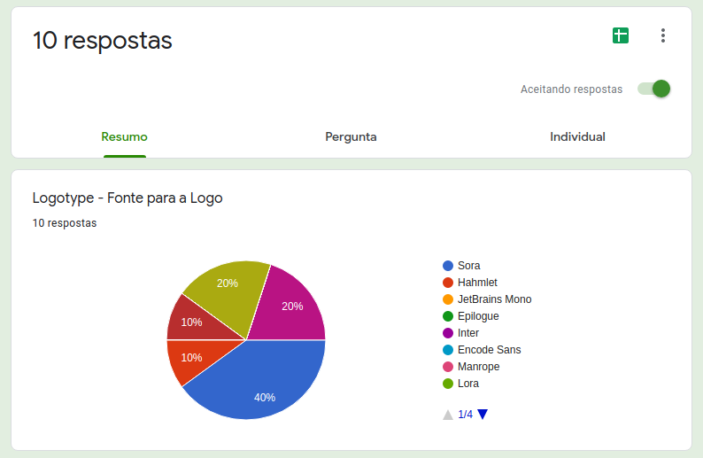
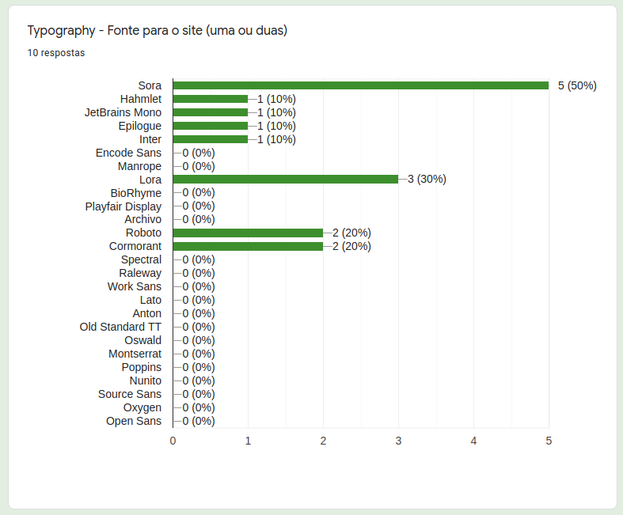
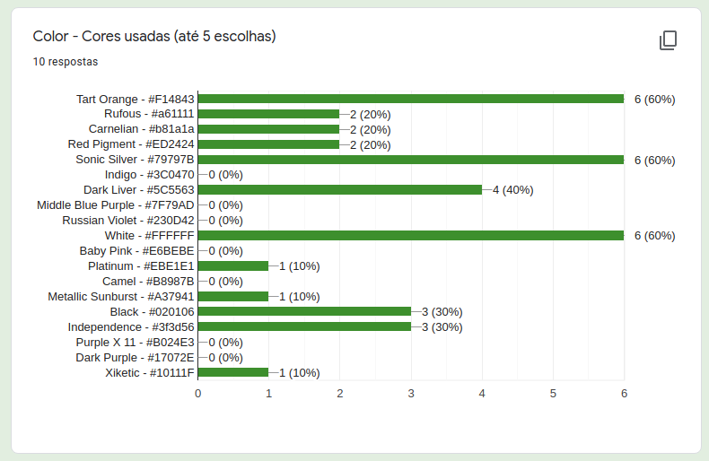
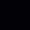

# Debate - Identidade Visual

## 1. Introdução 

Documento que mostra as discussões e os resultados para a decisão sobre a Identidade Visual do projeto.
 

## 2. Metodologia 

 Para as definições sobre a identidade visual, foram desenvolvidos alguns protótipos utilizando a ferramenta <a href="https://www.figma.com/" target="_blank">Figma</a>. Nesse protótipo, foram incluidas fontes disponibilizados por uma <a href="https://www.awwwards.com/20-best-web-fonts-from-google-web-fonts-and-font-face.html" target="_blank">matéria</a> do site <a href="https://www.awwwards.com/" target="_blank">awwwards</a>. As Cores que compõe o símbolo escolhido para o projeto, e cores similares para ter mais opções para a definição. Após a confecção do protótipo, o grupo realizou uma votação para definição da identidade visual através do <a href="https://www.google.com/intl/pt-BR/forms/about/" target="_blank">do google forms</a>.
 
 
### 3. Protótipo

<iframe style="border: 1px solid rgba(0, 0, 0, 0.1);" width="800" height="450" src="https://www.figma.com/embed?embed_host=share&url=https%3A%2F%2Fwww.figma.com%2Fproto%2FDKWzd4WjiCNoDUUINY1U4v%2FUntitled%3Fnode-id%3D6%253A6%26scaling%3Dscale-down-width%26page-id%3D0%253A1" allowfullscreen></iframe>

 <a href="https://www.figma.com/file/DKWzd4WjiCNoDUUINY1U4v/Identidade-Visual-Cardeal?node-id=0%3A1" target="_blank">Link do protótipo</a>, realizado na ferramenta <a href="https://www.figma.com/" target="_blank">Figma</a>.

 <a href="https://www.figma.com/proto/DKWzd4WjiCNoDUUINY1U4v/Identidade-Visual-Cardeal?node-id=6%3A6&scaling=min-zoom&page-id=0%3A1" target="_blank">Link de visualização do protótipo</a>.

 
### 4. Resultados

#### 4.1. Questionários

O questionário representa os tópicos a serem votados e escolhidos como definitivo para a identidade visual.
 

<iframe width="100%" height= "480px" src= "https://docs.google.com/forms/d/e/1FAIpQLSeHq0jPEeEwh4WcMH-Q0Wf7S2QTpO4WtxsHS_WPj0_hh6DWWw/viewform" frameborder= "0" marginwidth= "0" marginheight= "0" style= "border: none; max-height:100vh" allowfullscreen webkitallowfullscreen mozallowfullscreen msallowfullscreen> </iframe> 

#### 4.2. Fonte da Logo

A fonte <a href="https://fonts.google.com/specimen/Sora?query=sora" target="_blank">Sora</a> foi escolhida para a Logo e para o uso no website.
 

<h6 align = "center">Figura 1 - Resultado sobre a fonte da logo, versão 1.0.</h6>

<h6 align = "center">Fonte: Site <a href="https://www.google.com/intl/pt-BR/forms/about/" target="_blank">Google Forms</a></h6> 

#### 4.2. Fonte da Logo

As fontes escolhidas para o Website foram a  <a href="https://fonts.google.com/specimen/Sora?query=sora" target="_blank">Sora</a> e a fonte <a href="https://fonts.google.com/specimen/Lora?query=Cyreal" target="_blank">Lora</a>.
 

<h6 align = "center">Figura 2 - Resultado sobre as fontes para o site, versão 1.0.</h6>

<h6 align = "center">Fonte: Site <a href="https://www.google.com/intl/pt-BR/forms/about/" target="_blank">Google Forms</a></h6> 

#### 4.3. Cores

 Foram escolhidas 5 cores para fazerem parte da identidade visual. A cor que recebeu a maior votação foi trocada por outra para atender questões de estética visual, assim a cor "Dark Liver" foi trocada por "Independence".

<h6 align = "center">Figura 3 - Resultado sobre as fontes para o site, versão 1.0.</h6>

<h6 align = "center">Fonte: Site <a href="https://www.google.com/intl/pt-BR/forms/about/" target="_blank">Google Forms</a></h6>  

| **Cor** | **Nome** | **RGB** | **CMYK** | **WEB** | 
| :---: | :---: | :---: | :---: | :---: | 
|  | Tart Orange | 241, 72, 67 | 0, 70, 72, 5 | #F14843 |
|  | Sonic Silver | 121, 121, 123 | 2, 2, 0, 52 | #79797B |
|  | White | 255, 255, 255 | 0, 0, 0, 0  | #FFFFFF |
|  | Black | 2, 1, 6 | 67, 83, 0, 98 | #020106 |
|   | Independence | 63, 61, 86 | 27, 29, 0, 66 | #3f3d56 |

### 4.4. Participantes

 Todos os membros da equipe participaram da equete sobre a Identidade Visual.

<h6 align = "center">Figura 4 - Participantes da enquete, versão 1.0.</h6>

<h6 align = "center">Fonte: Site <a href="https://www.google.com/intl/pt-BR/forms/about/" target="_blank">Google Forms</a></h6> 

## 5. Referências

* [awwwards: 20 Best Google Web Fonts](https://www.awwwards.com/20-best-web-fonts-from-google-web-fonts-and-font-face.html), acessado dia 18 de agosto de 2021. 

* [awwwards: The awards of design, creativity and innovation on the internet](https://www.awwwards.com/), acessado dia 18 de agosto de 2021. 

* [Coolors: Create the perfect palette or get inspired by thousands of beautiful color schemes.](https://coolors.co/), acessado dia 18 de agosto de 2021.

* [Fonts Google: Font Lora, designed by Cyreal](https://fonts.google.com/specimen/Lora?query=lora#standard-styles), acessado dia 18 de agosto de 2021.

* [Fonts Google: Font Sora, designed by Jonathan Barnbrook, Julián Moncada](https://fonts.google.com/specimen/Sora?query=sora), acessado dia 18 de agosto de 2021.

* [Google Forms: Crie lindos formulários](https://fonts.google.com/specimen/Sora?query=sora), acessado dia 18 de agosto de 2021.

* [Figma: the collaborative interface design tool.](https://www.figma.com), acessado dia 18 de agosto de 2021.

## 6. Versionamento 

| Data | Versão | Descrição | Autor(es) | 
| :----: | :----: | :----: | :----: | 
| 18/08/2021 | 1.0 | Criação do documento | [Tomás Veloso](https://github.com/tomasvelos0) | 
| 18/08/2021 | 1.1    | Debate e escolha da identidade visual       | [Todos os membros](https://unbarqdsw2021-1.github.io/2021.1_G04_Cardeal/)  |