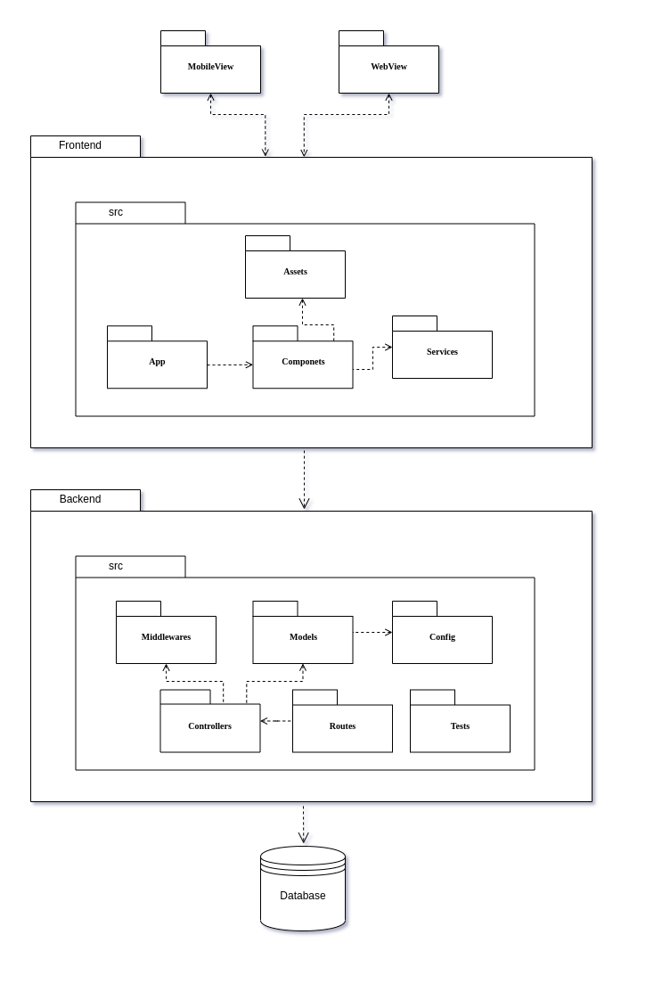

# Diagrama de Pacotes

## 1.Introdução

O diagrama de pacotes é um diagrama estrutural estático usado para representar e organizar a visão do sistema. Agrupando as estruturas da construção UML, representando de forma hierárquica os pacotes, subpacotes e suas relações, mostrando de forma genérica vários elementos do sistema.
 

## 2.Metodologia

O diagrama de pacotes é recomendado para oferecer uma visão de mais alto nível do modelo do sistema, onde mostra apenas um grupo de classe. Para a criação do diagrama de pacotes foi usado a ferramenta <a href="https://drawio-app.com/" target="_blank">Draw.io</a>, para demonstrar os nomes dos pacotes (em negrito) e as relações entre os pacotes.
 

## 3.Diagrama de Pacotes

<h6 align = "center">Figura 1 - Diagrama de pacotes, versão 1.0.</h6>

<h6 align = "center">Fonte: Site <a href="https://drawio-app.com/" target="_blank">Draw.io</a></h6> 

## 4.Referência

* [Draw.io: The easiest way for Confluence teams to collaborate using diagrams](https://drawio-app.com/), acessado dia 20 de agosto de 2021.

* [The Unified Modeling Language](https://www.uml-diagrams.org/multi-layered-web-architecture-uml-package-diagram-example.html), acessado dia 20 de agosto de 2021.

* [UFM: GlossarioUML](https://homepages.dcc.ufmg.br/~amendes/GlossarioUML/glossario/conteudo/pacotes/pacote.htm), acessado dia 20 de agosto de 2021.

> VALENTE, Marco. **Engenharia de Software Moderna**. Princípios e práticas para desenvolvimento de software com produtividade. Belo Horizonte, 10 de fevereiro de 2020.

* Rodrigues Barcelar, Ricardo. **Engenharia de Software Moderna**. Modelagem de Sistemas Orientada a Objetos com UML.

> **UML - Unified**. Linguagem de Modelagem Unificada em Português.

## 5.Versionamento

| Data | Versão | Descrição | Autor(es) | 
| :----: | :----: | :----: | :----: | 
| 20/08/2021 | 1.0 | Criação do documento | [Tomás Veloso](https://github.com/tomasvelos0) | 
