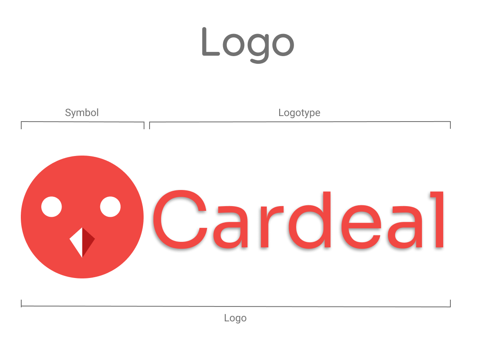
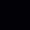

# Identidade Visual

## 1. Introdução 

A identidade visual é importante para definir parâmetros visuais do projeto em desenvolvimento. Assim, o conjunto de elementos que compõe a identidade visual, são as cores, tipografia, logo e símbolo.
 

## 2. Metodologia 

 Para a montagem da identidade visual, primeiro foi escolhido o nome e o símbolo do projeto, escolhido pelos membros na <a href="https://unbarqdsw2021-1.github.io/2021.1_G04_Cardeal/desenhoSoftwareBase/designSprint/">Design Sprint</a>, por possuírem características comuns com o projeto da equipe. A escolha das cores foi realizada em cima das cores que compõe o símbolo escolhido, o pássaro cardeal, e depois utilizando a ferramenta de palheta de cores para buscar cores similares, a ferramenta <a href="https://coolors.co/" target="_blank">Coolors</a> foi usada para buscar cores análogas e o resultado dessa consulta foi debatido pelos membros para escolher as cores em definitivo. A metodologia usada para definir a tipografia, foi realizada uma votação pelos membros entre as melhores fontes abertas disponibilizados por uma <a href="https://www.awwwards.com/20-best-web-fonts-from-google-web-fonts-and-font-face.html" target="_blank">matéria</a> do site <a href="https://www.awwwards.com/" target="_blank">awwwards</a>, site reponsável por divulgação de projetos de web design profissional.
 
 
### 3. Logo

 Logo é um símbolo de identificação para a empresa ou marca. A logo do projeto é o símbolo do pássaro cardeal, a escolha do nome e do símbolo, realizada no momento de debate sobre o nome do projeto, escolhido por sua características semelhantes à ideia do projeto, um pássaro que se adapta bem ao novo ambiente, que representaria os clientes que acessam o site Cardeal para buscar novo local para morar.

<h6 align = "center">Figura 1 - Logo, versão 1.0.</h6>

<h6 align = "center">Fonte: Site Figma</h6> 
 
### 4. Tipografia

 Tipografia é o formato e o arranjo das palavras, define a composição visual dos textos. A tipografia escolhida para o projeto foi divida em duas partes, a prima parte representa a fonte que compõe a Logo, a fonte escolhida foi <a href="https://fonts.google.com/specimen/Sora?query=sora" target="_blank">Sora</a>, e a segunda parte representa as fontes usadas no website, escolhidas duas fontes <a href="https://fonts.google.com/specimen/Sora?query=sora" target="_blank">Sora</a> e <a href="https://fonts.google.com/specimen/Lora?query=lora#standard-styles" target="_blank">Lora</a>.

### 4.1. Fonte - Sora

A fonte <a href="https://fonts.google.com/specimen/Sora?query=sora" target="_blank">Sora</a> foi escolhida para a Logo e para o uso no website.

Mais informações sobre a fonte e licença de uso dinponibilizados pelo site <a href="https://fonts.google.com/specimen/Sora?query=Jonathan+Barnbrook" target="_blank">fonts.google</a>

<h6 align = "center">Figura 2 - Representação da fonte Sora, versão 1.0.</h6>

<h6 align = "center">Fonte: Site <a href="https://www.figma.com/" target="_blank">Figma</a></h6> 

### 4.1. Fonte - Lora

A fonte <a href="https://fonts.google.com/specimen/Lora?query=Cyreal" target="_blank">Lora</a> foi escolhida para o uso no website.

Mais informações sobre a fonte e licença de uso dinponibilizados pelo site <a href="https://fonts.google.com/specimen/Sora?query=Jonathan+Barnbrook" target="_blank">fonts.google</a>

<h6 align = "center">Figura 3 - Representação da fonte Lora, versão 1.0.</h6>

<h6 align = "center">Fonte: Site <a href="https://www.figma.com/" target="_blank">Figma</a></h6> 

### 5. Cores

 A cor possui sua influência na psicologia humana, e as escolhas das core representam o tipo de mensagem que deseja transmitir. A escolha das cores foi realizada nas cores que compõe o símbolo do projeto e buscando cores análogas ao resultado para possuir maior váriações de cores, para essa consulta foi realizada por meio do site <a href="https://coolors.co/" target="_blank">Coolors</a>. Escolhidos apenas 4 cores para compor o projeto, para possuir um visual mais limpo.
 

### 5.1. Cores Principais

 As cores principais representam as cores que serão usadas no desenvolvimento da proposta de software.

<h6 align = "center">Figura 4 - Cores principais, versão 1.0.</h6>

<h6 align = "center">Fonte: Site <a href="https://coolors.co/f14843-79797b-ffffff-020106-3f3d56" target="_blank">Coolors</a></h6> 

| **Cor** | **Nome** | **RGB** | **CMYK** | **WEB** | 
| :---: | :---: | :---: | :---: | :---: | 
|  | Tart Orange | 241, 72, 67 | 0, 70, 72, 5 | #F14843 |
|  | Sonic Silver | 121, 121, 123 | 2, 2, 0, 52 | #79797B |
|  | White | 255, 255, 255 | 0, 0, 0, 0  | #FFFFFF |
|  | Black | 2, 1, 6 | 67, 83, 0, 98 | #020106 |
|   | Independence | 63, 61, 86 | 27, 29, 0, 66 | #3f3d56 |

### 5.2. Cores Secundárias

 As cores secundárias representam as tonalidades diferentes das cores principais, para usar tons diferentes no projeto.

<h6 align = "center">Figura 5 - Cores secundárias, versão 1.0.</h6>

<h6 align = "center">Fonte: Site <a href="https://coolors.co/" target="_blank">Coolors</a></h6> 

### 6. Identidade Visual

<h6 align = "center">Figura 6 - Cardeal Identidade Visual, versão 1.0.</h6>

<h6 align = "center">Fonte: Site <a href="https://www.figma.com/" target="_blank">Figma</a></h6> 

## 7. Referências

* [awwwards: 20 Best Google Web Fonts](hhttps://www.awwwards.com/20-best-web-fonts-from-google-web-fonts-and-font-face.html), acessado dia 18 de agosto de 2021. 

* [awwwards: The awards of design, creativity and innovation on the internet](https://www.awwwards.com/), acessado dia 18 de agosto de 2021. 

* [Coolors: Create the perfect palette or get inspired by thousands of beautiful color schemes.](https://coolors.co/), acessado dia 18 de agosto de 2021.

* [Fonts Google: Font Lora, designed by Cyreal](https://fonts.google.com/specimen/Lora?query=lora#standard-styles), acessado dia 18 de agosto de 2021.

* [Fonts Google: Font Sora, designed by Jonathan Barnbrook, Julián Moncada](https://fonts.google.com/specimen/Sora?query=sora), acessado dia 18 de agosto de 2021.

* [github: Arquitetura-desenho - A monitoria](https://2019-2-arquitetura-desenho.github.io/wiki/dinamica_seminario_II/identidade_visual/), acessado dia 18 de agosto de 2021.

## 8. Versionamento 

| Data | Versão | Descrição | Autor(es) | 
| :----: | :----: | :----: | :----: | 
| 18/08/2021 | 1.0 | Criação do documento | [Tomás Veloso](https://github.com/tomasvelos0) | 
| 18/08/2021 | 1.1    | Debate e escolha da identidade visual       | [Todos os membros](https://unbarqdsw2021-1.github.io/2021.1_G04_Cardeal/)  |