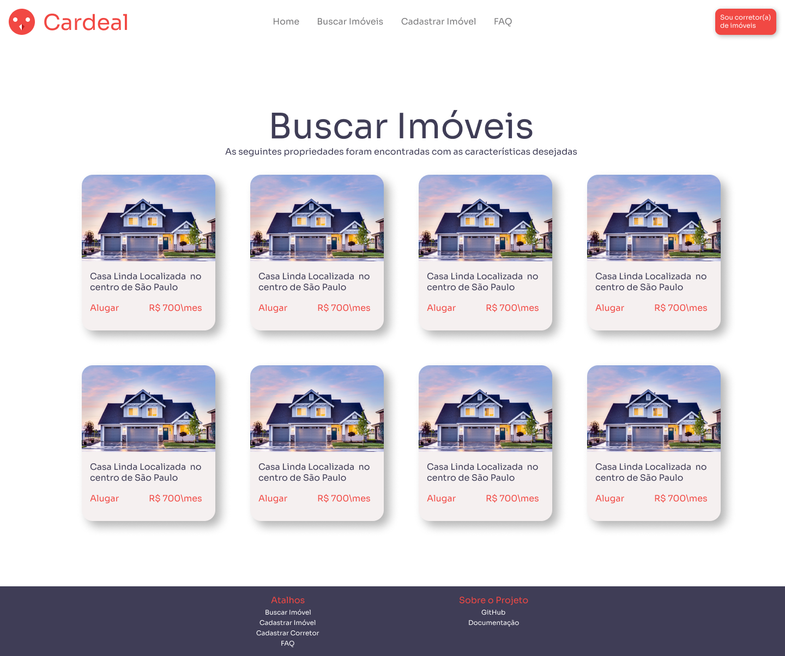

# Protótipo de Alta fidelidade
 
## 1. Introdução
Segundo o artigo "Prototipagem de alta fidelidade: o que é, quando, por que e como usar?", escrito pelo instituto de educação Tera, um protótipo de alta fidelidade (às vezes chamado de high-fi ou hi-fi) é uma representação interativa do produto, baseada no computador ou em dispositivos móveis. Esse protótipo já apresenta maior semelhança com o design final em termos de detalhes e funcionalidade.
 
O “high” em alta fidelidade refere-se ao nível de abrangência, que permite examinar questões de usabilidade em detalhes e tirar conclusões sobre o comportamento da pessoa usuária que testa o protótipo.
 
Os protótipos de alta fidelidade abrangem não apenas a interface da pessoa usuária (UI) do produto em termos visuais e estéticos, mas também os aspectos da experiência do(a) usuário(a) (UX) em termos de interações, fluxo e comportamento.
 
## 2. Metodologia
Para desenvolver o protótipo de alta fidelidade, os integrantes do grupo Estevão Reis, Pedro Haick e Tomás Veloso, se reuniram para definir e desenvolvê-lo. Para desenvolver o protótipo, os integrantes do grupo consultaram os documentos de [Brainstorm](../desenhoSoftwareBase/brainstorm.md), [Rich Picture](../desenhoSoftwareBase/richPicture.md) e [Identidade Visual](./identidadeVisual.md) . Baseado nesses documentos foi desenvolvido no software de prototipação Figma o protótipo de alta fidelidade. Após o desenvolvimento completo de todas as telas, foi enviado a todos os membros da equipe as imagens do protótipo com a finalidade de validar todo o trabalho. Com todos os membros da equipe satisfeitos com o resultado, foi concluída a tarefa de prototipação do site.
 
## 3. Resultados
### 3.1. Páginas
Essas foram as telas desenvolvidas:
#### 3.1.1. Home

#### 3.1.2. Busca de Imóveis

#### 3.1.3. Lista de Imóveis

#### 3.1.4. Detalhes do Imóvel

#### 3.1.5. Cadastro de Corretor

#### 3.1.6. Cadastro do Imóvel

#### 3.1.7. Lista de Imóveis Cadastrados por um Corretor

#### 3.1.8. Lista de Visitas Agendadas

#### 3.1.9. Formulário Genérico para se basear

### 3.1.10. Guia de estilo
Esse foi o gia de estilo criado para nos basearmos no desenvolvimento da interface do site.

 
 
## 4. Referências
> "Prototipagem de alta fidelidade: o que é, quando, por que e como usar?". Disponível em: https://medium.com/somos-tera/prototipagem-de-alta-fidelidade-635d745b662b. Acessado em 22/08/2021.
 
>unDraw. Disponível em https://undraw.co/. Acessado em 19/08/2021
 
>dribbble. Disponível em https://dribbble.com/. Acessado em 19/08/2021
 
>ICONS8. Disponível em https://icons8.com.br/. Acessado em 19/08/2021
 
>freeicons.io. Disponível em https://freeicons.io/. Acessado em 19/08/2021
 
>QUINTOANDAR. Disponível em https://www.quintoandar.com.br. Acessado em 19/08/2021
 
>"How to not get in trouble when branding your app with red". Disponível em https://uxdesign.cc/branding-your-app-with-red-a7df0b6b0e54. Acessado em 19/08/2021
 
>"When your brand isn’t broken: elegant error handling for sites with red logos". Disponível em https://medium.com/product-labs/when-your-brand-isn-t-broken-elegant-error-handling-for-apps-with-red-logos-f0d619c14758. Acessado em 19/08/2021

## 5. Versionamento
| Data | Versão | Descrição | Autor(es) |
| :--: | :--: | -- | :--: |
| 19/08/2021 | 1.0 | Desenvolvimento do protótipo |  Estevao Reis, Pedro Haick e Tomás Veloso |
| 19/08/2021 | 1.1 | Criação do documento |  Estevao Reis, Pedro Haick e Tomás Veloso |
| 22/08/2021 | 1.2 | Revisão e Padronização do documento |  Douglas Castr, Giovana Dionísio|
 