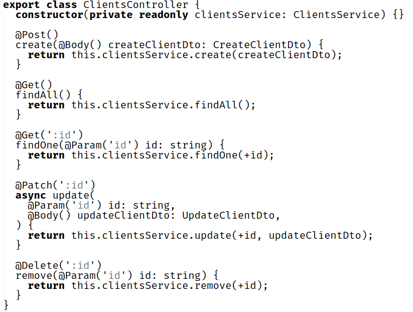
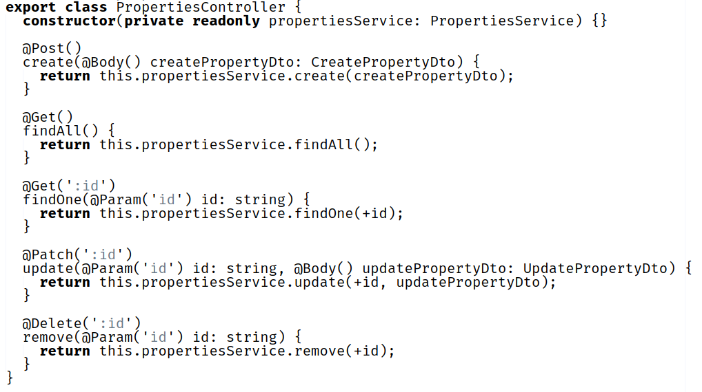

# Padrões de Software para Atribuição de Responsabilidade Geral - GRASP

## 1. Introdução

&emsp;&emsp;Para Larman, os padrões GRASP <i>"nomeiam e descrevem princípios fundamentais de atribuição de responsabilidade a objetos"</i> (LARMAN, 2000). Criador, especialista, controlador, invenção pura, indireção, alta coesão, baixo aclopamento, polimorfismo e variações protegidas são alguns desses padrões e princípios descritos utilizados no GRASP.
 

## 2. Criador 

## 3. Controlador

&emsp;&emsp;O padrão controlador <i>"é um objeto de interface, não-de-usuário responsável por tratar um evento de sistema. Um controller define o método para a operação de sistema"</i> (LARMAN, 200). Normalmente, um controlador deve delegar a outros objetos o trabalho que precisa ser feito, ou seja, ele coordena ou controla uma atividade, mas não trabalha sozinho.

&emsp;&emsp;Dessa forma, um erro comum em projeto de controladores é dar-lhes muitas responsabilidades. Por isso, é uma boa prática delegar a outros objetos a execução de um evento, enquanto ele coordena a atividade(LARMAN, 2000). Alguns benefícios que os controladores trazem para uma aplicação é o maior potencial para reutilização e interfaces mais conectáveis.

### 3.1. Metodologia

&emsp;&emsp;A partir das <i><a href="https://unbarqdsw2021-1.github.io/2021.1_G04_Cardeal/padroesDeProjeto/atas/30-08-21/" target="_blank">discussões</a></i> em equipe ocorrida no dia 30/08/2021, foi definido três padrões GRASP que seriam coerentes de se aplicar no nosso projeto. São eles: Criador, Controlador e Polimorfismo. Foi usado como insumo para os diagramas e implementações desses padrões o <i><a href="https://unbarqdsw2021-1.github.io/2021.1_G04_Cardeal/modelagem/diagrama_classes/" target="_blank">Diagrama de Classes</a></i>.
 
  
&emsp;&emsp;Para a construção dos diagramas foi usado a ferramenta [Draw.io](https://draw.io).

### 3.2. Aplicação no Projetos

&emsp;&emsp;Os controladores implementados na nossa aplicação são os responsáveis por receber as requisições do browser. Por ter muitas atividades na aplicação e para evitar o "inchaço" de um controlador de fachada, optamos por implementar um controlador para cada classe concreta, onde esses ficaram responsáveis por coordenar as requisições recebidas por cada classe.

#### 3.2.1. Diagrama

Autor: Douglas Castro

#### 3.2.2. Controlador de Clientes

Autores: Douglas Castro e Pedro Haick

O código acima pode ser visto com mais detalhes [aqui](https://github.com/UnBArqDsw2021-1/2021.1-g04-cardeal-back-end/blob/feature/sistema_de_cliente/src/modules/clients/clients.controller.ts).

#### 3.2.3. Diagrama

Autor: Douglas Castro

#### 3.2.4. Controlador de Propriedades

Autores: Bruno Nunes e Gustavo Duarte

O código acima pode ser visto com mais detalhes [aqui](https://github.com/UnBArqDsw2021-1/2021.1-g04-cardeal-back-end/blob/feature/US04/src/properties/properties.controller.ts).

## 4. Polimorfismo 

## 5. Especialista na Informação

## 6. Alta Coesão

## 7. Baixo Acoplamento

## 8. Indireção

## 9. Fabricação ou Invenção Pura

## 10. Variações Protegidas

## 11. Referências

- Larman, Craig. Utilizando UML e padrões. Bookman Editora, 2000.

## 12. Versionamento
| Data       | Versão | Descrição         | Autores       |
| ---------- | ------ | ----------------- | ------------- |
| 30/08/2021 | 0.1 | Criação do arquivo| Estevao Reis  |
| 15/09/2021 | 0.2 | Adição da estrutura do documento| Douglas Castro |
| 16/09/2021 | 0.3 | Adição da introdução | Douglas Castro |
| 16/09/2021 | 0.4 | Adição da metodologia usada para o controlador | Douglas Castro |
| 17/09/2021 | 0.5 | Adição da controladores | Douglas Castro, Bruno Nunes, Pedro Haick e Gustavo Duarte |
| 17/09/2021 | 0.6 | Revisão do Controlador | Giovana Dionisio |