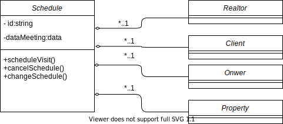
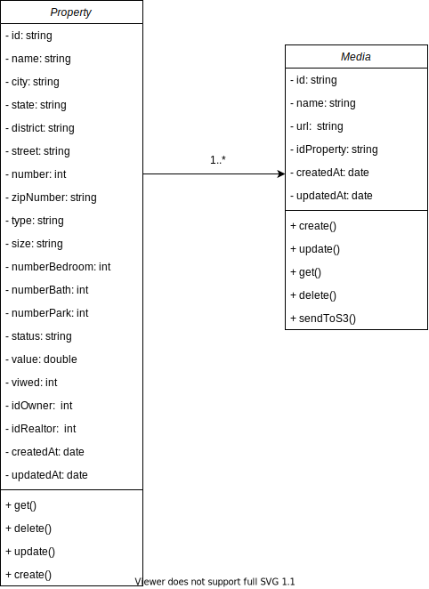
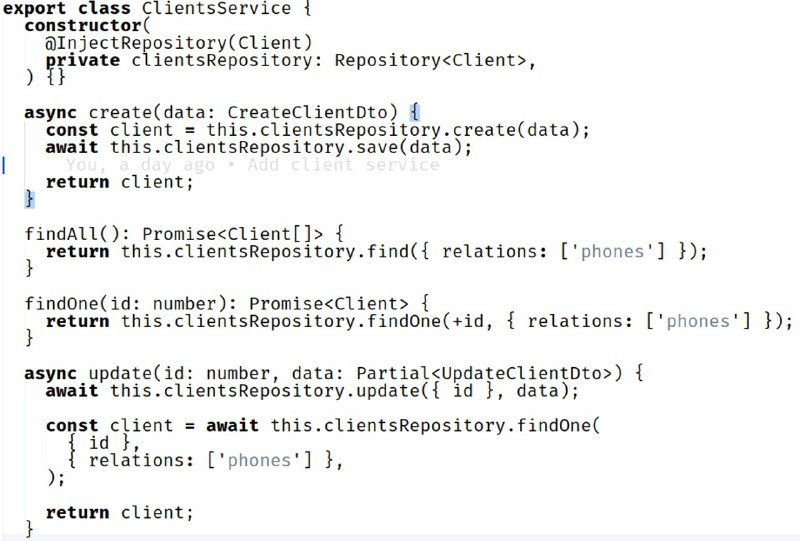

# Padrões de Software para Atribuição de Responsabilidade Geral - GRASP
 
## 1. Introdução
 

&emsp;&emsp;Para Larman, os padrões GRASP <i>"nomeiam e descrevem princípios fundamentais de atribuição de responsabilidade a objetos"</i> (LARMAN, 2000). Criador, especialista, controlador, invenção pura, indireção, alta coesão, baixo acoplamento, polimorfismo e variações protegidas são alguns desses padrões e princípios descritos utilizados no GRASP.

 
## 2. Criador
&emsp;&emsp;Segundo Larman em seu livro "Utilizando UML e Padrões"
O GRASP Criador vem para resolver o seguinte problema;
 
&emsp;&emsp;*Quem deve ser responsável pela criação de uma nova instância de uma classe?*
 
&emsp;&emsp;Em seu livro ele diz que a criação de objetos é uma das atividades mais comuns em um sistema orientado a objetos. Consequentemente, é útil ter um princípio geral para a atribuição de responsabilidades de criação. Sendo essas responsabilidades bem atribuídas, o projeto apresentará acoplamento baixo, mais clareza, encapsulamento e reutilização.
 
&emsp;&emsp;O Criador propõe atribui à classe B a responsabilidade de criar uma instância da classe A se uma das seguintes condições for verdadeira:
 
- B “contém” A ou agrega A de modo composto.
- B registra A.
- B usa A de maneira muito próxima.
- B tem os dados iniciais de A, que serão passados para A quando ele for criado. Assim, B é um Especialista em relação à criação de A.
 
&emsp;&emsp;B é um criador de objetos de A. Se mais de uma opção se aplicar, prefira uma classe B que agregue ou contenha a
classe A.
 
### 2.1. Metodologia
&emsp;&emsp;A partir das discussões em equipe ocorrida no dia [30/08/2021](./atas/30-08-21.md), foi definido três padrões GRASP que seriam coerentes de se aplicar no nosso projeto. São eles: Criador, Controlador e Polimorfismo. Foi usado como insumo para os diagramas e implementações desses padrões o [Diagrama de classes](../modelagem/diagrama_classes.md).
 
#### 2.1. Aplicação no Projeto
&emsp;&emsp;Em nosso projeto esse GRASP é aplicável, a medida que a aplicação fará uso de agendamentos de visita ao imóvel, como pode ser conferido em nosso [Backlog](../modelagem/backlog_do_produto.md). A classe responsável pelo agendamento, como é visto no [Diagrama de classes](../modelagem/diagrama_classes.md),  precisa obter informações do imóvel, proprietário, corretor e cliente para registrar o agendamento adequadamente. Portanto a classe Schedule, será responsável por instanciar as classes Client, Owner, Realtor, Property, havendo uma relação de agregação entre o Schedule e os outros, como é visto na imagem a seguir:
 

 
&emsp;&emsp;Além disso, consultando o [Diagrama de classes](../modelagem/diagrama_classes.md), é visto que a classe Property utiliza a classe Media, que é responsável por instâncias as referências de quaisquer mídias envolvidas à propriedade. Portanto é responsabilidade da classe Property instanciar a classe Media, havendo uma relação de uma associação entre elas como é visto na imagem a seguir:
 

 
## 3. Controlador

&emsp;&emsp;O padrão controlador <i>"é um objeto de interface, não-de-usuário responsável por tratar um evento de sistema. Um controller define o método para a operação de sistema"</i> (LARMAN, 2000). Normalmente, um controlador deve delegar a outros objetos o trabalho que precisa ser feito, ou seja, ele coordena ou controla uma atividade, mas não trabalha sozinho.

 

&emsp;&emsp;Dessa forma, um erro comum em projeto de controladores é dar-lhes muitas responsabilidades. Por isso, é uma boa prática delegar a outros objetos a execução de um evento, enquanto ele coordena a atividade(LARMAN, 2000). Alguns benefícios que os controladores trazem para uma aplicação é o maior potencial para reutilização e interfaces mais conectáveis.

 
### 3.1. Metodologia
 

&emsp;&emsp;A partir das <i><a href="https://unbarqdsw2021-1.github.io/2021.1_G04_Cardeal/padroesDeProjeto/atas/30-08-21/" target="_blank">discussões</a></i> em equipe ocorrida no dia 30/08/2021, foi definido três padrões GRASP que seriam coerentes de se aplicar no nosso projeto. São eles: Criador, Controlador e Polimorfismo. Foi usado como insumo para os diagramas e implementações desses padrões o <i><a href="https://unbarqdsw2021-1.github.io/2021.1_G04_Cardeal/modelagem/diagrama_classes/" target="_blank">Diagrama de Classes</a></i>.

 &emsp;&emsp;Para a construção dos diagramas foi usado a ferramenta [Draw.io](https://draw.io).
 
### 3.2. Aplicação no Projeto
 

&emsp;&emsp;Os controladores implementados na nossa aplicação são os responsáveis por receber as requisições do browser. Por ter muitas atividades na aplicação e para evitar o "inchaço" de um controlador de fachada, optamos por implementar um controlador para cada classe concreta, onde esses ficaram responsáveis por coordenar as requisições recebidas por cada classe.

 
#### 3.2.1. Diagrama
 

 

Autor: Douglas Castro

 
#### 3.2.2. Controlador de Clientes
 

 

Autores: Douglas Castro e Pedro Haick

 
O código acima pode ser visto com mais detalhes [aqui](https://github.com/UnBArqDsw2021-1/2021.1-g04-cardeal-back-end/blob/feature/sistema_de_cliente/src/modules/clients/clients.controller.ts).
 
#### 3.2.3. Diagrama
 

 

Autor: Douglas Castro

 
#### 3.2.4. Controlador de Propriedades
 

 

Autores: Bruno Nunes e Gustavo Duarte

 
O código acima pode ser visto com mais detalhes [aqui](https://github.com/UnBArqDsw2021-1/2021.1-g04-cardeal-back-end/blob/feature/US04/src/properties/properties.controller.ts).
 
## 4. Polimorfismo

&emsp;&emsp;Polimorfismo corresponde ao padrão de projeto que determina que "as responsabilidades devem ser atribuídas a abstrações e não a objetos concretos, permitindo que eles possam variar conforme a necessidade" (BOAS, 2019). Ou seja, ao aplicar-se o polimorfismo, cria-se uma interface que possa ser implementada por classes diferentes mas que compartilhem certos comportamentos e características. 

&emsp;&emsp;Esse padrão de projeto é vantajoso por proporcionar redução de código, além de flexibilizá-lo (MEDEIROS, 2012), possibilitando a criação de novas classes que realizam a mesma operação polimórfica, sem causar muito impacto para as outras classes dependentes da interface implementada (BASSETTO, 2011). 

 
### 4.1 Metodologia

&emsp;&emsp;Na reunião do dia <i><a href="https://unbarqdsw2021-1.github.io/2021.1_G04_Cardeal/padroesDeProjeto/atas/30-08-21/" target="_blank">30/08/2021</a></i>, foi acordada pela equipe a aplicação deste padrão no nosso projeto por ser coerente ao nosso trabalho, além ser relativamente simples de ser aplicado. 

 
### 4.2 Aplicação no projeto

&emsp;&emsp;O Polimorfismo foi aplicado em nosso projeto na criação da classe "Person", que serve como uma interface para as classes "Realtor" e "Client". Ambas as classes dependentes possuem os métodos de <i>create</i>, <i>update</i>, <i>delete</i> e <i>get</i>, que foram adicionados à interface principal. 

 
#### 4.2.1 Diagrama

 

Autores: Estevão Reis e Igor Araujo

 
## 5. Especialista na Informação
&emsp;&emsp;Segundo Larman em seu livro "Utilizando UML e Padrões"
O GRASP Especialista na Informação vem para resolver o seguinte problema;
 
&emsp;&emsp;*Qual é um princípio geral de atribuição de responsabilidades a objetos?*
 
&emsp;&emsp;Em seu livro, ele diz que um modelo de projeto pode criar diversas classes de software, e, por sua vez, uma aplicação pode demandar a satisfação de milhares de responsabilidades a serem executadas. Durante o momento de planejamento e desenho dos objetos, quando o relacionamento entre objetos são definidas, deve-se fazer escolhas sobre atribuição de responsabilidades a classes de software. Fazendo isso de forma adequada, os sistemas tendem a ser mais fáceis de entender, de manter e de estender, permitindo mais oportunidades de reúso de componentes em futuras aplicações.
 
&emsp;&emsp;Portanto, o GRAPS Especialista vem trazendo essa solução em sua implementação:
 
&emsp;&emsp;*Atribua responsabilidade ao especialista na informação – a classe que tem a informação necessária para satisfazer a responsabilidade.*
 
### 5.1.Metodologia
&emsp;&emsp;Inicialmente a equipe não havia optado pela aplicação desse padrão em nosso projeto. Entretanto, na reunião ocorrida em [17/09/2021](./atas/17-09-21.md), a equipe decidiu descrever sobre todos os padrẽs GRASPS, mesmo não sendo aplicados no projeto, para fins didáticos, enriquecendo mais ainda a documentação.
 
&emsp;&emsp;Para a construção dos diagramas foi usado a ferramenta [Draw.io](https://draw.io).
 
### 5.2. Aplicação no projeto
&emsp;&emsp; Até o momento não foi identificado na aplicação a utilização deste GRASP, porém caso seja identificado a necessidade de ser utilizado, será documentada nesta parte do documento
 
## 6. Alta Coesão
&emsp;&emsp;Segundo Larman em seu livro "Utilizando UML e Padrões"
O GRASP Alta Coesão vem para resolver o seguinte problema;
 
&emsp;&emsp;*Como manter os objetos bem focados, inteligíveis e gerenciavéis e como efeito colateral apoiar Acoplamento Baixo?*
 
&emsp;&emsp;Segundo Larman, se tratando de termos de projeto de objetos, a coesão é uma forma de medir o quanto as responsabilidades de um componente estão fortemente relacionadas e focalizadas. Um componente com responsabilidades altamente relacionadas e que não consegue realizar uma grande quantidade de tarefas tem coesão alta. Esses elementos incluem classes, subsistemas entre outros.
 
&emsp;&emsp;Portanto, este padrão soluciona o problema da seguinte forma:
 
&emsp;&emsp;*Atribuir uma responsabilidade de forma que a coesão permaneça alta.*
 
&emsp;&emsp;Uma classe com baixa coesão faz muitas coisas não associadas a ela e trabalha de forma desnecessária e indevida. Tais classes são inconvenientes pois enfrentam os seguintes problemas:
 
- são difíceis de compreender
 
- são difíceis de reutilizar
 
- são difíceis de manter
 
- são delicadas; constantemente afetadas por modificações
 
&emsp;&emsp;As classes com coesão baixa geralmente representam um grau de abstração muito alto e de “grande granularidade”, ou então assumiram responsabilidades que deveriam ter sido delegadas a outros objetos.
 
### 6.1.Metodologia
&emsp;&emsp;Inicialmente a equipe não havia optado pela aplicação desse padrão em nosso projeto. Entretanto, na reunião ocorrida em [17/09/2021](./atas/17-09-21.md), a equipe decidiu descrever sobre todos os padrẽs GRASPS, mesmo não sendo aplicados no projeto, para fins didáticos, enriquecendo mais ainda a documentação.
 
### 6.2. Aplicação no projeto
&emsp;&emsp; Até o momento não foi identificado na aplicação a utilização deste GRASP, porém caso seja identificado a necessidade de ser utilizado, será documentada nesta parte do documento
 
 
## 7. Baixo Acoplamento

&emsp;&emsp;O termo "acoplamento" se refere ao nível de conexão (ou dependência) de um elemento a outros (DE LIMA, 2015). Logo, quanto maior o acoplamento entre classes de um projeto, mais difícil se torna a realização de mudanças, pois estas causam grande impacto, e a reutilização de código. Para a resolução deste problema, aplica-se o padrão de projeto de Baixo Acoplamento.

&emsp;&emsp;Vários conceitos estão envolvidos na utilização do Baixo Acoplamento. Além da aplicação de outros padrões de projeto, como a <i><a href = "#6-alta-coesao">Alta Coesão</a></i>, a <i><a href = "#8-indirecao">Indireção</a></i> e as <i><a href = "#10-variacoes-protegidas">Variações Protegidas</a></i>, ao implementar este padrão, também é utilizado o encapsulamento de informações e operações que sejam particulares às suas respectivas classes (BASSETTO, 2011). Através dessas implementações é possível reduzir o acoplamento de dados e de controle, aumentando a compreensão de cada classe isoladamente, facilitando sua reutilização e diminuindo o impacto das mudanças de outras classes (DE LIMA, 2015).

 
### 7.1. Metodologia

&emsp;&emsp;Inicialmente a equipe não havia optado pela aplicação desse padrão em nosso projeto. Entretanto, na reunião ocorrida em <i><a href="https://unbarqdsw2021-1.github.io/2021.1_G04_Cardeal/padroesDeProjeto/atas/17-09-21/" target="_blank">17/09/2021</a></i>, a equipe responsável pelo back-end do produto informou que, ao longo do desenvolvimento do projeto, esse padrão havia sido utilizado. Logo, foi acordado pela equipe a elaboração deste tópico e a apresentação da sua implementação em nosso código.

 
### 7.2. Aplicação no Projeto

&emsp;&emsp;O Baixo Acoplamento foi aplicado entre as classes ClientsController e ClientsServices. Apesar da dependência entre elas, foi aplicado o encapsultamento de informações através dos modificadores "private". Além disso, as operações implementadas pela ClientsController através da ClientsServices são decompostas em operações primitivas, evitando o acoplamento de controle.

 
### 7.2.1. ClientsServices

 

Autores: Douglas Castro e Pedro Haick

 
O código acima pode ser visto com mais detalhes [aqui](https://github.com/UnBArqDsw2021-1/2021.1-g04-cardeal-back-end/blob/feature/sistema_de_cliente/src/modules/clients/clients.service.ts).
 
### 7.2.1. ClientsController

 

Autores: Douglas Castro e Pedro Haick

 
O código acima pode ser visto com mais detalhes [aqui](https://github.com/UnBArqDsw2021-1/2021.1-g04-cardeal-back-end/blob/feature/sistema_de_cliente/src/modules/clients/clients.controller.ts).
 
## 8. Indireção

&emsp;&emsp;A Indireção é um dos padrões que contribui para o <i><a href = "#7-baixo-acoplamento">Baixo Acoplamento</a></i> de um projeto. Ele consiste na criação de uma classe mediadora que irá ser delegada de responsabilidades (BOAS, 2019). Dessa forma, é possível evitar o acoplamento direto entre duas classes, aumentando a possibilidade de reuso do código (DE LIMA, 2015).

&emsp;&emsp; Esse padrão pode ser aplicado de diversas formas, inclusive com a aplicação de outros padrões de projeto, como o Controlador ou a Injeção de Dependência. Além disso, diversos outros Design Patterns, não só GRASPs, se beneficiam da aplicação deste conceito (BASSETTO, 2011).

 
### 8.1. Metodologia

&emsp;&emsp;A equipe decidiu pela elaboração deste tópico neste documento na <i><a href="https://unbarqdsw2021-1.github.io/2021.1_G04_Cardeal/padroesDeProjeto/atas/17-09-21/" target="_blank"> reunião do dia 17/09/2021</a></i>. Logo após, durante as pesquisas para sua construção, notou-se que a equipe já havia implementado este padrão no projeto.

 
#### 8.1.1 Aplicação no Projeto

&emsp;&emsp;Como citado anteriormente, a utilização do padrão <i><a href = "#3-controlador">Controlador</a></i> é uma das maneiras de aplicação do padrão de Indireção. Portanto, aplicamos este projeto ao implementarmos os Controllers no nosso back-end.

 
 
## 9. Fabricação ou Invenção Pura
 

&emsp;&emsp;São classes criadas da imaginação, que suporta uma alta coesão, um baixo acoplamento e reutilização de maneira que o projeto desta invenção seja muito "<i>limpo</i>" e "<i>puro</i>", por isso elas são nomeadas como invenção pura. Essas classes podem ser entendidas como prestadoras de serviço e devem ter responsabilidades pequenas e coesas (LARMAN, 2000).

 

&emsp;&emsp;Alguns benefícios que esse padrão traz é a alta coesão e o baixo acoplamento, já que está focado em um conjunto muito específico de serviço, e o potencial de reutilização que pode ser aumentado, visto que as responsabilidades a elas atribuídas podem ser reutilizadas em outras aplicações (JHA, 2016).

 
### 9.1. Aplicação no Projeto
 

&emsp;&emsp;Não foi identificado esse padrão no projeto.

 
## 10. Variações Protegidas
 

&emsp;&emsp;O padrão Variações Protegidas protege os elementos das variações em outros elementos (objetos, sistemas, subsistemas) com foco na instabilidade com uma interface e usando polimorfismo para criar várias implementações desta interface. Seu principal objetivo é proteger o sistema ou uma classe de variações previstas ou que tenham grandes possibilidades de ocorrer (BASSETTO, 2011).

 

&emsp;&emsp;Podemos observar esse padrão quando precisamos integrar um sistema com API de pacotes de aplicações, por exemplo. Nessa situação a ideia é proteger o sistema ou uma determinada classe da possibilidade de alterações na interface do componente, do serviço ou da API (BASSETTO, 2011).

 
### 10.1. Aplicação no Projeto
 

&emsp;&emsp;Não identificamos esse padrão no projeto.

 
## 11. Referências
 
> Larman, Craig. Utilizando UML e padrões. Bookman Editora, 2000.

> MEDEIROS, Higor. Uso de Polimorfismo em Java. DevMedia, 2012. Disponível em: <https://www.devmedia.com.br/uso-de-polimorfismo-em-java/26140>. Acesso em: 17 de Agosto de 2021.

> JHA, Ranjeet. GRASP Design Principles. mySoftKey, 2016. Disponível em: <https://www.mysoftkey.com/architecture/grasp-design-principles/>. Acesso em: 17 de Agosto de 2021.

> BOAS, Leandro. Padrões GRASP — Padrões de Atribuir Responsabilidades. Medium, 2019. Disponível em: <https://medium.com/@leandrovboas/padr%C3%B5es-grasp-padr%C3%B5es-de-atribuir-responsabilidades-1ae4351eb204>. Acesso em: 17 de Agosto de 2021.

> BASSETTO, Nelson. RDD – Responsibility Driven Design e GRASP – General Responsibility Assignment Software Principles (2 de 2). 2011. Disponível em: <http://nelsonbassetto.com/blog/tags/grasp/>. Acesso em: 17 de Agosto de 2021.

> DE LIMA, Edirlei Soares. Análise e Projeto Orientados por Objetos - Aula 03 – Padrões de Projeto GRASP. 52 slides. 2015. Disponível em: <https://edirlei.com/aulas/poo/POO_Aula_03_Padroes_Projeto_GRASP_2015.pdf> Acesso em: 17 de Agosto de 2021.

> Padrões GRASP — Padrões de Atribuir Responsabilidades. <https://medium.com/@leandrovboas/padr%C3%B5es-grasp-padr%C3%B5es-de-atribuir-responsabilidades-1ae4351eb204>. Acessado em 15/09/2021
>Larman, Craig. Utilizando UML e Padrões. Acessado em 15/09/2021
 
## 12. Versionamento
| Data       | Versão | Descrição         | Autores       |
| ---------- | ------ | ----------------- | ------------- |
| 30/08/2021 | 0.1 | Criação do arquivo| Estevao Reis  |
| 15/09/2021 | 0.2 | Adição da estrutura do documento| Douglas Castro |
| 16/09/2021 | 0.3 | Adição da introdução | Douglas Castro |
| 16/09/2021 | 0.4 | Adição da metodologia usada para o controlador | Douglas Castro |
| 17/09/2021 | 0.5 | Adição dos controladores | Douglas Castro, Bruno Nunes, Pedro Haick e Gustavo Duarte |
| 17/09/2021 | 0.6 | Estruturação do Arquivo| Estevao Reis |
| 17/09/2021 | 0.7 | Revisão do Controlador | Giovana Dionisio |
| 17/09/2021 | 0.8 | Adição do padrão Invenção Pura | Douglas Castro |
| 17/09/2021 | 0.9 | Adição do padrão Variações Protegidas | Douglas Castro |
| 17/09/2021 | 1.0 | Adição do polimorfismo | Giovana Dionisio |
| 17/09/2021 | 1.1 | Adição do tópico de Baixo Acoplamento | Giovana Dionisio |
| 18/09/2021 | 1.2 | Revisão do documento | Giovana Dionisio, Douglas Castro |
| 18/09/2021 | 1.3 | Adição do GRASP Criador | Estevao Reis  |
| 18/09/2021 | 1.4 | Adição do GRASP Especialista | Estevao Reis  |
| 18/09/2021 | 1.5 | Adição do GRASP Alta Coesão | Estevao Reis  |