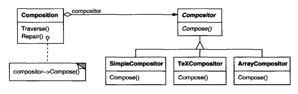
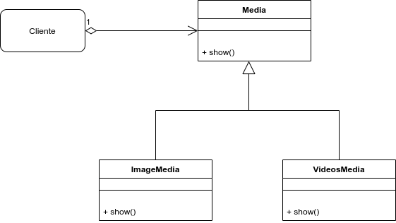
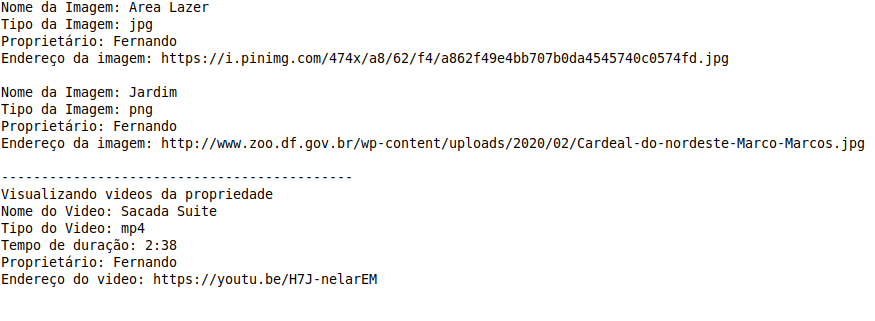
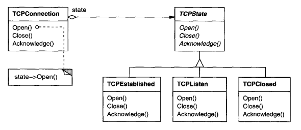
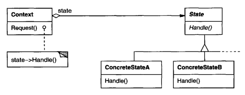
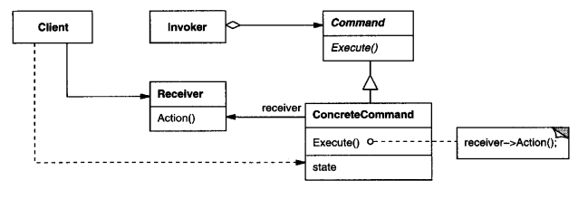
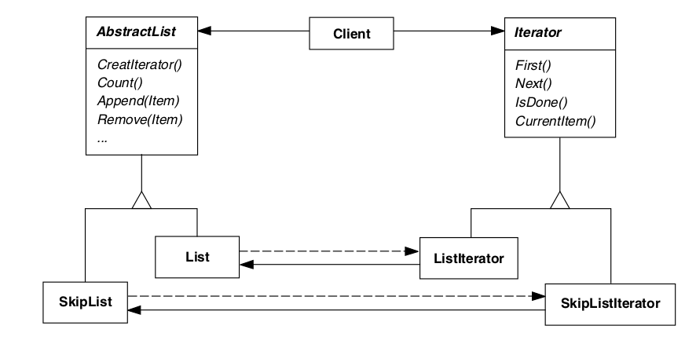
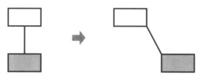
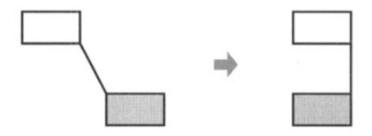
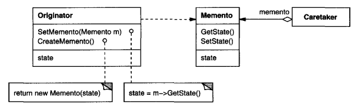

# GoFs Comportamentais
 
## 1. Introdução

O GoF comportamental está preocupado com o algoritmo e a atribuição de responsabilidades entre objetos. Na área comportamental ele é descrito não somente como padrões de objetos ou classes, mas também como os padrões de comunicação entre eles. Esses padrões caracterizam um controle de fluxo complexo que é díficil de seguir no tempo de execução. Eles tiram de foco o controle de fluxo e lhe permite concentrar somente no caminho que os objetos estão interconectados. (GAMMA, 2007) 

É mostrado abaixo os tipos de padrões comportamentais e também alguns exemplos que podem ser caracterizados em nossa aplicação.

## 2. Strategy

De acordo com Gamma (2007), o strategy define uma família de algoritmos, encapsulando cada um, e faz eles serem intercambiáveis. Deixando o algoritmo variar independentemente dos clientes que vão usá-lo.

Uma motivação é que muitos algoritmos servem para quebrar um fluxo de texto em linhas. Construindo então esses algoritmos em classes que necessitam deles não são desejáveis por algumas razões como:

- Clientes que necessitam de quebrar as linhas são muitos mais complexos em diferentes interfaces utilizadas. Esses clientes são enormes e difíceis de se manter, especialmente se eles suportam múltiplos algoritmos com quebra de linha.

- Diferentes algoritmos que são apropriados em tempos diferentes. Não queremos o suporte de vários algoritmos múltiplos de quebra de linha se não iremos usar eles todos.

- É difícil adicionar novos algoritmos e modificar os antigos quando o suporte de quebra de cilha é uma parte íntegra do cliente.

Para tentarmos evitar esses tipos de problemas, definimos então classes que encapsulam diferentes algoritmos de quebra de linha. Um algoritmo que é encapsulado dessa forma é chamado de Strategy.

Usamos o padrão Strategy quando

- muitas classes relacionadas diferem somente no seu comportamento. Strategies que fornecem um caminho para configurar uma classe com um de muitos comportamentos.
- é preciso diferentes variações de um algoritmo.
- um algoritmo usa a data de um cliente que ele não deve saber sobre. Use o padrão Strategy para evitar expor estrutura de dados complexos ou específicos.
- uma classe define muitos comportamentos, e eles aparecem como demonstrações condicionais múltiplas como operações.

Algo de ficar de olho para o padrão Strategy que tem os seguintes beneficios e desvantagens:

1. A escolha das implementações.

   Os Strategies podem prover diferentes implementações de um mesmo comportamento. O cliente pode escolher entre as strategies com diferentes trade-offs de tempo e espaço.

2. Clientes têm que perceber as diferentes Strategies.

   Esse padrão tem um potencial de desvantagem num cliente que necessita entender como as Strategies diferem antes da seleção de uma apropriada. Clientes podem estar expostos a problemas de implementação. Sendo assim, é dito que deve-se usar o padrão Strategy somente quando a variação do comportamento é relevante aos clientes.

3. Aumento no número de objetos.

   Os Strategies aumentam o número de objetos numa aplicação. Às vezes você pode reduzir essa sobrecarga implementando strategies que são objetos sem estado num contexto que pode ser compartilhado. Strategies compartilhadas não deveriam ter um estado de manutenção entre as invocações.

Fonte texto e imagens: (GAMMA, 2007)

Utilizamos o Strategy como ToyExample para mostrar uma funcionalidade da nossa aplicação em relação a utilização de mídias, como imagens e vídeos onde serão mostrados na publicação de uma propriedade.

Sendo assim, a ideia da pequena aplicação em java é justamente listar todas as mídias tanto em imagens como vídeo, o modesto console do java mostra como seria o fornecimento dessas informações.

Fizemos esse exemplo em Java e o código pode ser visto na pasta "ToyExampleStrategy", onde abaixo temos uma parte do código:

[Código Java](../assets/ToyExampleStrategy/Cardeal.java)

## 3. State

De acordo com Gamma (2007), o State permite que um objeto altere seu comportamento quando o seu estado interno mudo. O objeto vai parecer que mudou sua classe.

Como motivação, considere uma classe TPConnection que representa uma conexão de rede. O objeto TCP-Connection pode estar em diferentes estados: Estabelecido, Escutando e Fechado. Quando o objeto TCPConnecttion recebe um pedido de outros objetos, ele responde diferentemente dependendo do seu estado atual. Como exemplo, o efeito de um pedido Aberto, depende de onde a conexão permanece se é num estado Fechado ou Estabelecido. Quando o padrão State descreve como TCPConnection pode exibir diferentes comportamentos em cada estado.
Sendo assim, o estado da conexão delega todo o comportamento do objeto.

Sempre que uma conexão muda de estado, o objeto TCPConnection muda o estado do objeto e seus usos. Quando a conexão vai de estabelecida para fechada, por exemplo, o TCPConnection vai trocar a instância TCPEstablished para a instância TCPClosed.

O padrão State é utilizado em um dos casos:

- O comportamento do objeto depende de seu estado, e tem que mudar seu comportamento no tempo de execução dependendo do seu estado.
- Operações tem uma grande demonstração condicional de várias partes que depende do estado de um objeto. Esse estado é geralmente representado por um ou mais constantes enumerados. De vez em quando, muitas operações vão conter a mesma estrutura condicional. O padrão State coloca cada caminho das respectivas condições em classes separadas. Isso deixa você tratar o estado de um objeto como um objeto em seu próprio direito de variar independentemente de outros objetos.

Esse padrão tem como consequências:

- Deixa a transição de estados mais explícitas

  Quando um objeto define seu estado atual somente em termos de valores de dados internos, o mesmo estado de transição não tem representações explícitas; eles somente mostram os deveres de algumas variáveis. Introduzindo objetos separados por diferentes estados que fazem a transição mais explícita.

- Objetos State podem ser compartilhados

  Se o objeto State não tem instâncias de variáveis - isso é, o estado que eles representam está codificado totalmente ao seu tipo - então o contexto pode ser compartilhado a um objeto State.

Fonte texto e imagens: (GAMMA, 2007)

## 4. Command

De acordo com Gamma (2007), o Command encapsula a solicitação como um objeto, deste modo permitindo você a parametrizar clientes com diferentes solicitações, filas ou solicitações de relatórios, e o suporte a operações desfeitas.

Utilizar quando:

- Parametrizar objetos por uma ação a ser executada. Você pode expressar tal parametrização numa linguagem procedural através de uma função callback, ou seja, uma função que é registrada em algum lugar para ser chamada em um momento mais adiante. Os Commands são uma substituição orientada a objetos para callbacks;
- Especificar, enfileirar e executar solicitações em tempos diferentes. Um objeto Command pode ter um tempo de vida independente da solicitação original. Se o receptor de uma solicitação pode ser representado de uma maneira independente do espaço de endereçamento, então você pode transferir um objeto Command para a solicitação para um processo diferente e lá atender a solicitação;
- Suportar desfazer operações. A operação Execute, de Command, pode armazenar estados para reverter seus efeitos no próprio comando. A interface do Command deve ter acrescentada uma operação Unexecute, que o reverte.efeitos de uma chamada anterior de Execute. Os comandos executados são armazenados em uma lista histórica. O nível ilimitado de desfazer e refazer operações é obtido percorrendo esta lista para trás e para frente, chamando operações Unexecute e Execute, respectivamente.

O padrão Command tem as seguintes consequências:

- Command desacopla o objeto que invoca a operação daquele que sabe como fazer.
- Commands são objetos de primeira classe. Eles podem ser manipulados ou estendidos como qualquer outro objeto.
- É fácil adicionar novos Commands, porque vocÇẽ não tem que mudar classes existentes.

Fonte texto e imagens: (GAMMA, 2007)

## 5. Iterator

 
 Iterator é um padrão de projeto para fornecer seus elementos sem que sua estrutura interna seja exposta. Portanto, é um padrão, onde em uma coleção de dados fornece diferentes maneiras de acessar esses dados sem expor o encapsulamento dessa coleção.
A motivação para esse padrão de projeto, é não declarar todas as formas de percurso em um determinado conjunto de dados, em um objeto, mas deixar a critério do objeto Iterator em como será esse acesso aos elementos. Dessa forma, o usuário utilizando o iterator, percorre os dados da forma que deseja sem a necessidade de interagir com todos os dados da coleção. 

{target=\_blank}

<h6 align = "center">Fonte: Padrões de Projeto: Soluções Reutilizáveis, GAMMA et al.,página 246.</h6> 

Segundo o livro, Padrões de Projeto: Soluções Reutilizáveis, o padrão de projeto Iterator possui aplicabilidade em:

- para acessar os conteúdos de um objeto agregado sem expor a sua representação interna;

- para suportar múltiplos percursos de objetos agregados;

- para fornecer uma interface uniforme que percorra diferentes estruturas agregadas (ou seja, para suportar a iteração polimórfica).

## 6. Mediator

## 7. Chain of Responsibility

### 7.1. Introdução

Esse design pattern também pode ser conhecido como CoR, Corrente de responsabilidade, Corrente de comando, Chain of command.

O Chain of Responsibility é um padrão de projeto comportamental que permite que você passe pedidos por uma corrente de handlers. Ao receber um pedido, cada handler decide se processa o pedido ou o passa adiante para o próximo handler na corrente.

Chain of Responsibility

Fonte: [wiki](https://en.wikipedia.org/wiki/Chain-of-responsibility_pattern)
### 7.2. Metodologia

 O padrão Chain of Responsibility foi estudado, e será utilizado mais a frente no projeto para lidar com a questão da implementação do login do Corretor na aplicação. A sua implementação seguirá o seu padrão característico, descrito na introdução de modo a preservar e ser possível identificá-lo de maneira clara no projeto.

### 7.3. Estrutura

A redução do acoplamento é obtida dando a mais de um objeto a chance de lidar com a solicitação consequentemente. O item da cadeia recebe a solicitação e, após alguma lógica, passa a solicitação para o próximo handler ao longo da cadeia de handlers.

O primeiro objeto na cadeia recebe a solicitação e a trata ou encaminha para o próximo candidato na cadeia, que faz o mesmo. 

O objeto que fez a solicitação não tem conhecimento explícito de quem irá tratá-la - a solicitação tem um receptor implícito.

Este padrão inclui duas funções principais:

- **Handler** - define uma interface para lidar com solicitações, lida com a própria solicitação e implementa o link sucessor
- **Cliente** - inicia a solicitação para um objeto Handler na cadeia.

- **Main** -
componha cadeias apenas uma vez ou componha-as dinamicamente, dependendo da lógica do aplicativo
- **Concrete Handlers** - 
contém a lógica real para solicitações de processamento
ao receber uma solicitação, cada manipulador decide se deve processá-la e passá-la ao longo da cadeia
geralmente independente e imutável, aceitando todos os dados necessários, apenas um por meio do construtor

Diagrama UML - Chain of responsibility

Prós  

- Capacidade de controlar a ordem de tratamento da solicitação.
- Atende **Princípio de Responsabilidade Única** que diz que uma classe deve possuir uma, e apenas uma responsabilidade. Pode-se traduzir isso em “uma classe deve ter apenas um motivo para mudar”.
- Atende **Princípio Aberto / Fechado**
que diz que as entidades de software (classes, módulos, funções, etc.) devem estar abertas para extensão, mas fechadas para modificação, ou seja, deve ser possível estender o comportamento de uma classe, mas não a modificar.

Contras

- Algum pedido pode acabar sem tratamento

### 7.4. Chain of Responsability aplicado ao projeto

O Padrão Chain of Responsability ainda não foi aplicado ao projeto. Quando implementado será referenciado neste tópico.

## 8. Observer
 
O Observer é um padrão de projeto que permite que os objetos interessados sejam avisados de mudança de estado ou outros eventos que ocorram em um outro objeto. Ele também pode ser chamado de Publiser-Subscriber. GAMMA define o Observer da seguinte maneira:
 
"Definir uma dependência um-para-muitos entre objetos, de maneira que quando um objeto muda de estado todos os seus dependentes são notificados e atualizados automaticamente." (GAMMA et al., 2000, p.274).
 

_Fonte: https://pt.wikipedia.org/wiki/Observer_ 
 
### 8.1 Metodologia

A partir da reunião realizada no dia [17/09/2021](./atas/17-09-21.md) ficou decidido entre os membros do grupo que os padrões de projeto seriam explicados para fins didáticos para enriquecer a documentação e aumentar a compreensão do conteúdo nos participantes do trabalho.

### 8.2 Aplicação no projeto
 
O padrão Observer foi identificado e aplicado no front-end do projeto. O Observable é uma classe que aplica o padrão Observer. É emitida uma notificação para o Observable sempre que ocorre uma mudança em um de seus itens e a partir disto podemos executar uma ação. Em nosso projeto ele foi aplicado para observar a resposta das requisições da API, retornando um objeto assim que a requisição concluir sua tarefa, ou retornando um erro caso não seja possível concluir a requisição.
 

## 9. Visitor 

### 9.1. Introdução

Imagine que temos um objeto composto que consiste em componentes. A estrutura do objeto é fixa - não podemos alterá-la ou não planejamos adicionar novos tipos de elementos à estrutura.

Agora, como poderíamos adicionar novas funcionalidades ao nosso código sem modificar as classes existentes?

O padrão de design do Visitante pode ser uma resposta. Simplificando, teremos que fazer é adicionar uma função que aceita a classe visitante para cada elemento da estrutura.

Dessa forma, nossos componentes permitirão que a implementação do visitante os “visite” e execute qualquer ação necessária naquele elemento.

Em outras palavras, extraímos o algoritmo que será aplicado à estrutura do objeto das classes.

Consequentemente, fazemos bom uso do princípio Aberto / Fechado, pois não modificamos o código, mas ainda seremos capazes de estender a funcionalidade fornecendo uma nova implementação de Visitante.
### 9.2. Metodologia

 O padrão Chain of Responsibility foi estudado, e será utilizado mais a frente no projeto para lidar com a questão da implementação do login do Corretor na aplicação. A sua implementação seguirá o seu padrão característico, descrito na introdução de modo a preservar e ser possível identificá-lo de maneira clara no projeto.

### 9.3. Estrutura

Diagrama UML - Visitor

- **Visitor** (NodeVisitor) - declara uma operação Visit para cada classe de ConcreteElement no objeto
estrutura. O nome da operação e assinatura identifica a classe que envia
o pedido de visita ao visitante. Isso permite que o visitante determine o concreto
classe do elemento que está sendo visitado. Em seguida, o visitante pode acessar o elemento
diretamente por meio de sua interface específica.

- **Concrete Visitor** (TypeCheckingVisitor) - implementa cada operação declarada pelo Visitante. Cada operação implementa um fragmento do algoritmo definido para a classe de objeto correspondente na estrutura. ConcreteVisitor fornece o contexto para o algoritmo
e armazena seu estado local. Este estado geralmente acumula resultados durante o
travessia da estrutura.

• **Element** (Nó) - define uma operação Aceitar que leva um visitante como argumento.

- **ConcreteElement** (AssignmentNode, VariableRefNode)
-implementa uma operação Accept que leva um visitante como argumento.

• **ObjectStructure** (Programa)

- pode enumerar seus elementos.
- pode fornecer uma interface de alto nível para permitir que o visitante visite seus elementos.
- pode ser um composto ou uma coleção, como um lista ou um conjunto.

Prós  

- Um objeto visitante pode acumular algumas informações úteis ao trabalhar com vários objetos. Isso pode ser útil quando você deseja percorrer alguma estrutura complexa de objetos, como uma árvore de objetos, e aplicar o visitante a cada objeto dessa estrutura.
- Atende **Princípio de Responsabilidade Única** que diz que uma classe deve possuir uma, e apenas uma responsabilidade. Pode-se traduzir isso em “uma classe deve ter apenas um motivo para mudar”.
- Atende **Princípio Aberto / Fechado**
que diz que as entidades de software (classes, módulos, funções, etc.) devem estar abertas para extensão, mas fechadas para modificação, ou seja, deve ser possível estender o comportamento de uma classe, mas não a modificar.

Contras

- Você precisa atualizar todos os visitantes cada vez que uma classe é adicionada ou removida da hierarquia de elementos.
- Os visitantes podem não ter acesso necessário aos campos e métodos particulares dos elementos com os quais devem trabalhar.

### 9.4. Visitor aplicado ao projeto

O Padrão Visitor foi aplicado ao projeto. 
Seguem abaixo um exemplo onde é definido uma classe Imovel.

Exemplo de model Angular12

Foi criado uma camada de modelo usando o sistema de injeção de dependências e retirando a lógica de dentro do componente.

Essa model que é visitada pelos componentes  e serviços que necessitam do uso dessa classe.

Utilização da model Imovel pelo serviço Imovel.

Service é o objeto usado para organizar e/ou compartilhar estados de objetos e as regras de negócio da aplicação. Além de se utilizar do Visitor ele também é singleton, ou seja, há apenas uma instância disponível durante a vida útil da aplicação. Outra característica importante é a inicialização tardia (lazily instantiated), que só é efetuada quando o AngularJS identifica que tem algum componente dependente.

[Código Model](../assets/imovel.model.ts)

[Código Serviço](../assets/imovel.service.ts)

## 10. Memento

De acordo com Gamma (2007), o Memento tem como intenção, sem que viole a encapsulação, a captura e a externalização dos estados internos de um objeto para que o objeto possa ser restaurado para esse estado posteriormente.

Algumas vezes é necessário gravar o estado inicial de um objeto. Sendo assim é necessário implementar checkpoint e desfazer mecanismos que deixem o usuário voltar nas tentativas anteriores de operações ou se recuperar de erros. Você tem que salvar o estado da informação em algum lugar, para que os objetos possam ser restaurados ao os estados anteriores. Mas os objetos normalmente encapsulam algumas ou todas as partes do seu estado, fazendo então inacessível a outros objetos é impossível de salvar externamente. Expondo esse estado pode violar a encapsulação, o que compromete a confiabilidade e extensibilidade da aplicação.

Considere um exemplo de um editor gráfico que suporta a conectividade entre objetos. Um usuário pode mover então dois retângulos conectados a uma linha alterando então o formato dos objetos e o alargamento da linha.

Vemos então que além dos estados serem gravados, são mantidas as posições dos objetos também com as operações onde levam o cálculo do alargamento da linha. Porém neste caso queremos desfazer essa ação voltando para o estado original, mas o suporte para desfazer não é tão fácil quanto parece. Um jeito óbvio de desfazer a operação de movimento seria guardar o valor de origem da distância que foi movida e voltar com essa distância armazenada. Contudo, isso não garante que todos os objetos irão aparecer onde eles estavam antes. Suponhamos que exista uma folga na conexão. Nesse caso, simplesmente mover um retângulo de volta a sua posição original não terá conquistado o efeito desejado.

Para resolvermos esse problema com o padrão Memento, o objeto memento armazena uma "fotografia" do estado atual interno de outro objeto - o originador do memento. O mecanismo de desfazer vai solicitar que um memento de um originador quando for necessário fazer o checkpoint do estado do originador. Quando o originador inicia o memento com a informação que caracteriza o seu estado atual. Somente o originador pode guardar e receber informação de um memento - o memento é "opaco" para outros objetos.

Aplicamos o padrão Memento quando

- alguma porção de um estado do objeto tem que ser salvado, assim ele pode ser restaurado mais tarde, e
- uma interface direta para obter o estado pode expor detalhes da implementação e quebrar a encapsulação do objeto.

O padrão Memento tem consequências severas:

- Ele simplifica o Originator.

  Em outro tipo de designs que preservam o encapsulamento, o originator mantém a versão do estado interno que um cliente solicita. Isso inclui todo o armazenamento do gerenciamento do Originator. Tendo clientes que gerenciam o estado onde pedem por uma simplificação do Originator e mantém clientes de terem que notificar um originator quando são completados.

- Usar mementos podem ser caros.

  Mementos podem incluir sobrecargas consideráveis onde um Originator tem que copiar um grande montante de informação que são armazenadas no memento. A não que a encapsulação e restauração do estado Originator seja barato, o padrão pode não ser apropriado.

- Definindo interfaces estreitas e amplas.

  Pode ser difícil em algumas linguagem de programação em certificar-se que somente o originator pode acessar o estado do memento.

- Custos escondidos em zelar por mementos.

  O caretaker é responsável pela deleção de mementos que ele zela. Portanto, o caretaker não tem ideia do quanto de informação está no memento. Sendo assim, um caretaker leve pode inferir num largo custo de armazenamento quando ele guarda os mementos.

Fonte texto e imagens: (GAMMA, 2007)

## 11. Template Method
### 11.1 Introdução
 

 Template Method é padrão de projeto comportamental com o propósito de definir uma sequência que a solução computacional irá percorrer. Portanto, a ideia central é criar um template de métodos que serão executados em etapas, não importando o que constitui internamente o método, para diferentes classes herdadas da classe que tenha o papel do Template Method, mas que essas classes seguiram as etapas definidas pela super classe.  
<cite>"Definir o esqueleto de um algoritmo em uma operação, postergando alguns passos para
as subclasses. Template Method permite que subclasses redefinam certos passos de um
algoritmo sem mudar a estrutura do mesmo."</cite> (GAMMA et al., 2000, p.301).

### 11.2. Metodologia

 Para a criação do template method, foi estudado uma forma de implementar o padrão no projeto. Foi criado assim uma estrutura no <a href="https://app.diagrams.net/" target="_blank">Draw.io</a> e no momento de desenvolvimento do front-end verificar se essa estrutura pode ser implementada ou não neste momento. Assim, esse modelo poderá ser atualizado ao longo do tempo para melhor adaptar-se ao projeto.

### 11.3. Template Method

#### 11.3.1. Template Method Estrutura

 A abordagem do Template Method é criar uma classe (TemplateMethodClass), para especificar a sequência de métodos que serão executados em ordem, assim, protegendo as subclasses para seguirem essa ordem estabelecida. Essa sequência de métodos pode ser sobrescrita nas classes herdadas, assim cada subclasse possui sua particularidade no método, mas não na sequência, ou o método da sequência pode ser padrão para todas as subclasses. 
 
 
<h6 align = "center">Figura 1 - Template Method estrutura, versão 1.0.</h6>
 
{target=\_blank}
 
#### 11.3.2 Template Method Projeto

 A abordagem do Template Method para o projeto foi criada para que a sequência de métodos seja seguida por todas as subclasses, mas apenas um método da subclasse é diferente. Portanto a sequência foi esquematizada com o primeiro método fazendo a requisição para o banco de dados das postagens, o método da subclasse que diferencia entre os outros, é o método da filtragem, assim cada classe concreta, possui uma filtragem diferente, escolhida pelo usuário, e a última etapa da sequência é o método de exibição das postagens na página. 
 
 
<h6 align = "center">Figura 2 - Template Method Projeto, versão 1.0.</h6>
 
{target=\_blank}
 
<h6 align = "center">Fonte: Site <a href="https://app.diagrams.net/" target="_blank">Draw.io</a></h6> 

## 12. Referências

> GAMMA, Erich; HELM, Richard; JOHNSON, Ralph; VLISSIDES, John. **Padrões de Projeto**: Soluções reutilizáveis de software orientado a objetos. Porto Alegre: Bookman, 2007.
 
---
 
> SERRANO, Milene. **Arquitetura e Desenho de Software:** Aula GoFs Estruturais, disponível em: [aprender3.unb](https://aprender3.unb.br/pluginfile.php/897143/mod_label/intro/Arquitetura%20e%20Desenho%20de%20Software%20-%20Aula%20GoFs%20Estruturais%20-%20Profa.%20Milene.pdf){target=\_blank} (último acesso: dia 13 de setembro de 2021).
 
---
 
> [Draw.io: The easiest way for Confluence teams to collaborate using diagrams](https://drawio-app.com/){target=\_blank}, acessado dia 11 de setembro de 2021.
 
---
 
> [Refactoring: Template Method](https://www.figma.com){target=\_blank}, acessado dia 11 de agosto de 2021.
 
---
 
> Padrões de Projeto Observer. Disponível em: <https://pt.wikipedia.org/wiki/Observer> Acessado em: 17/09/2021
 
---
 
> Padrão de projeto de software. Disponível em: <https://pt.wikipedia.org/wiki/Padr%C3%A3o_de_projeto_de_software#Padr%C3%B5es_GoF_('Gang_of_Four')> Acessado em: 17/09/2021
 
---
 
> Design Patterns – Observer. Disponível em: <https://www.devmedia.com.br/design-patterns-observer/16875> Acessado em: 17/09/2021
 
---
 
> Exploring the Observer Design Pattern. Disponível em: <https://docs.microsoft.com/en-us/previous-versions/msp-n-p/ee817669(v=pandp.10)?redirectedfrom=MSDN> Acessado em: 17/09/2021
 
---

> Command. Disponível em: <https://pt.wikipedia.org/wiki/Command> Acessado em: 19/09/2021

---

## 13. Versionamento

| Data       | Versão | Descrição                                 | Autores                                          |
| ---------- | ------ | ----------------------------------------- | ------------------------------------------------ |
| 30/08/2021 | 0.1    | Criação do arquivo                        | [Estevao Reis](https://github.com/estevaoreis25) |
| 13/09/2021 | 0.2    | Adição do conteúdo e Template Method      | [Tomás Veloso](https://github.com/tomasvelos0)   |
| 17/09/2021 | 0.3    | Estruturação do Arquivo                   | [Estevao Reis](https://github.com/estevaoreis25) |
| 19/09/2021 | 0.4    | Introdução do Observer                    | Gustavo Duarte Moreira                           |
| 19/09/2021 | 0.5    | Revisão e Correção Ortográfica do Arquivo | [Marcos Vinícius](https://github.com/marcos-mv)  |
| 19/09/2021 | 0.6    | Adição dos padrões 2, 3, 4, 9             | [Bruno Nunes](https://github.com/brunocmo)       |
| 19/09/2021 | 0.7    | Adição ToyExample Strategy                | [Bruno Nunes](https://github.com/brunocmo)       |
| 20/09/2021 | 0.8    | Adição do padrão 5                        | [Tomás Veloso](https://github.com/tomasvelos0)   |
| 20/09/2021 | 0.9 | Revisão | Gustavo, Igor, Estevão, Giovana |
| 13/10/2021 | 1.0    | Incluir no texto referencias            | [Bruno Nunes](https://github.com/brunocmo)  
 
