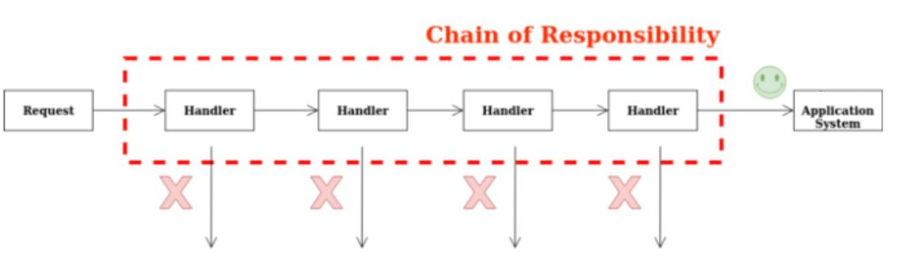
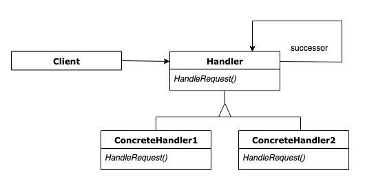

# GoFs Comportamentais

## 1. Introdução
## 2. Strategy
## 3. State 
## 4. Command 
## 5. Iterator
## 6. Mediator
## 7. Chain of Responsibility

## 7.1. Introdução

Esse design pattern também pode ser conhecido como CoR, Corrente de responsabilidade, Corrente de comando, Chain of command.

O Chain of Responsibility é um padrão de projeto comportamental que permite que você passe pedidos por uma corrente de handlers. Ao receber um pedido, cada handler decide se processa o pedido ou o passa adiante para o próximo handler na corrente.

Chain of Responsibility

Fonte: [wiki](https://en.wikipedia.org/wiki/Chain-of-responsibility_pattern)
## 7.2. Metodologia

 O padrão Chain of Resposibility foi estudado, e irá ser utilizado mais a frente no projeto para lidar com a questão da implementação do login do Corretor na aplicação. A sua implementação seguirá o seu padrão característico, descrito na introdução de modo a preservar e ser possível identificá-lo de maneira clara no projeto.

## 7.3. Estrutura

A redução do acoplamento é obtida dando a mais de um objeto a chance de lidar com a solicitação conseqüentemente. O item da cadeia que recebe a solicitação e, após alguma lógica, passa a solicitação para o próximo handler ao longo da cadeia de handlers.

O primeiro objeto na cadeia recebe a solicitação e a trata ou encaminha para o próximo candidato na cadeia, que faz o mesmo. 

O objeto que fez a solicitação não tem conhecimento explícito de quem irá tratá-la - a solicitação tem um receptor implícito.

Este padrão inclui duas funções principais:

- **Handler** - define uma interface para lidar com solicitações, lida com a própria solicitação e implementa o link sucessor
- **Cliente** - inicia a solicitação para um objeto Handler na cadeia.

- **Main** -
componha cadeias apenas uma vez ou componha-as dinamicamente, dependendo da lógica do aplicativo
- **Concrete Handlers** - 
contém a lógica real para solicitações de processamento
ao receber uma solicitação, cada manipulador decide se deve processá-la e passá-la ao longo da cadeia
geralmente independente e imutável, aceitando todos os dados necessários, apenas um por meio do construtor

Diagrama UML - Chain of resposibility

Prós  

- Capacidade de controlar a ordem de tratamento da solicitação.
- Atende **Princípio de Responsabilidade Única** que diz que uma classe deve possuir uma, e apenas uma, responsabilidade. Pode-se traduzir isso em “uma classe deve ter apenas um motivo para mudar”.
- Atende **Princípio Aberto / Fechado**
que diz que as entidades de software (classes, módulos, funções, etc.) devem estar abertas para extensão, mas fechadas para modificação, ou seja, deve ser possível estender o comportamento de uma classe, mas não a modificar.

Contras

- Algum pedido pode acabar sem tratamento

## 7.4. Chain of Responsability aplicado ao projeto

O Padrão Chain of Responsability ainda não foi aplicado ao projeto. Quando implementado será referenciado nesse tópico.
## 8. Observer 

O Observer é um padrão de projeto que permite que os objetos ineteressados sejam avisados de mudaça de estado ou outros eventos que ocorram em um outro objeto. Ele também pode ser chamado de Publiser-Subscriber. GAMMA define o Observer da seguinte maneira:

"Definir uma dependência um-para-muitos entre objetos, de maneira que quando um objeto muda de estado todos os seus dependentes são notificados e atualizados automaticamente." (GAMMA et al., 2000, p.274).

_Fonte: https://pt.wikipedia.org/wiki/Observer_  

### 8.1 Metodologia

A partir da reunião realizada no dia [17/09/2021](./atas/17-09-21.md) ficou decido entre os membros do grupo que os padrões de projeto seriam explicados para fins didáticos para enriquecer a documentação e aumentar a compreenção do conteúdo nos participantes do trabalho.

### 8.2 Aplicação no projeto

O padão Observer foi identificado e aplicado no front-end do projeto.

## 9. Visitor 
## 10. Memento 
## 12. Template Method 
### 12.1 Introdução

 Template Method é padrão de projeto comportamental com o propósito de definir uma sequência que a solução computacional irá percorrer. Portanto, a ideia central é criar um template de métodos que serão executados em etapas, não importando o que constitui internamente o método, para diferentes classes herdadas da classe que tenha o papel do Template Method, mas que essas classes seguiram as etapas definidas pela super classe.  
<cite>"Definir o esqueleto de um algoritmo em uma operação, postergando alguns passos para
as subclasses. Template Method permite que subclasses redefinam certos passos de um
algoritmo sem mudar a estrutura do mesmo."</cite> (GAMMA et al., 2000, p.301).

### 12.2. Metodologia

 Para a criação do template method, foi estudado uma forma de implementar o padrão no projeto. Foi criado assim uma estrutura no <a href="https://app.diagrams.net/" target="_blank">Draw.io</a> e no momento de desenvolvimento do front-end verificar se essa estrutura pode ser implementada ou não neste momento. Assim, esse modelo poderá ser atualizado ao longo do tempo para melhor adaptar-se ao projeto.

### 12.3. Template Method

#### 12.3.1. Template Method Estrutura

 A abordagem do Template Method é criar uma classe (TemplateMethodClass), para especificar a sequência de métodos que serão executados em ordem, assim, protegendo as subclasses para seguirem essa ordem estabelecida. Essa sequência de métodos pode ser sobrescrita nas classes herdadas, assim cada subclasse possui sua particularidade no método, mas não na sequência, ou o método da sequência pode ser padrão para todas as subclasses. 
 

<h6 align = "center">Figura 1 - Template Method estrutura, versão 1.0.</h6>

{target=\_blank}

<h6 align = "center">Fonte: Site <a href="https://app.diagrams.net/" target="_blank">Draw.io</a></h6> 
 
#### 12.3.2 Template Method Projeto

 A abordagem do Template Method para o projeto foi criada para que a sequência de métodos seja seguida por todas as subclasses, mas apenas um método da subclasse é diferente. Portanto a sequência foi esquematizada com o primeiro método fazendo a requisição para o banco de dados das postagens, o método da subclasse que diferencia entre os outros, é o método da filtragem, assim cada classe concreta, possui uma filtragem diferente, escolhida pelo usuário, e a última etapa da sequência é o método de exibição das postagens na página. 
 

<h6 align = "center">Figura 2 - Template Method Projeto, versão 1.0.</h6>

{target=\_blank}

<h6 align = "center">Fonte: Site <a href="https://app.diagrams.net/" target="_blank">Draw.io</a></h6> 

## 12. Referências

> GAMMA, Erich; HELM, Richard; JOHNSON, Ralph; VLISSIDES, John. **Padrões de Projeto**: Soluções reutilizáveis de software orientado a objetos. Porto Alegre: Bookman, 2007.

---

> SERRANO, Milene. **Arquitetura e Desenho de Software:** Aula GoFs Estruturais, disponível em: [aprender3.unb](https://aprender3.unb.br/pluginfile.php/897143/mod_label/intro/Arquitetura%20e%20Desenho%20de%20Software%20-%20Aula%20GoFs%20Estruturais%20-%20Profa.%20Milene.pdf){target=\_blank} (último acesso: dia 13 de setembro de 2021).

---

> [Draw.io: The easiest way for Confluence teams to collaborate using diagrams](https://drawio-app.com/){target=\_blank}, acessado dia 11 de setembro de 2021.

---

> [Refactoring: Template Method](https://www.figma.com){target=\_blank}, acessado dia 11 de agosto de 2021.

---

> Padrões de Projeto Observer. Disponível em: <https://pt.wikipedia.org/wiki/Observer> Acessado em: 17/09/2021

---

> Padrão de projeto de software. Disponível em: <https://pt.wikipedia.org/wiki/Padr%C3%A3o_de_projeto_de_software#Padr%C3%B5es_GoF_('Gang_of_Four')> Acessado em: 17/09/2021

---

> Design Patterns – Observer. Disponível em: <https://www.devmedia.com.br/design-patterns-observer/16875> Acessado em: 17/09/2021

---

> Exploring the Observer Design Pattern. Disponível em: <https://docs.microsoft.com/en-us/previous-versions/msp-n-p/ee817669(v=pandp.10)?redirectedfrom=MSDN> Acessado em: 17/09/2021

---

> Chain of Responsibility. Disponível em: <https://refactoring.guru/pt-br/design-patterns/chain-of-responsibility>. Acessado em: 17/09/2021

---

> An Easy Guide to Learn Chain of Responsibility in Golang. Disponível em: <https://levelup.gitconnected.com/a-easy-guide-to-learn-chain-of-responsibility-in-golang-979eba3bda44>. Acessado em: 17/09/2021
---
>  Chain-of-responsibility pattern. Disponível em: <https://en.wikipedia.org/wiki/Chain-of-responsibility_pattern>. Acessado em: 17/09/2021

## 13. Versionamento 

| Data       | Versão | Descrição         | Autores       | 
| ---------- | ------ | ----------------- | ------------- | 
| 30/08/2021 | 0.1    | Criação do arquivo| [Estevao Reis](https://github.com/estevaoreis25)  |
| 13/09/2021 |  0.2   | Adição do conteúdo | [Tomás Veloso](https://github.com/tomasvelos0) |
| 17/09/2021 | 0.3   | Estruturação do Arquivo| [Estevao Reis](https://github.com/estevaoreis25) |
| 19/09/2021 | 0.5   | Introdução do Observer| Gustavo Duarte Moreira|
| 19/09/2021 | 0.6   | Revisão e Correção Ortográfica do Arquivo| [Marcos Vinícius](https://github.com/marcos-mv)|
| 19/09/2021 | 0.7   | Chain of Resposibility Pattern| [Marcos Vinícius](https://github.com/marcos-mv)|

