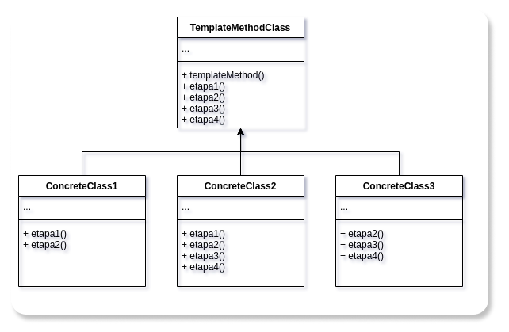

# GoFs Comportamentais

## 1. Introdução

O GoF comportamental está preocupado com o algoritmo e a atribuição de responsabilidades entre objetos. Na área comportamental ele é descrito não somente como padrões de objetos ou classes, mas também como os padrões de comunicação entre eles. Esses padrões caracterizam um controle de fluxo complexo que é díficil de seguir no tempo de execução. Eles tiram de foco o controle de fluxo e lhe permite concentrar somente no caminho que os objetos estão interconectados.

## 2. Strategy

O strategy define uma família de algoritmos, encapsulando cada um, e faz eles serem intercambiáveis. Deixando o algoritmo variar independentemente dos clientes que vão usá-lo.
 
Uma motivação é que muitos algoritmos servem para quebrar um fluxo de texto em linhas. Construindo então esses algoritmos em classes que necessitam deles não são desejáveis por algumas razões como:
 
* Clientes que necessitam de quebrar as linhas são muitos mais complexos em diferentes interfaces utilizadas. Esses clientes são enormes e difíceis de se manter, especialmente se eles suportam múltiplos algoritmos com quebra de linha.
 
* Diferentes algoritmos que são apropriados em tempos diferentes. Não queremos o suporte de vários algoritmos múltiplos de quebra de linha se não iremos usar eles todos.
 
* É difícil adicionar novos algoritmos e modificar os antigos quando o suporte de quebra de cilha é uma parte íntegra do cliente.
 
Para tentarmos evitar esses tipos de problemas, definimos então classes que encapsulam diferentes algoritmos de quebra de linha. Um algoritmo que é encapsulado dessa forma é chamado de Strategy.
 
Usamos o padrão Strategy quando
 
* muitas classes relacionadas diferem somente no seu comportamento. Strategies que fornecem um caminho para configurar uma classe com um de muitos comportamentos.
* é preciso diferentes variações de um algoritmo.
* um algoritmo usa a data de um cliente que ele não deve saber sobre. Use o padrão Strategy para evitar expor estrutura de dados complexos ou específicos.
* uma classe define muitos comportamentos, e eles aparecem como demonstrações condicionais múltiplas como operações.

Algo de ficar de olho para o padrão Strategy que tem os seguintes beneficios e desvantagens:

1. A escolha das implementações.
 
   Os Strategies podem prover diferentes implementações de um mesmo comportamento. O cliente pode escolher entre as strategies com diferentes trade-offs de tempo e espaço.
 
2. Clientes têm que perceber as diferentes Strategies.
 
   Esse padrão tem um potencial de desvantagem num cliente que necessita entender como as Strategies diferem antes da seleção de uma apropriada. Clientes podem estar expostos a problemas de implementação. Sendo assim, é dito que deve-se usar o padrão Strategy somente quando a variação do comportamento é relevante aos clientes.
 
3. Aumento no número de objetos.
 
   Os Strategies aumentam o número de objetos numa aplicação. Às vezes você pode reduzir essa sobrecarga implementando strategies que são objetos sem estado num contexto que pode ser compartilhado. Strategies compartilhadas não deveriam ter um estado de manutenção entre as invocações.

## 3. State 
## 4. Command 
## 5. Iterator
## 6. Mediator
## 7. Chain of Responsability 
## 8. Observer 

O Observer é um padrão de projeto que permite que os objetos ineteressados sejam avisados de mudaça de estado ou outros eventos que ocorram em um outro objeto. Ele também pode ser chamado de Publiser-Subscriber. GAMMA define o Observer da seguinte maneira:

"Definir uma dependência um-para-muitos entre objetos, de maneira que quando um objeto muda de estado todos os seus dependentes são notificados e atualizados automaticamente." (GAMMA et al., 2000, p.274).

_Fonte: https://pt.wikipedia.org/wiki/Observer_  

### 8.1 Metodologia

A partir da reunião realizada no dia [17/09/2021](./atas/17-09-21.md) ficou decido entre os membros do grupo que os padrões de projeto seriam explicados para fins didáticos para enriquecer a documentação e aumentar a compreenção do conteúdo nos participantes do trabalho.

### 8.2 Aplicação no projeto

O padão Observer foi identificado e aplicado no front-end do projeto.

## 9. Visitor 
## 10. Memento 
## 12. Template Method 
### 12.1 Introdução

 Template Method é padrão de projeto comportamental com o propósito de definir uma sequência que a solução computacional irá percorrer. Portanto, a ideia central é criar um template de métodos que serão executados em etapas, não importando o que constitui internamente o método, para diferentes classes herdadas da classe que tenha o papel do Template Method, mas que essas classes seguiram as etapas definidas pela super classe.  
<cite>"Definir o esqueleto de um algoritmo em uma operação, postergando alguns passos para
as subclasses. Template Method permite que subclasses redefinam certos passos de um
algoritmo sem mudar a estrutura do mesmo."</cite> (GAMMA et al., 2000, p.301).

### 12.2. Metodologia

 Para a criação do template method, foi estudado uma forma de implementar o padrão no projeto. Foi criado assim uma estrutura no <a href="https://app.diagrams.net/" target="_blank">Draw.io</a> e no momento de desenvolvimento do front-end verificar se essa estrutura pode ser implementada ou não neste momento. Assim, esse modelo poderá ser atualizado ao longo do tempo para melhor adaptar-se ao projeto.

### 12.3. Template Method

#### 12.3.1. Template Method Estrutura

 A abordagem do Template Method é criar uma classe (TemplateMethodClass), para especificar a sequência de métodos que serão executados em ordem, assim, protegendo as subclasses para seguirem essa ordem estabelecida. Essa sequência de métodos pode ser sobrescrita nas classes herdadas, assim cada subclasse possui sua particularidade no método, mas não na sequência, ou o método da sequência pode ser padrão para todas as subclasses. 
 

<h6 align = "center">Figura 1 - Template Method estrutura, versão 1.0.</h6>

{target=\_blank}

<h6 align = "center">Fonte: Site <a href="https://app.diagrams.net/" target="_blank">Draw.io</a></h6> 
 
#### 12.3.2 Template Method Projeto

 A abordagem do Template Method para o projeto foi criada para que a sequência de métodos seja seguida por todas as subclasses, mas apenas um método da subclasse é diferente. Portanto a sequência foi esquematizada com o primeiro método fazendo a requisição para o banco de dados das postagens, o método da subclasse que diferencia entre os outros, é o método da filtragem, assim cada classe concreta, possui uma filtragem diferente, escolhida pelo usuário, e a última etapa da sequência é o método de exibição das postagens na página. 
 

<h6 align = "center">Figura 2 - Template Method Projeto, versão 1.0.</h6>

{target=\_blank}

<h6 align = "center">Fonte: Site <a href="https://app.diagrams.net/" target="_blank">Draw.io</a></h6> 

## 12. Referências

> GAMMA, Erich; HELM, Richard; JOHNSON, Ralph; VLISSIDES, John. **Padrões de Projeto**: Soluções reutilizáveis de software orientado a objetos. Porto Alegre: Bookman, 2007.

---

> SERRANO, Milene. **Arquitetura e Desenho de Software:** Aula GoFs Estruturais, disponível em: [aprender3.unb](https://aprender3.unb.br/pluginfile.php/897143/mod_label/intro/Arquitetura%20e%20Desenho%20de%20Software%20-%20Aula%20GoFs%20Estruturais%20-%20Profa.%20Milene.pdf){target=\_blank} (último acesso: dia 13 de setembro de 2021).

---

> [Draw.io: The easiest way for Confluence teams to collaborate using diagrams](https://drawio-app.com/){target=\_blank}, acessado dia 11 de setembro de 2021.

---

> [Refactoring: Template Method](https://www.figma.com){target=\_blank}, acessado dia 11 de agosto de 2021.

---

> Padrões de Projeto Observer. Disponível em: <https://pt.wikipedia.org/wiki/Observer> Acessado em: 17/09/2021

---

> Padrão de projeto de software. Disponível em: <https://pt.wikipedia.org/wiki/Padr%C3%A3o_de_projeto_de_software#Padr%C3%B5es_GoF_('Gang_of_Four')> Acessado em: 17/09/2021

---

> Design Patterns – Observer. Disponível em: <https://www.devmedia.com.br/design-patterns-observer/16875> Acessado em: 17/09/2021

---

> Exploring the Observer Design Pattern. Disponível em: <https://docs.microsoft.com/en-us/previous-versions/msp-n-p/ee817669(v=pandp.10)?redirectedfrom=MSDN> Acessado em: 17/09/2021

---

## 13. Versionamento 

| Data       | Versão | Descrição         | Autores       | 
| ---------- | ------ | ----------------- | ------------- | 
| 30/08/2021 | 0.1    | Criação do arquivo| [Estevao Reis](https://github.com/estevaoreis25)  |
| 13/09/2021 |  0.2   | Adição do conteúdo | [Tomás Veloso](https://github.com/tomasvelos0) |
| 17/09/2021 | 0.3   | Estruturação do Arquivo| [Estevao Reis](https://github.com/estevaoreis25) |
| 19/09/2021 | 0.5   | Introdução do Observer| Gustavo Duarte Moreira|
| 19/09/2021 | 0.6   | Revisão e Correção Ortográfica do Arquivo| [Marcos Vinícius](https://github.com/marcos-mv)|

