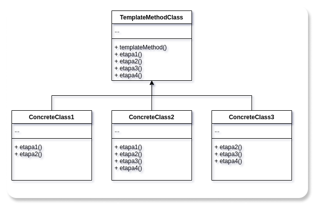
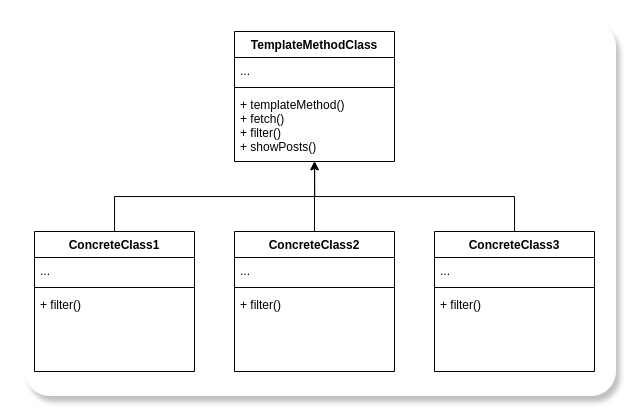

# Identidade Visual

## 1. Introdução

 Template Method é padrão de projeto comportamental com o propósito de definir uma sequência que a solução computacional irá percorrer. Portanto, a ideia central é criar um template de métodos que serão executados em etapas, não importando o que constitui internamente o método, para diferentes classes herdadas da classe que tenha o papel do Template Method, mas que essas classes seguiram as etapas definidas pela super classe.  
<cite>"Definir o esqueleto de um algoritmo em uma operação, postergando alguns passos para
as subclasses. Template Method permite que subclasses redefinam certos passos de um
algoritmo sem mudar a estrutura do mesmo."</cite> (GAMMA et al., 2000, p.301).

## 2. Metodologia

 Para a criação do template methodo, foi estudado uma forma de implementar o padrão no projeto. Criado assim uma estrutura no <a href="https://app.diagrams.net/" target="_blank">Draw.io</a> e no momento de desenvolvimento do front-end verificar se essa estrutura pode ser implementada ou não neste momento. Assim, esse modelo poderá ser atualizado ao longo do tempo para melhor adaptar-se ao projeto.

## 3. Template Method

### 3.1. Template Method Estrutura

 A abordagem do Template Method é criar uma classe (TemplateMethodClass), para especificar a sequência de métodos que serão executados em ordem, assim, protegendo as subclasses para seguirem essa ordem estabelecida. Essa sequência de métodos pode ser sobrescrita nas classes herdadas, assim cada subclasse possui sua particularidade no método, mas não na sequência, ou o método da sequência pode ser padrão para todas as subclasses. 
 

<h6 align = "center">Figura 1 - Template Method estrutura, versão 1.0.</h6>

{target=\_blank}

<h6 align = "center">Fonte: Site <a href="https://app.diagrams.net/" target="_blank">Draw.io</a></h6> 
 
### 3.2 Template Method Projeto

 A abordagem do Template Method para o projeto foi criada para que a sequência de métodos seja seguida por todas as subclasses, mas apenas um método da subclasse é diferente. Portanto a sequência foi esquematizada com o primeiro método fazendo a requisição para o banco de dados das postagens, o método da subclasse que diferencia entre os outros, é o método da filtragem, assim cada classe concreta, possui uma filtragem diferente, escolhida pelo usuário, e a última etapa da sequência é o método de exibição das postagens na página. 
 

<h6 align = "center">Figura 2 - Template Method Projeto, versão 1.0.</h6>

{target=\_blank}

<h6 align = "center">Fonte: Site <a href="https://app.diagrams.net/" target="_blank">Draw.io</a></h6> 

## 4. Referências

> GAMMA, Erich; HELM, Richard; JOHNSON, Ralph; VLISSIDES, John. **Padrões de Projeto**: Soluções reutilizáveis de software orientado a objetos. Porto Alegre: Bookman, 2007.

---

> SERRANO, Milene. **Arquitetura e Desenho de Software:** Aula GoFs Estruturais, disponível em: [aprender3.unb](https://aprender3.unb.br/pluginfile.php/897143/mod_label/intro/Arquitetura%20e%20Desenho%20de%20Software%20-%20Aula%20GoFs%20Estruturais%20-%20Profa.%20Milene.pdf){target=\_blank} (último acesso: dia 13 de setembro de 2021).

---

> [Draw.io: The easiest way for Confluence teams to collaborate using diagrams](https://drawio-app.com/){target=\_blank}, acessado dia 11 de setembro de 2021.

---

> [Refactoring: Template Method](https://www.figma.com){target=\_blank}, acessado dia 11 de agosto de 2021.

---

## 5. Versionamento

|    Data    | Versão |     Descrição      |                   Autor(es)                    |
| :--------: | :----: | :----------------: | :--------------------------------------------: |
| 30/08/2021 |  0.1   | Criação do arquivo |                  Estevao Reis                  |
| 13/09/2021 |  1.0   | Adição do conteúdo | [Tomás Veloso](https://github.com/tomasvelos0) |

