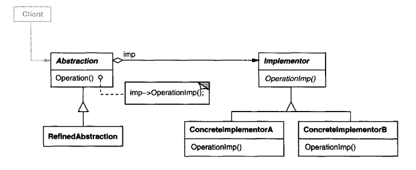
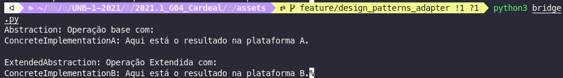

# GoFs Estruturais
## 1. Introdução
 
Os padrões de projeto estrutural estão preocupados em como classes e objetos podem ser compostos, para formar estruturas maiores.
 
Os padrões de design estrutural simplificam a estrutura, identificando os relacionamentos.
 
Esses padrões se concentram em como as classes herdam umas das outras e como são compostas de outras classes.
 
Existem 7 tipos de padrões de projeto estruturais listados a seguir.
 
- **Padrão Adapter**:
Adaptação de uma interface em outra de acordo com a expectativa do cliente.
 
- **Padrão de Bridge**:
Separando abstração (interface) da implementação.
 
- **Padrão Compose**:
Permite que os clientes operem na hierarquia de objetos.
 
- **Padrão de Decorator**:
Adiciona funcionalidade a um objeto dinamicamente.
 
- **Padrão Facade**:
Fornece uma interface para um conjunto de interfaces.
 
- **Padrão Flyweight**:
Reutiliza um objeto compartilhando-o.
 
- **Padrão Proxy**:
Representa outro objeto.
 
## 2. Adapter
 
## 2.1. Introdução
 

O padrão do Adapter funciona como uma ponte entre duas interfaces incompatíveis. Esse tipo de padrão de design vem sob o padrão estrutural, pois esse padrão combina a capacidade de duas interfaces independentes. O padrão é fácil de entender, pois o mundo real está cheio de adaptadores.
Este padrão envolve uma única classe que é responsável por unir funcionalidades de interfaces independentes ou incompatíveis.

 

Um exemplo abstrato que exemplifica bem o padrão Adapter é, imagine que precisamos nos mover de A para B e esse percurso só pode ser feito através de trilhos, nós temos acesso a um carro mas esse sozinho não consegue andar sobre trilhos. O que fazer? A solução é a criação de uma adaptação que integre o carro aos trilhos.

 

Abstração da utilização de um Adaptador

 
Fonte: https://refactoring.guru/pt-br/design-patterns/adapter
## 2.2. Metodologia
 
O padrão Adapter foi estudado, porém ainda não encontramos necessidade de implementar de maneira direta no projeto. Mas caso seja necessário , a sua implementação seguirá o seu padrão característico, descrito na introdução de modo a preservar e ser possível identificá-lo de maneira clara no projeto.
 
## 2.3. Estrutura
 
Em outras palavras, o padrão Adapter que também é conhecido como Wrapper, fornece a interface de acordo com os requisitos do cliente ao usar os serviços de uma classe com uma interface diferente.
 
Vantagem do padrão de Adapter
- Ele permite que dois ou mais objetos anteriormente incompatíveis interajam.
- Ele permite a reutilização de funcionalidades pré-existentes.
 
É Adapter é usado:
 
- Quando um objeto precisa utilizar uma classe existente com uma interface incompatível.
- Quando você deseja criar uma classe reutilizável que coopere com classes que não possuem interfaces compatíveis.
- Quando você deseja criar uma classe reutilizável que coopere com classes que não possuem interfaces compatíveis.
 
Existem as seguintes especificações para o padrão do adaptador:
 
- Interface de destino(ITarget): Esta é a classe de interface que será usada pelos clientes para atingir sua solicitação.
- Classe do adaptador(Adapter): esta classe é uma classe de wrapper que implementa a interface de destino desejada e modifica a solicitação específica disponível na classe Adaptee.
- Classe Adaptee: Esta é a classe que é usada pela classe Adapter para reutilizar a funcionalidade existente e modificá-la para o uso desejado.
- Cliente: Esta é uma classe que interage com um tipo que implementa a interface ITarget. No entanto, a classe de comunicação denominada Adaptee não é compatível com o Client.
 

Diagrama UML de um Adaptador

 

Exemplo da utilização de um Adaptador

 
Fonte: https://refactoring.guru/pt-br/design-patterns/adapter
 
No figura anterior é mostrado a utilização de um adaptador XML -> JSON, para que seja possível utilizar os dados XML gerados pelo "Fornecedor de dados de ações" na "Biblioteca de Análises" que utiliza dados no formato JSON. Sem a utilização de um adaptador isso não seria possível. É função do adaptador sempre que receber os dados XML traduzi-los para JSON, o que permite a interação de duas interfaces que anteriormente eram incompatíveis.
 
## 2.4. Adapter aplicado ao projeto
 
O Padrão Adapter ainda não foi aplicado ao projeto. Mas logo abaixo um exemplo da utilização de um adapter implementado em python.
 
[Código](../assets/adapter.py)
 

 
 
## 3. Composite
 
O padrão de projeto COMPOSITE é estrutural, permite que os objetos que fazem parte de uma relação parte-todo sejam agrupados e tratados da mesma forma. Compostos em estruturas de árvores.
Esse padrão permite que os clientes usem os objetos individualmente ou em composições, ele é capaz de fazer as mesmas operações em uma agregação de objetos(todo) e em objetos individuais(parte).
 

 
_Fonte: https://pt.wikipedia.org/wiki/Composite_

 
### 3.1 Metodologia
 
A partir da reunião realizada no dia [17/09/2021](./atas/17-09-21.md) ficou decidido entre os membros do grupo que os padrões de projeto seriam explicados para fins didáticos para enriquecer a documentação e aumentar a compreensão do conteúdo nos participantes do trabalho.
 
### 3.2 Aplicação no projeto
 
Utilizando estrutura de árvore que é criada a partir de objetos, que podem conter vários métodos. Sendo visível no projeto ao se efetuar a criação de um objeto novo com mais de um método.
 
## 4. Bridge
 
## 4.1. Introdução
 
O padrão de projeto Bridge permite separar a abstração da implementação.
Existem 2 partes no padrão de design do Bridge:
 
- **Abstração**
- **Implementação**
 
Este é um mecanismo de design que encapsula uma classe de implementação dentro de uma classe de interface. Isto é, desacopla a interface da implementação. Ocultando detalhes dos clientes/aplicações.
 
O padrão Brige permite que a Abstração e a Implementação sejam desenvolvidas de forma independente e o código do cliente pode acessar apenas a parte da Abstração sem se preocupar com a parte da Implementação.
 
A abstração é uma interface ou classe abstrata e o implementador também é uma interface ou classe abstrata.
 
A abstração contém uma referência ao implementador. Filhos da abstração são chamados de abstrações refinadas e filhos do implementador são implementadores concretos.
 
Uma vez que podemos alterar a referência ao implementador na abstração, somos capazes de alterar o implementador da abstração em tempo de execução. As alterações no implementador não afetam o código do cliente.
Ele aumenta o acoplamento fraco entre abstração de classe e sua implementação.
 
## 4.2. Metodologia
 
A partir da reunião realizada no dia [17/09/2021](./atas/17-09-21.md) ficou decidido entre os membros do grupo que os padrões de projeto seriam explicados para fins didáticos para enriquecer a documentação e aumentar a compreensão do conteúdo nos participantes do trabalho.
 
O padrão Bridge foi estudado, porém ainda não encontramos necessidade de implementar de maneira direta no projeto. Mas caso seja necessário , a sua implementação seguirá o seu padrão característico, descrito na introdução de modo a preservar e ser possível identificá-lo de maneira clara no projeto.
 
## 4.3. Estrutura
 

Diagrama UML utilização de Bridge 

 
fonte:[wiki](https://en.wikipedia.org/wiki/Bridge_pattern)
 
- **Abstração** - núcleo do design pattern Bridge e define o ponto crucial. Contém uma referência ao implementador.
- **Abstração refinada** - estende a abstração, levando os detalhes mais finos um nível abaixo. Oculta os elementos mais sutis dos implementadores.
- **Implementador** - define a interface para as classes de implementação. Essa interface não precisa corresponder diretamente à interface de abstração e pode ser muito diferente. A abstração fornece uma implementação em termos de operações fornecidas pela interface do Implementador.
- **Implementação concreta** - implementa o implementador acima, fornecendo implementação concreta.
 
O padrão Bridge deve ser utilizado quando:
 
Você deseja evitar uma ligação permanente entre uma abstração e sua implementação. Pode ser o caso, por exemplo, quando a implementação
deve ser selecionado ou alternado em tempo de execução.
 
• ambas as abstrações e suas implementações devem ser extensíveis por
subclasses. Neste caso, o padrão Bridge permite combinar os diferentes
abstrações e implementações e estendê-los de forma independente.
 
• mudanças na implementação de uma abstração não devem ter impacto sobre
clientes; ou seja, seu código não deve ter que ser recompilado.
 
• (C ++) você deseja ocultar a implementação de uma abstração completamente de
clientes. Em C ++, a representação de uma classe é visível na interface da classe.
 
• você tem uma proliferação de classes, conforme mostrado anteriormente na primeira Motivação
diagrama. Essa hierarquia de classes indica a necessidade de dividir um objeto em
duas partes. Rumbaugh usa o termo "generalizações aninhadas" [RBP + 91] para
referem-se a tais hierarquias de classes.
 
• você deseja compartilhar uma implementação entre vários objetos (talvez usando
contagem de referência), e este fato deve ser escondido do cliente. Um simples
exemplo é a classe String de Coplien [Cop92], na qual vários objetos podem compartilhar
a mesma representação de string (StringRep).
 
## 4.4. Bridge aplicado ao projeto
 
O Padrão Bridge ainda não foi aplicado ao projeto. Mas logo abaixo um exemplo da utilização de um Bridge implementado em python.
 
[Código](../assets/bridge.py)
 

 
## 5. Decorator
 
O padrão de projeto estrutural Decorator permite que sejam acoplados comportamentos novos para objetos de maneira dinâmica. Decorators são uma alternativa flexível ao uso de herança estendendo funcionalidades.
 
 

 
_Fonte: https://en.wikipedia.org/wiki/Decorator_pattern_

### 5.1 Metodologia
 
A partir da reunião realizada no dia [17/09/2021](./atas/17-09-21.md) ficou decidido entre os membros do grupo que os padrões de projeto seriam explicados para fins didáticos para enriquecer a documentação e aumentar a compreensão do conteúdo nos participantes do trabalho.
 
### 5.2 Aplicação no projeto
 
O padrão Decorator não foi aplicado ao projeto.
 
 
## 6. Facade
## 7. Flyweight
 
O Flyweight(peso-mosca) é um padrão de projeto estrutural que é apropriado quando muitos objetos precisam ser manipulados em memória RAM e possuem informações repetidas. Os objetos compartilham partes comuns do estado, em vez de manter todos os dados em cada objeto. Otimizando o uso de memória.
 
 

 
_Fonte: https://refactoring.guru/pt-br/design-patterns/flyweight_

 
### 7.1 Metodologia
 
A partir da reunião realizada no dia [17/09/2021](./atas/17-09-21.md) ficou decidido entre os membros do grupo que o padrão Flyweight seria estudado. Porém, conforme o escopo do projeto foi definido não foi visualizada a necessidade de implementação do padrão.
 
### 7.2 Aplicação no projeto
 
O padrão Flyweight não foi aplicado ao projeto.
 
## 8. Proxy
 
## 8.1. Introdução
 
O padrão de projeto estrutural Proxy, é um padrão de projeto no qual uma classe irá funcionar de interface para outra coisa. Sendo assim, o Proxy pode fazer interface com praticamente qualquer coisa, desde uma conexão de rede a um arquivo.
 
## 8.2. Metodologia
 
O padrão Proxy foi estudado, porém não está implementado de maneira direta no projeto. Mas se sim, a sua implementação seguiria o seu padrão característico descrito na introdução de modo a preservar e ser possível identificá-lo de maneira clara no projeto.
 
## 8.3. Estrutura
 
A abordagem do Proxy é feita do seguinte modo e seguindo os seguintes parâmetros, o Proxy é um objeto wrapper que está sendo chamado pelo cliente para acessar o objeto de serviço real. Ao se chamar o Proxy, pode se encaminhar direto para o uso do serviço real ou oferecer uma lógica adicional, complementar aquele objeto, antes de propriamente encaminhar para ele, podendo fornecer um substituto ( ou placeholder ), adiciona nível extra de indireção e adicionar um agregador para proteger o componente real de complexidade indevida.
 

 
 
## 8.4. Proxy aplicado ao projeto
 
O padrão proxy não foi aplicado ao projeto.
 
## 9. Referências
 
> Padrões de Projeto Proxy. Disponível em: <https://pt.wikipedia.org/wiki/Proxy_(padr%C3%B5es_de_projeto)>.  Acessado em: 18/09/2021
 
> Padrões de Projeto Proxy. Disponível em: <https://refactoring.guru/pt-br/design-patterns/proxy/java/example>.  Acessado em: 18/09/2021
 
>  "The Adapter design pattern - Problem, Solution, and Applicability". Disponível em: <http://w3sdesign.com/?gr=s01&ugr=proble>. Acessado em: 18/09/2021.
 
> "Adapter Pattern". Disponível em: <http://w3sdesign.com/?gr=s01&ugr=struct>. Acessado em: 18/09/2021.
 
> "The Adapter Pattern". Disponível em: <https://refactoring.guru/pt-br/design-patterns/adapter>. Acessado em: 18/09/2021.
 
> "The GoF Design Patterns Reference". Disponível em: <http://w3sdesign.com/GoF_Design_Patterns_Reference0100.pdf>. Acessado em: 18/09/2021.
 
> Arquitetura e Desenho de Software - Aula GoFs Estruturais. Disponívem em: <https://aprender3.unb.br/pluginfile.php/897142/mod_label/intro/Arquitetura%20e%20Desenho%20de%20Software%20-%20Aula%20GoFs%20Estruturais%20-%20Profa.%20Milene.pdf>. Acessado em: 18/09/2021
 
> Padrões de Projeto Composite. Disponível em: <https://pt.wikipedia.org/wiki/Composite>. Acessado em: 18/09/2021
 
> Padrões de Projeto Decorator. Disponível em: <https://en.wikipedia.org/wiki/Decorator_pattern>. Acessado em: 18/09/2021
 
> Padrões de Projeto Composite. Disponível em: <https://pt.wikipedia.org/wiki/Flyweight>. Acessado em: 18/09/2021
 
> Padrões de Projeto Estruturais. Disponível em: <https://refactoring.guru/pt-br/design-patterns/structural-patterns>. Acessado em: 19/09/2021
 
> Arquitetura e desenvolvimento de software — Parte 8 — Composite. Disponível em: <https://medium.com/@gbbigardi/arquitetura-e-desenvolvimento-de-software-parte-8-composite-9d342d641a4a>. Acessado em: 19/09/2021
 
> Arquitetura e desenvolvimento de software — Parte 8 — Composite. Disponível em: <https://medium.com/@gbbigardi/arquitetura-e-desenvolvimento-de-software-parte-8-composite-9d342d641a4a>. Acessado em: 19/09/2021
 
> Gamma, Erich; Richard Helm, Ralph Johnson, John M.
Vlissides . Design patterns: elements of reusable objectoriented software. Reading: Addison-Wesley, c1995. 395 p.
 
> SERRANO, Milene. **Arquitetura e Desenho de Software:** Aula GoFs Estruturais, disponível em: [aprender3.unb](https://aprender3.unb.br/pluginfile.php/897143/mod_label/intro/Arquitetura%20e%20Desenho%20de%20Software%20-%20Aula%20GoFs%20Estruturais%20-%20Profa.%20Milene.pdf){target=\_blank} (último acesso: dia 19 de setembro de 2021).
 
>Design Patterns: The Bridge Pattern. Disponível em: <https://www.informit.com/articles/article.aspx?p=30297>. Acessado em: 19/09/2021
 
> Design Patterns - Bridge Pattern. Disponível em: <https://www.tutorialspoint.com/design_pattern/bridge_pattern.htm>. Acessado em 19/09/2021.
 
> Bridge Design Pattern. Disponível em: <https://www.geeksforgeeks.org/bridge-design-pattern/>. Acessado em 19/09/2021.
 
 
## 10. Versionamento
 
| Data       | Versão | Descrição         | Autores       |
| ---------- | ------ | ----------------- | ------------- |
| 30/08/2021 | 0.1    | Criação do arquivo| Estevao Reis  |
| 17/09/2021 | 0.2    | Estruturação do Arquivo| Estevao Reis |
| 19/09/2021 | 0.3    | Adição do Padrão Proxy| Luiz Gustavo  |
| 19/09/2021 | 0.4    | Adição da Introdução | Gustavo Moreira  |
| 19/09/2021 | 0.5    | Adição dos padrões Composite, Decorator e Flyweight | Gustavo Moreira |
| 19/09/2021 | 0.6    | Adição Introdução, Adapter e Bridge Pattern | Marcos Vinícius |
| 19/09/2021 | 0.7 | Revisão | Bruno, Marcos, Luiz, Tomás, Gustavo, Igor, Estevão, Giovana |