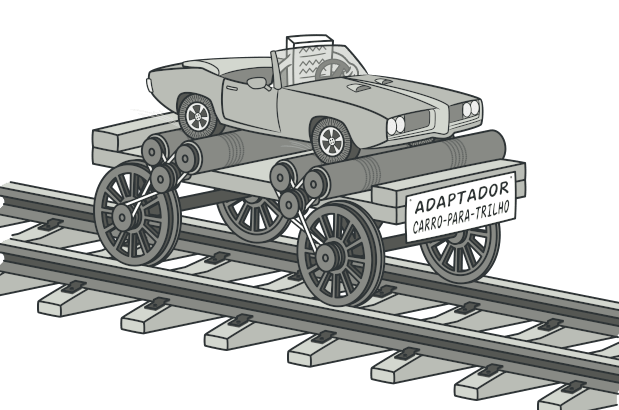
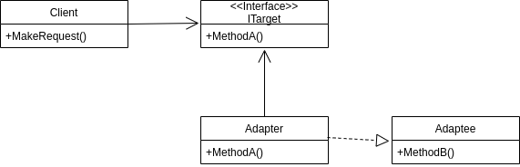
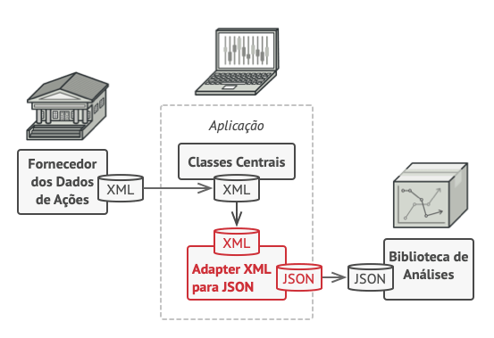
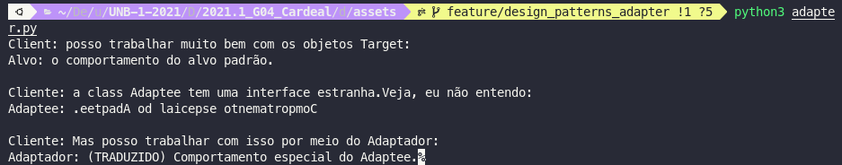

# GoFs Estruturais

## 1. Introdução

## 2. Adapter 

## 2.1. Introdução

O padrão do Adapter funciona como uma ponte entre duas interfaces incompatíveis. Esse tipo de padrão de design vem sob o padrão estrutural, pois esse padrão combina a capacidade de duas interfaces independentes. O padrão é fácil de entender, pois o mundo real está cheio de adaptadores.
Este padrão envolve uma única classe que é responsável por unir funcionalidades de interfaces independentes ou incompatíveis.

Um exemplo abstrato que exemplifica bem o padrão Adapter é, imagine que precisamos nos mover de A para B e esse percurso só pode ser feito através de trilhos, nós temos acesso a um carro mas esse sozinho não consegue andar sobre trilhos. O que fazer? A solução é a criação de uma adaptação que integre o carro aos trilhos.

Abstração da utilização de um Adaptador

Fonte: https://refactoring.guru/pt-br/design-patterns/adapter
## 2.2. Metodologia

 O padrão Adapter foi estudado, porém ainda não encontramos necessidade de implementado de maneira direta no projeto. Mas caso seja necessário , a sua implementação seguirá o seu padrão característico, descrito na introdução de modo a preservar e ser possível indentificá-lo de maneira clara no projeto.

## 2.3. Estrutura

Em outras palavras, o padrão Adapter que também é conhecido como Wrapper, fornece a interface de acordo com os requisitos do cliente ao usar os serviços de uma classe com uma interface diferente.

Vantagem do padrão de Adapter
- Ele permite que dois ou mais objetos anteriormente incompatíveis interajam.
- Ele permite a reutilização de funcionalidades pré-existente.

É Adapter é usado:

- Quando um objeto precisa utilizar uma classe existente com uma interface incompatível.
- Quando você deseja criar uma classe reutilizável que coopere com classes que não possuem interfaces compatíveis.
- Quando você deseja criar uma classe reutilizável que coopere com classes que não possuem interfaces compatíveis.

Existem as seguintes especificações para o padrão do adaptador:

- Interface de destino(ITarget): Esta é a classe de interface que será usada pelos clientes para atingir sua solicitação.
- Classe do adaptador(Adapter): esta classe é uma classe de wrapper que implementa a interface de destino desejada e modifica a solicitação específica disponível na classe Adaptee.
- Classe Adaptee: Esta é a classe que é usada pela classe Adapter para reutilizar a funcionalidade existente e modificá-la para o uso desejado.
- Cliente: Esta é uma classe que interage com um tipo que implementa a interface ITarget. No entanto, a classe de comunicação denominada Adaptee não é compatível com o Client.

Diagrama UML de um Adaptador

Exemplo da utilização de um Adaptador

Fonte: https://refactoring.guru/pt-br/design-patterns/adapter

No figura anterior é mostrado a utilização de um adaptador XML -> JSON, para que seja possível utilizar os dados XML gerados pelo "Fonecedor de dados de ações" na "Biblioteca de Análises" que utiliza dados no formato JSON. Sem a utilização de um adaptador isso não seria possível. É função do adaptador sempre que receber os dados XML traduzi-los para JSON, o que permite a interação de duas inferfaces que anteriormente eram incompatíveis.

## 2.4. Adapter aplicado ao projeto

O Padrão Adapter ainda não foi aplicado ao projeto. Mas logo abaixo um exemplo da utilização de um adapter implementado em python.

[Código](../assets/adapter.py)

## 3. Composite 
## 4. Bridge 
## 5. Decorator 
## 6. Facade 
## 7. Flyweight 
## 8. Proxy 

## 8.1. Introdução

O padrão de projeto estrutural Proxy, é um padrão de projeto no qual uma classe irá funcionar de interface para outra coisa. Sendo assim, o Proxy pode fazer interface com praticamente qualquer coisa, desde uma conexão de rede a um arquivo.

## 8.2. Metodologia

 O padrão Proxy foi estudado, porém não está implementado de maneira direta no projeto. Mas se sim, a sua implementação seguiria o seu padrão característico descrito na introdução de modo a preservar e ser possível indentífica-lo de maneira clara no projeto.

## 8.3. Estrutura

A abordagem do Proxy é feita do seguinte modo e seguindo os seguintes parametros, o Proxy é um objeto wrapper que está sendo chamado pelo cliente para acessar o objeto de serviço real. Ao se chamar o Proxy, pode se encaminhar direto para o uso do serviço real ou oferecer uma lógica adicional, complementar aquele objeto, antes de propriamente encaminhar para ele, podendo fornecer um substituto ( ou placeholder ), adiciona nível estra de indireção e adicionar um agregador para proteger o componente real de complexidade indevida. 

Fonte: https://pt.wikipedia.org/wiki/Prototype#Estrutura

## 8.4. Proxy aplicado ao projeto

O padrão proxy não foi aplicado ao projeto.

## 9. Referências

> Padrões de Projeto Proxy. Disponível em: <https://pt.wikipedia.org/wiki/Proxy_(padr%C3%B5es_de_projeto)>.  Acessado em: 18/09/2021

> Padrões de Projeto Proxy. Disponível em: <https://refactoring.guru/pt-br/design-patterns/proxy/java/example>.  Acessado em: 18/09/2021

>  "The Adapter design pattern - Problem, Solution, and Applicability". Disponivel em: <http://w3sdesign.com/?gr=s01&ugr=proble>. Acessado em: 18/09/2021.

> "Adapter Pattern". Disponivel em: <http://w3sdesign.com/?gr=s01&ugr=struct>. Acessado em: 18/09/2021.

> "The Adapter Pattern". Disponivel em: <https://refactoring.guru/pt-br/design-patterns/adapter>. Acessado em: 18/09/2021.

> "The GoF Design Patterns Reference". Disponivel em: <http://w3sdesign.com/GoF_Design_Patterns_Reference0100.pdf>. Acessado em: 18/09/2021.

## 10. Versionamento 

| Data       | Versão | Descrição         | Autores       | 
| ---------- | ------ | ----------------- | ------------- | 
| 30/08/2021 | 0.1    | Criação do arquivo| Estevao Reis  |
| 17/09/2021 | 0.2    | Estruturação do Arquivo| Estevao Reis |
| 19/09/2021 | 0.3    | Adição do Padrão Proxy| Luiz Gustavo  | 
| 19/09/2021 | 0.4    | Adição do Padrão Adapter| Marcos Vinícius  |              |
