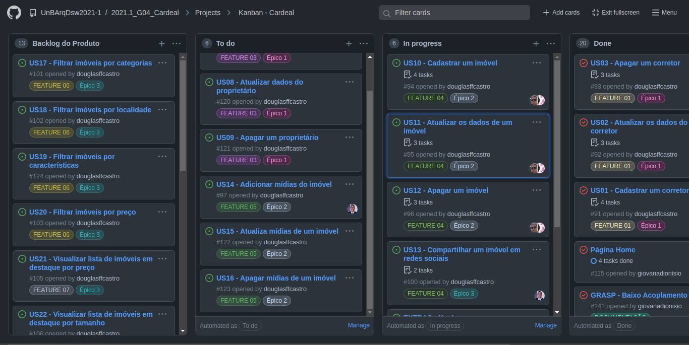

# Kanban

## 1. Introdução

&emsp;&emsp;O Kanban é conhecido como um método organizacional e de gestão que controla as tarefas de uma equipe e pode ser adaptado para cada necessidade. Sua ideia é usar cartões coloridos, como os post-its, em um quadro que gerencia as entregas de um projeto. Esse quadro nos dá uma melhor visualização e controle das tarefas e de como o projeto está evoluindo. Ele gerencia o fluxo e o tempo de trabalho de cada tarefa que está sendo executada, equilibra e organiza todos os processos fazendo com que as atividades não sejam interrompidas por outras.

## 2. Objetivos

&emsp;&emsp;Acordado na <a href="https://unbarqdsw2021-1.github.io/2021.1_G04_Cardeal/desenhoSoftwareBase/metodologia/">Metodologia</a>, o quadro Kanban foi construído para que os membros da equipe se organizassem quanto as atividades que deverão ser realizadas nas entregas.

&emsp;&emsp;Para melhor atender as nossas necessidades, o quadro foi feito no <a href="https://github.com/">GitHub</a> e conta com quadro colunas: Backlog do Produto, To do, In progress e Done.

## 3. Quadro Kanban da Equipe

O quadro pode ser visto com mais detalhes aqui: <a href="https://github.com/UnBArqDsw2021-1/2021.1_G04_Cardeal/projects/1">Quadro Kanban</a>.

## 4. Referências

PRESOTTO, Alanis. Kanban: o que é e como funciona, 2021. Alura. Disponível em: <a href="https://www.alura.com.br/artigos/metodo-kanban">https://www.alura.com.br/artigos/metodo-kanban</a>. Acesso em 19 de Setembro de 2021.
## Versionamento 
| Data       | Versão | Descrição         | Autores       | 
| ---------- | ------ | ----------------- | ------------- | 
| 17/08/2021 | 0.1    | Criação do arquivo | Estevao Reis  |
| 19/08/2021 | 0.2    | Adição do Documento | Douglas Castro  |