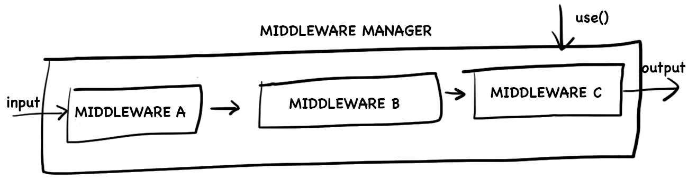
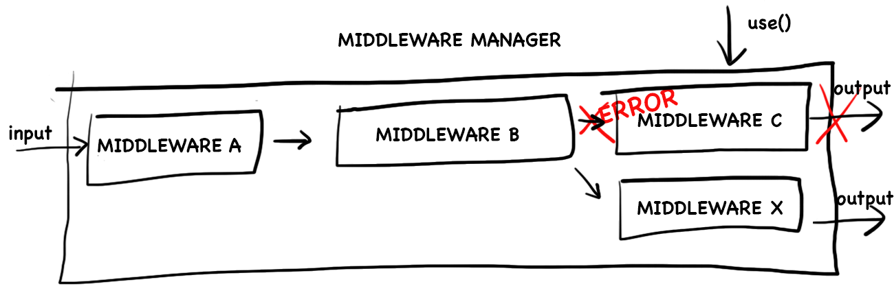

# Padrão Emergente - Middleware
 
## 1.Introdução
&emsp;&emsp;Segundo o artigo "Fundamental Node.js Design Patterns", middleware é um conceito poderoso, mas simples de entender: a  saída de uma unidade / função é a entrada para a próxima.
 
&emsp;&emsp;Como é citado no artigo "Building extensible pipelines with middleware", escrito por Mark Jordan, os principais requisitos para esse padrão são um tipo de entrada, um tipo de saída e um conjunto de requisitos funcionais  para fazer diversas coisas ao transformar um no outro.
 
&emsp;&emsp;Descrito por Waldemar Neto, no artigo "Entendendo o Middleware pattern em Node.js", a implementação desse padrão de projeto representa um pipeline de processamento onde handlers, units e filters são funções. Essas funções são conectadas criando uma sequência de processamento assíncrona que permite pré-processamento, processamento e pós-processamento de qualquer tipo de dado.
 
&emsp;&emsp;O diagrama abaixo representa a implementação do Middleware pattern:
 

 
&emsp;&emsp;O primeiro componente que deve ser dada maior atenção no diagrama acima é o Middleware Manager, ele é responsável por organizar e executar as funções. Alguns dos detalhes mais importantes desta implementação são:
 
- Novos middlewares podem ser invocados usando uma função específica para isso
 
- Geralmente novos middlewares são adicionados ao final do pipeline, mas essa não é uma regra obrigatória.
 
- Quando um novo dado é recebido para processamento, o middleware registrado é invocado em um fluxo de execução assíncrono.
 
- Cada unidade no pipeline recebe o resultado da anterior como input.
 
- Cada pedaço do middleware pode decidir parar o processamento simplesmente não chamando o callback, ou em caso de erro, passando o erro por callback. Normalmente erros disparam um fluxo diferente de processamento que é dedicado ao tratamento de erros.
 
&emsp;&emsp;O exemplo abaixo mostra um caminho de erro:
 

 
&emsp;&emsp;Não há restrições de como os dados são processados ou propagados no pipeline. Algumas estratégias são:
 
- Incrementar os dados com propriedades ou funções.
 
- Substituir os dados com o resultado de algum tipo de processamento.
 
- Manter a imutabilidade dos dados sempre retornando uma cópia como resultado do processamento.
 
&emsp;&emsp;Comumente esse padrão é utilizado no tratamento de solicitações da web. Um exemplo disso seria quando desejamos aceitar uma solicitação da web, fazer algum processamento nela e, em seguida, criar um objeto de resposta apropriado que é devolvido ao cliente. Para isso, cada função de middleware precisa acessar o estado atual da entrada, saída e a próxima função no pipeline a ser chamada. Um dos principais benefícios desse pattern é a facilidade de adicionar plugins de maneira não intrusiva.
 
## 2.Metodologia
&emsp;&emsp;Juntamente com toda a equipe, na reunião realizada no dia [17/09/2021](./atas/17-09-21.md), foi decidido que utilizaríamos o padrão de projeto Middleware na aplicação do Cardeal, pois uma das tecnologias que decidimos utilizar em nosso projeto, o Node.js, faz bastante uso desse padrão e possui ele internamente implementado.
 
## 3. Aplicação no Projeto
Dentro do nosso projeto usaremos middlewares para validação de dados que serão enviados para os endponits validando e retornando erros padrãoes usando validators. Outra forma de utilização dos middlewares para verificar se o usuário tem acesso aquela determinada página.
Para exemplificar a utilização criamos um middleware simples onde a chamada de um endpoint passa pelo middleware e depois para a controller como mostra os prints abaixo mostrando como funciona o comportamento do middleware.

 
## Referências
> Fundamental Node.js Design Patterns. Disponível em <https://blog.risingstack.com/fundamental-node-js-design-patterns/>. Acessado em 19/09/2021.
 
>Entendendo o Middleware pattern em Node.js. Disponível em <https://walde.co/2017/09/11/entendendo-o-middleware-pattern-em-node-js/>. Acessado em 19/09/2021.
 
>Building extensible pipelines with middleware. Disponível em <https://medium.com/ingeniouslysimple/building-extensible-pipelines-with-middleware-4f64428cab39>. Acessado em 19/09/2021
 
>What is Middleware? Definition and Example Use Cases. Disponível em <https://www.freecodecamp.org/news/what-is-middleware-with-example-use-cases/>. Acessado em 19/09/2021
 
## Versionamento
 
| Data       | Versão | Descrição         | Autores       |
| ---------- | ------ | ----------------- | ------------- |
| 30/08/2021 | 0.1    | Criação do arquivo| Estevao Reis  |
| 19/09/2021 | 0.2    | Descrição do padrão| Estevao Reis  |
| 20/09/2021 | 0.3    | Adicionando middleware| Igor Araújo  |
 