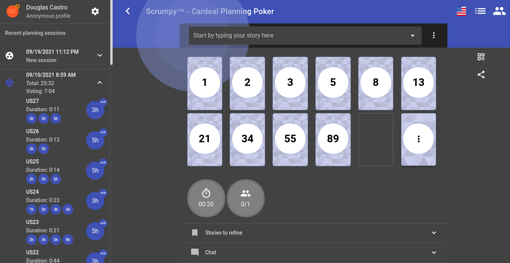

# Planning Poker

## 1. Introdução

&emsp;&emsp;Estimar um Backlog é um dos grandes desafios que surgem ao decorrer de um projeto. Conhecendo essa dificuldade, surge ao decorrer do tempo várias estratégias que buscam estimar da forma mais precisa possível os itens de um backlog. Uma dessas técnicas é o Planning Poker, que foi escolhida para estimar o backlog do Cardeal (BRASILEIRO, 2018).

&emsp;&emsp;Resumidamente, em um jogo Planning Poker, cada membro da equipe de desenvolvimento recebe um conjunto de cartas com os valores de uma certa sequência, que irá determinar uma estimativa para os itens do Backlog do Produto (CARVALHO, 2019).

## 2. Metodologia

&emsp;&emsp;Inicialmente, na documentação que descreve a <a href="https://unbarqdsw2021-1.github.io/2021.1_G04_Cardeal/desenhoSoftwareBase/metodologia/">Metodologia</a>, foi definido que usaríamos essa ferramenta para estimar o grau de dificuldade e o tempo que será necessário para se concluir as atividades.

&emsp;&emsp;No dia <a href="">10/09/2021</a>, usamos para a realização dessa atividade a sequência de Fibonacci e que para cada ponto de história seria necessário uma hora de trabalho.

&emsp;&emsp;Usamos a aplicação <a href="https://scrumpy.poker/">Scrumpy Planning Poker</a> para realizar o Planning Poker.

&emsp;&emsp;Integrantes que participaram:

- Bruno Nunes
- Douglas Castro
- Estevão Reis
- Giovana Vitor
- Gustavo D.
- Igor Sousa
- Marcos C.
- Pedro Haick
- Tomás Veloso

### 2.1. Planning Poker

## 3. Resultados

### 3.1. Backlog do Produto Estimado

| **ID** | **Descrição** |  **Story Point** |
| :- | :- | :- |
| US01 | Eu, como corretor, gostaria de me cadastrar na plataforma. | 5 |
| US02 | Eu, como corretor, gostaria de atualizar meu cadastro na plataforma. | 3 |
| US03 | Eu, como corretor, gostaria de apagar meu cadastro na plataforma. | 2 |
| US04 | Eu, como corretor, gostaria de cadastrar um cliente. | 5 |
| US05 | Eu, como corretor, gostaria de atualizar o cadastro do cliente. | 3 |
| US06 | Eu, como corretor, gostaria de deletar um cliente. | 2 |
| US07 | Eu, como corretor, gostaria de cadastrar um proprietário. | 5 |
| US08 | Eu, como corretor, gostaria de atualizar o cadastro do proprietário. | 3 |
| US09 | Eu, como corretor, gostaria de apagar um proprietário. | 2 |
| US10 | Eu, como corretor, gostaria de cadastrar um imóvel. | 3 |
| US11 | Eu, como corretor, gostaria de atualizar as informações de um imóvel. | 5 |
| US12 | Eu, como corretor, gostaria de apagar um imóvel. | 3 |
| US13 | Eu, como usuário(cliente e/ou corretor), gostaria de compartilhar o imóvel de um imóvel para alguma rede social. | 3 |
| US14 | Eu, como corretor, gostaria de adicionar as mídia(foto ou vídeo) do imóvel. | 3 |
| US15 | Eu, como corretor, gostaria de atualizar as mídia(foto ou vídeo) do imóvel. | 3 |
| US16 | Eu, como corretor, gostaria de apagar as mídia(foto ou vídeo) do imóvel. | 3 |
| US17 | Eu, como usuário(corretor e/ou cliente), gostaria de filtrar imóveis por categorias. | 2 |
| US18 | Eu, como usuário(corretor e/ou cliente), gostaria de filtrar imóveis por localidade. | 2 |
| US19 | Eu, como usuário(corretor e/ou cliente), gostaria de filtrar imóveis por caracteristicas do imóvel (quantidade de quartos, banheiros, garagem, etc). | 3 |
| US20 | Eu , como usuário(corretor e/ou cliente), gostaria de filtrar os imóveis pelo preço. | 5 |
| US21 | Eu, como usuário(corretor e/ou cliente), gostaria de visualizar lista de imóveis em destaque por preço do imóvel. | 3 |
| US22 | Eu, como usuário(corretor e/ou cliente), gostaria de visualizar lista de imóveis em destaque pelo tamanho do imóvel. | 5 |
| US23 | Eu, como cliente, gostaria de ver uma lista de nome de todos os corretores. | 5 |
| US24 | Eu, como cliente, gostaria de filtrar os corretores por nome. | 3 |
| US25 | Eu, como cliente, gostaria de filtrar os corretores por localização. | 5 |
| US26 | Eu, como cliente, gostaria de mandar um e-mail para o corretor dentro da plataforma. | 3 |
| US27 | Eu, como cliente, gostaria de visualizar os contatos do corretor. | 2 |
| US28 | Eu, como corretor, gostaria de agendar uma reunião para o cliente. | 5 |
| US29 | Eu, como corretor, gostaria de visualizar os agendamentos cadastrados. | 3 |

## 4. Referências

- BRASILEIRO, Roberto. Planning Poker: A melhor maneira de estimar qualquer atividade. Método Ágil, 2018. Disponível em: <a href="https://www.metodoagil.com/planning-poker/">https://www.metodoagil.com/planning-poker/</a>. Acesso em: 19 de Setembro de 2021.
- CARVALHO, Técia. Planning Poker: o que é e como funciona com o Scrum. Voitto, 2019. Disponível em: <a href="https://www.voitto.com.br/blog/artigov2/planning-poker">https://www.voitto.com.br/blog/artigov2/planning-poker</a>. Acesso em: 19 de Setembro de 2021.

## 5. Versionamento

| Data       | Versão | Descrição         | Autores       | 
| ---------- | ------ | ----------------- | ------------- | 
| 15/09/2021 | 0.1    | Criação do arquivo | Douglas Castro |
| 10/09/2021 | 0.2    | Adição do backlog estimado | Bruno Nunes, Douglas Castro, Estevão Reis, Giovana Vitor, Gustavo D., Igor Sousa, Marcos C., Pedro Haick, Tomás Veloso |
| 17/09/2021 | 0.3    | Estruturação do documento | Douglas Castro |
| 19/09/2021 | 0.4    | Adição da documentação | Douglas Castro |